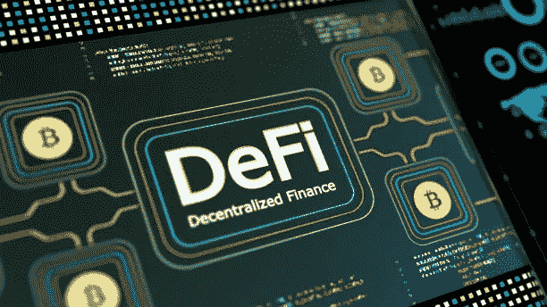

# 不要否认定义

> 原文：<https://medium.com/coinmonks/do-not-deny-defi-c37c2914ce79?source=collection_archive---------56----------------------->

istock

至少在某种程度上，这是货币的未来。贪婪已经控制了整个世界，职业政客将他们的议程塞进了选民的钱包。全球金融压力只会增强对分散货币的需求。

一年前，当我开始这个意想不到的隐星人之旅时，我有三个目标。我将投资加密货币(我有)，收回我的初始投资，让…