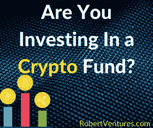
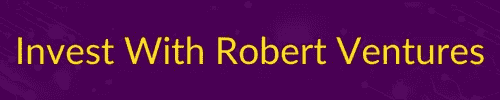

# 在投资加密基金之前做这 4 件事

> 原文：<https://medium.com/coinmonks/do-these-4-things-before-investing-in-a-crypto-fund-3d3ad2d2dbf1?source=collection_archive---------47----------------------->

投资加密资产有两种主要方法:投资个人代币和投资加密基金。基金是由策略团队根据其策略精心选择和管理的资产组合。

在一些情况下，投资于加密基金而不是单个加密货币，或者至少在你的投资组合中包括一只基金。首先，它由一群投资者管理，这些投资者跟踪市场方向，并及时了解推动代币价格的最新消息和因素。其次，基金比交易所交易代币更节税，更划算。最后，它们还提供多样化，降低风险，限制你对该行业的敞口。

不同的公司管理着数以百计的基金，目标也各不相同，所以在选择投资哪只基金时，你需要做好自己的尽职调查。我们的方法包括分析基金的四个不同部分:

**第一步:操作&论文**

*   资本的配置是什么？(增长、天使、种子、A 轮、公开市场、基金中的基金)
*   他们投资于什么部门/行业？论文？
*   他们投资的平均期限是多久？
*   他们的退出策略和最终目标是什么？

每只基金都有不同的策略。例如，如果你将资金配置在一只收益型基金中，你应该期待可预测的回报和今天 6%到 10%的 APY。与此同时，如果你投资于杠杆基金，你应该预计到更高的波动性。因此，有不同目标的基金，你应该在投资前明确你在寻找什么。

在此之后，你应该检查基金资金配置背后的投资理念、投资期限(即，摇摆交易、长期)以及退出策略，看看它们是否符合你的投资者特征。

**第二步:团队(背景、管理&经验)**

*   他们积极参与风险投资有多久了？
*   他们对目前投资的行业了解多少？
*   他们的记录如何？
*   他们经历过衰退或熊市吗？
*   他们最糟糕的交易是什么？他们是怎么克服的？

了解谁是管理你资产的人是至关重要的。理想情况下，你应该寻找一只团队从事过风险投资、拥有区块链或密码相关背景的基金。当然，长期成功的记录也是一个优势，但由于这是一个新兴市场，可能很难找到符合这一要求的基金。

另一个需要考虑的重要方面是团队是否已经度过了衰退期。最好的基金是那些能在最坏的情况下处理你的资金的基金。

**第三步:基金&条款**

*   最低应用是什么？
*   他们如何组织交易？
*   根据基金的规模，这将如何实现目标回报？更大资本的收益递减
*   运营商的收费结构是怎样的？

快速了解你需要投资多少资金和他们的交易结构。此外，如果基金有更大的资本，你应该预期收益递减。此外，始终检查过程中涉及的费用:资产管理，性能，再融资和处置。

**第四步:综合方面**
评估所有资金文件。检查所有文件看起来是否专业，是否由声誉良好的联合律师准备。在审阅投资备忘录时，确保它是专业撰写的。问问你自己，基金是否给了你足够的时间和关注。他们回答了你所有的问题吗？

此外，不要忘记评估风险投资基金正在投资的竞争对手和行业。基金有竞争优势吗？从回报、期限、基金的完整性、背景和提议的投资主题来看，整个交易有意义吗？

在投资加密基金之前，你应该获得足够的信任来投资它们，所以要谨慎地进行尽职调查。毕竟是你的钱。

[https://robertventures.com/](https://robertventures.com/)

[*乔罗伯特*](https://robertventures.lt.acemlnc.com/Prod/link-tracker?notrack=1&notrack=1&redirectUrl=aHR0cHMlM0ElMkYlMkZqb2Vyb2JlcnQuY29tJTJG&sig=GVfJDbRYKT1A3ESAAN19sWRoa5KqCFNgxJXhdKMnYwm&iat=1650978100&a=%7C%7C649750535%7C%7C&account=robertventures%2Eactivehosted%2Ecom&email=LRRV6glqIfcVPcYsJBrMHi%2FZD%2BmsUFpJrc5fHf6IoVE%3D&s=bad97c655476f96a390a72c05a742011&i=222A570A6A2582) *现任罗伯特风险投资公司首席执行官，拥有超过 20 年的资产管理经验。自创业以来，乔已经为投资者和合伙人创造了可预见的两位数回报。Joe 已经投资了股权和代币的种子轮，以及比特币、以太坊和其他顶级加密货币的投资组合。*

*如果您是合格投资者，并想了解更多关于我们产品的信息，请* [*联系我们。*](https://robertventures.lt.acemlnc.com/Prod/link-tracker?notrack=1&notrack=1&redirectUrl=aHR0cHMlM0ElMkYlMkZyb2JlcnR2ZW50dXJlcy5jb20lMkY=&sig=EGNaRMpDC6N4LUQ3gCD8zcKX8PapfU85YGNLLuq2Eaub&iat=1650978100&a=%7C%7C649750535%7C%7C&account=robertventures%2Eactivehosted%2Ecom&email=LRRV6glqIfcVPcYsJBrMHi%2FZD%2BmsUFpJrc5fHf6IoVE%3D&s=bad97c655476f96a390a72c05a742011&i=222A570A6A2583)

> 加入 Coinmonks [电报频道](https://t.me/coincodecap)和 [Youtube 频道](https://www.youtube.com/c/coinmonks/videos)了解加密交易和投资

# 另外，阅读

*   [MXC 交易所评论](/coinmonks/mxc-exchange-review-3af0ec1cba8c) | [Pionex vs 币安](https://coincodecap.com/pionex-vs-binance) | [Pionex 套利机器人](https://coincodecap.com/pionex-arbitrage-bot)
*   [如何在印度购买比特币？](/coinmonks/buy-bitcoin-in-india-feb50ddfef94) | [WazirX 审查](/coinmonks/wazirx-review-5c811b074f5b)
*   [联合国硬币评论](https://coincodecap.com/unocoin-review) | [最佳加密赌注硬币](https://coincodecap.com/best-crypto-staking-coins)
*   [如何使用 MetaMask Wallet 获取 KCC 地址？](https://coincodecap.com/kcc-address-metamask)
*   [如何获得自己的。XYZ 领域？](https://coincodecap.com/xyz-domain)