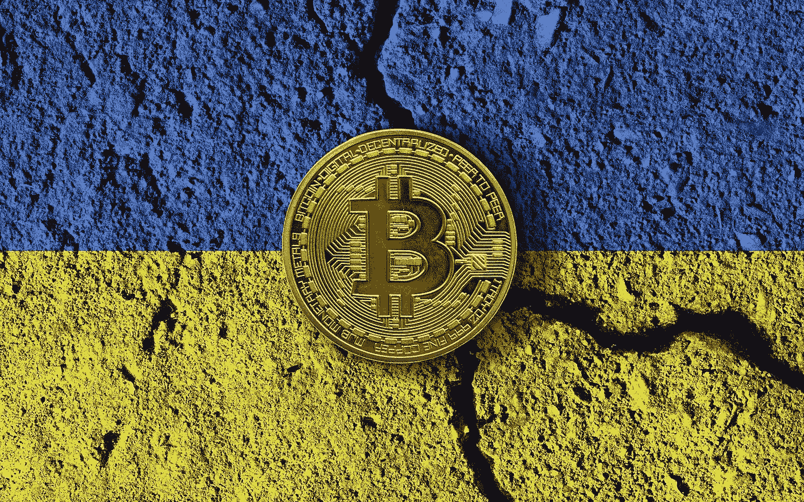

# 乌克兰人会把比特币储蓄存在 u 盘里吗？

> 原文：<https://medium.com/coinmonks/do-ukrainians-keep-their-bitcoin-savings-on-a-usb-stick-3d9731b2bbdb?source=collection_archive---------43----------------------->

乌克兰战事正酣。其直接结果是，一波又一波的乌克兰公民被迫背井离乡，带着最少的人逃离。比如比特币！

但这不是一个名叫 Fadey 的 20 岁乌克兰男孩所做的。年轻，但首先是加密货币的投资者，他有一个聪明的想法，带走了他 40%的存款…