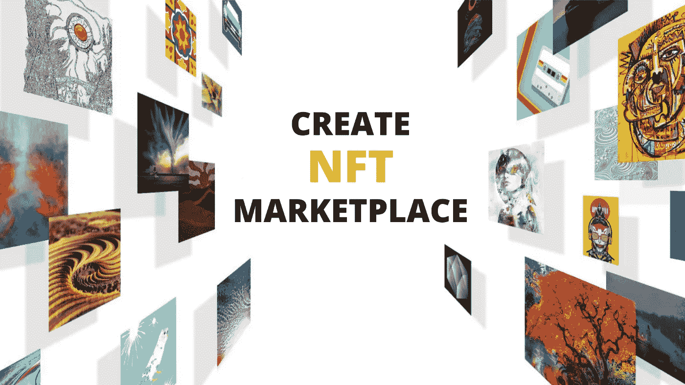

# 如果你创建自己的 NFT 市场，你有优势吗？

> 原文：<https://medium.com/coinmonks/do-you-have-the-advantages-if-your-create-your-own-nft-marketplace-8785f540cfc0?source=collection_archive---------29----------------------->

NFT 市场的唯一目的是为数字资产的所有者提供合适的价格。这个平台有助于在底层区块链上列出数字收藏品，包括索拉纳、以太坊、创、币安智能链等。

企业正在收购 NFT 市场改善服务，以保持市场竞争力。用户也可以通过在网站上创建一个帐户，并拥有一个数字钱包来携带他们的 NFT，从而创建自己的 NFT 市场。然后，用户可以上传他们的资产，展示给其他人进行交易。他们还可以决定接受哪种支付方式来出售他们的作品。

Photo Source on Google

尽管如此，个人去创造自己的 NFT 市场，因为它为他们提供了很多优势。他们在这里-

*   根据代币的独特性和价格价值，NFT 可以在不同的市场进行交易。
*   在不可替换的令牌交换时，它提供了无障碍传输。
*   提供了带有 NFT 令牌的所有权，不允许在分散平台中进行修改。
*   区块链集成提供了认证，加强了防止模仿的 NFTs。
*   NFT 允许用户在多个市场进行交易，并通过拍卖进行交易。
*   NFT 有能力跟踪资产所有者，而忽略第三方验证需求。
*   企业可以创造更高的投资回报率，并通过创建他们的 NFT 市场获得大量的客户群。
*   NFT 市场持续增长，维护成本低。

# 结论

如果你去发展你自己的 NFT 市场，这些是你将得到的一些优势。与任何其他加密业务相比，风险企业或个人将通过它获得更多的收入、可见性和用户密度。

NFT 和区块链很有可能在未来发展壮大。由于高价格和各种技术问题，早期不可能长期发展和维持 NFT 市场。

> 加入 Coinmonks [电报频道](https://t.me/coincodecap)和 [Youtube 频道](https://www.youtube.com/c/coinmonks/videos)了解加密交易和投资

# 另外，阅读

*   [7 大顶级副本交易平台](https://coincodecap.com/copy-trading-platforms) | [BuyCoins 审核](https://coincodecap.com/buycoins-review)
*   [MyConstant Review](https://coincodecap.com/myconstant-review) | [8 款最佳摇摆交易机器人](https://coincodecap.com/best-swing-trading-bots)
*   [Godex.io 审核](/coinmonks/godex-io-review-7366086519fb) | [邀请审核](/coinmonks/invity-review-70f3030c0502) | [BitForex 审核](https://coincodecap.com/bitforex-review)
*   [10 本关于加密的最佳书籍](https://coincodecap.com/best-crypto-books) | [英国 5 个最佳加密机器人](https://coincodecap.com/uk-trading-bots)
*   [ko only Review](https://coincodecap.com/koinly-review)|[Binaryx Review](https://coincodecap.com/binaryx-review)|[Hodlnaut vs CakeDefi](https://coincodecap.com/hodlnaut-vs-cakedefi-vs-celsius)