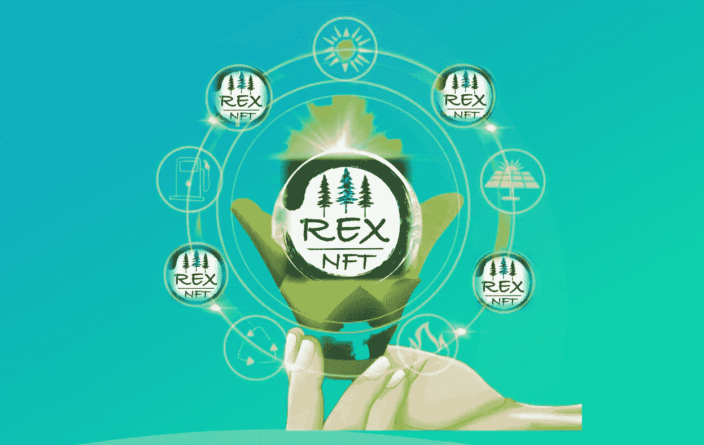

# 你知道雷克斯 NFT 是最好的可再生能源和生产平台吗

> 原文：<https://medium.com/coinmonks/do-you-know-rex-nft-is-the-best-renewable-energy-and-production-platform-c8f3ee82bebd?source=collection_archive---------40----------------------->

是的，它已被确认和信任！[雷克斯 NFT](https://www.rexcreditnft.io/) 是最好的可再生能源发电和生产，我也希望你能利用雷克斯 NFT 平台探索、受益和享受。在进一步向您介绍该平台的一些用途的同时，我将基本上清楚地了解该平台及其运营方式，其次是如何购买他们的一些本币，以及更多关于该企业的信息。敬请期待！

**雷克斯 What 是什么？**根据研究，每一个 NFT 代表 1000 千瓦时的可再生能源。雷克斯 NFT 通过多边形链部署，对用户有很多好处，例如:赌注和奖励选项。他们的一些本国货币将通过每周的时间框架发送给他们的代币持有者，作为空投到有雷克斯 NFT 代币的钱包的手段。你猜怎么着？
所有用户都可以通过[购买雷克斯 NFT 代币](https://opensea.io/collection/rexnft)参与空投

该视频将让您更清楚地了解该平台

**如何运作？**
雷克斯 NFT 是一个可再生能源信贷 [(REC)](https://www.rexcreditnft.io/) 也可以称为可再生能源证书是一种方式或模式，表明你对可再生能源的投资，购买 REC 不代表购买电力，也不代表减免电费。RECs 是直接资助将用于电网的可再生能源的门户，如果您购买了雷克斯 NFT，这表明您自动资助了清洁可再生能源的生产。REC 针对每兆瓦时 1 MWh，即 1000 千瓦时的可再生电力生成并发送到电网。这一过程减少了你和我的碳足迹，导致他们创造了一个以消费者为基础的市场，以 NFT 为特色。

作为用户的好处
1。每次执行[购买](https://www.rexcreditnft.io/)一辆雷克斯 NFT，你都是在直接资助绿色可再生能源的产生，这将让你毫无争议地免费接入他们的电网。
2。在每一个强大的持有人或持有[雷克斯 NFT](https://www.rexcreditnft.io/) 有权获得免费空投令牌提到的平台周刊。
3。减少 NFT 碳排放

如何购买雷克斯 NFT
访问这里[购买](https://opensea.io/collection/rexnft)后，资金与每个 NFT 的预设金额你的钱包。如需协助和帮助或咨询，您可以访问官方媒体平台，我将把它放在下面，以帮助您跟踪和监控您的 REX 令牌。

[网站](https://www.rexcreditnft.io/) | [电报](https://www.t.me/rexnft) | [推特](https://twitter.com/REXCreditNFT) | [不和](https://discord.gg/q3eupFKDQm) | [媒体](/@rexnft)|[insta gram](https://www.instagram.com/rexcreditnft/)|[Reddit](https://www.reddit.com/r/REXNFT/)|[用户:rig money](https://bitcointalk.org/index.php?action=profile;u=3380226)|[POA](https://bitcointalk.org/index.php?topic=5396335.msg60019138#msg60019138)# REX NFTs # REX # NFTs

> 加入 Coinmonks [电报频道](https://t.me/coincodecap)和 [Youtube 频道](https://www.youtube.com/c/coinmonks/videos)了解加密交易和投资

# 另外，阅读

*   最好的[加密税务软件](/coinmonks/best-crypto-tax-tool-for-my-money-72d4b430816b) | [硬币追踪评论](/coinmonks/cointracking-review-a-reliable-cryptocurrency-tax-software-5114e3eb5737)
*   [Stackedinvest 评论](https://coincodecap.com/stackedinvest-review) | [北海巨妖评论](/coinmonks/kraken-review-6165fc1056ac) | [bitFlyer 评论](https://coincodecap.com/bitflyer-review)
*   最佳[加密借贷平台](/coinmonks/top-5-crypto-lending-platforms-in-2020-that-you-need-to-know-a1b675cec3fa) | [杠杆令牌](/coinmonks/leveraged-token-3f5257808b22)
*   最佳[加密制图工具](/coinmonks/what-are-the-best-charting-platforms-for-cryptocurrency-trading-85aade584d80) | [最佳加密交易所](/coinmonks/crypto-exchange-dd2f9d6f3769)
*   [比斯勒评论](https://coincodecap.com/bitsler-review)|[WazirX vs coin switch vs coin dcx](https://coincodecap.com/wazirx-vs-coinswitch-vs-coindcx)
*   [7 大副本交易平台](https://coincodecap.com/copy-trading-platforms) | [BuyCoins 点评](https://coincodecap.com/buycoins-review)