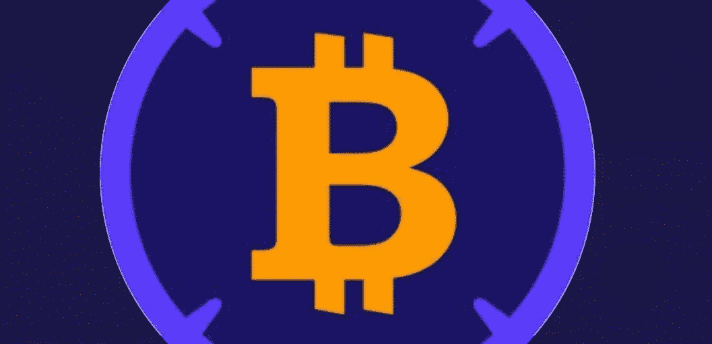
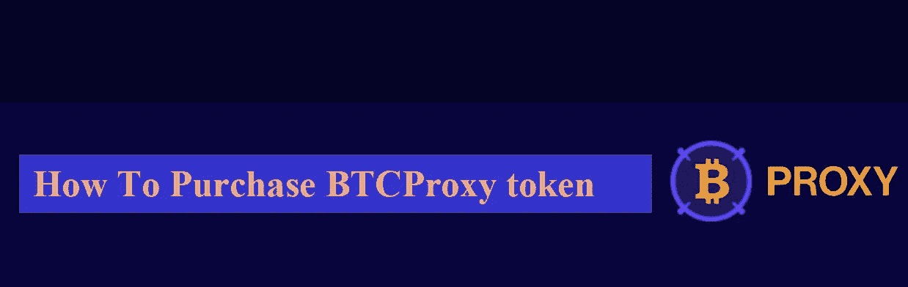

# 你知道 BTCProxy 用复利奖励赌注者，增加你在每个算法中的 PRXY 持有量吗？

> 原文：<https://medium.com/coinmonks/do-you-know-that-btcproxy-rewards-stakers-with-compounding-interest-that-increases-your-prxy-f0f658722f22?source=collection_archive---------51----------------------->

你知道 BTCProxy 用复利奖励赌注者，每种算法增加你的 PRXY 持股吗？是的，这是绝对正确的！我会仔细解释并指导你如何操作，如何在下注时赚钱，包括如何购买 PRXY 令牌，其功能以及为什么你需要成为一名密码爱好者或爱好者。

**什么是 BTCProxy**
BTCProxy 是一个加密货币升级平台，专为多机构目的而构建和设计，通过利用其生态系统上的代理中继，为以太坊主网或多边形链上的 BTC 分散式令牌化冒险提供稳定性。此外，它允许比特币的采纳者和所有者将比特币存入他们的平台，并在没有价格变化或任何担心丢失或被盗的第三方帮助的情况下转换成以太坊或多边形链，这可能通过 BTCProxy 生态系统实现。世界林业人员协会(Woodmen of the World)💋

**工作原理**
BTC 代理利用侧链将比特币交易的验证“依赖”于以太坊智能合约，进一步扩展了安排和操作，改进了包装令牌协议的设计。Prxy 依赖于它侧链和它的重要性，因为它实现了额外的开放性和直接性，且可以在交易后验证任何进入 BTC 地址的存款。为了清楚的解释[单击此处](https://docs.btcproxy.io/getting-started/how-it-works)，配置确认了任何 BTC 算法和进入 polygon mainnet 的交易都以非常单一的成本生产率进行，因此将 Polygon network 或以太坊智能合约上的交易转发给 mint 或以 BTCprxy 本地货币奖励。Prxy 中继可能需要大约 30 分钟才能完成一笔交易，但 BTC/Matic/ETH 确认可能会实时显示，以实现完全透明和实时的优势。[确认](https://docs.btcproxy.io/getting-started/how-it-works)不需要第三方。

**下注时如何赚取**
BTC proxy 奖励持有者在其生态系统中下注其 BTC/Matic/ETH。这些是一些**功能**，包括持有和赌注；
**报酬率 APY**
股权 BTC *投保:* 115%
股权 PRXY *复利:* 2000%
PRXY 国债 15 天:7%
BTCpx 国债 15 天:8.25%
1 .代理回报赌注者复利，增加你的 PRXY 持有每一个算法。
2。通过提供贴现价格为 PRXY 的流动性。你赚取收益，收入增加国库等。
3。流动性控制:购买流动性允许协议将其与 BTCpx 配对，并根据需要分配资源。
4。治理:来自其他各种社区的投票，包括核心开发人员、合作伙伴、令牌持有者和 DAO 成员。点击此处了解更多信息

如何购买 BTCProxy token
正如该团队所说，他们的目标是在 CEX 上市。在 CEX 上市将有助于增加它们的交易量和流动性，并吸引更多的兴趣。预计在 9 月下旬上市将有助于缓冲任何短期价格波动。关于如何从团队购买的更多问题[请点击此处](https://t.me/BTC_Proxy)

此外，我特别需要您访问该网站以获取更多信息和任何更新，包括如何与团队成员保持联系以获得资金和合作或进一步发展。

[网站](https://btcproxy.io/) | [白皮书](https://docs.btcproxy.io/getting-started) | [不和](https://discord.gg/JVHUbREbBU) | [电报](https://t.me/BTC_Proxy) | [推特](https://twitter.com/BTC_proxy)|[$ PRXY](https://twitter.com/search?q=%24PRXY&src=cashtag_click)[$ MATIC](https://twitter.com/search?q=%24MATIC&src=cashtag_click)# BTC

平台用户名: **Rigmoney**
本项目为悬赏而写的赞助文章。

由
霍普森·哈里森撰写

> 加入 Coinmonks [电报频道](https://t.me/coincodecap)和 [Youtube 频道](https://www.youtube.com/c/coinmonks/videos)了解加密交易和投资

# 另外，阅读

*   [3 商业评论](/coinmonks/3commas-review-an-excellent-crypto-trading-bot-2020-1313a58bec92) | [Pionex 评论](https://coincodecap.com/pionex-review-exchange-with-crypto-trading-bot) | [Coinrule 评论](/coinmonks/coinrule-review-2021-a-beginner-friendly-crypto-trading-bot-daf0504848ba)
*   [莱杰 vs n rave](/coinmonks/ledger-vs-ngrave-zero-7e40f0c1d694)|[莱杰 nano s vs x](/coinmonks/ledger-nano-s-vs-x-battery-hardware-price-storage-59a6663fe3b0) | [币安评论](/coinmonks/binance-review-ee10d3bf3b6e)
*   [Bybit Exchange 审查](/coinmonks/bybit-exchange-review-dbd570019b71) | [Bityard 审查](https://coincodecap.com/bityard-reivew) | [Jet-Bot 审查](https://coincodecap.com/jet-bot-review)
*   [3 commas vs crypto hopper](/coinmonks/3commas-vs-pionex-vs-cryptohopper-best-crypto-bot-6a98d2baa203)|[赚取加密利息](/coinmonks/earn-crypto-interest-b10b810fdda3)
*   最好的比特币[硬件钱包](/coinmonks/hardware-wallets-dfa1211730c6) | [BitBox02 回顾](/coinmonks/bitbox02-review-your-swiss-bitcoin-hardware-wallet-c36c88fff29)