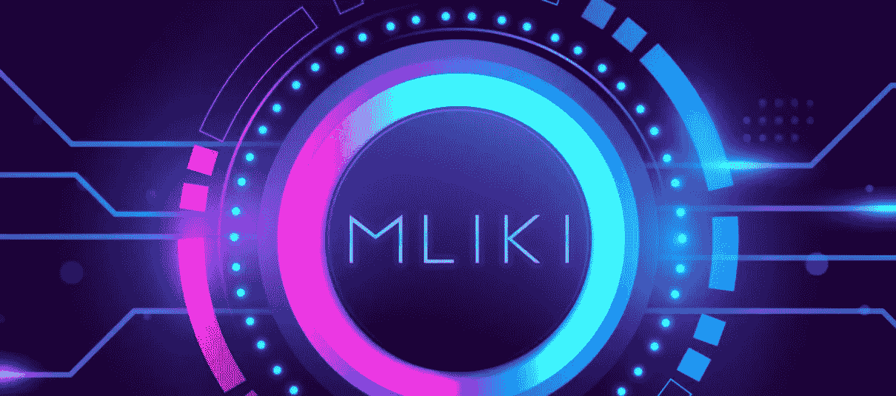
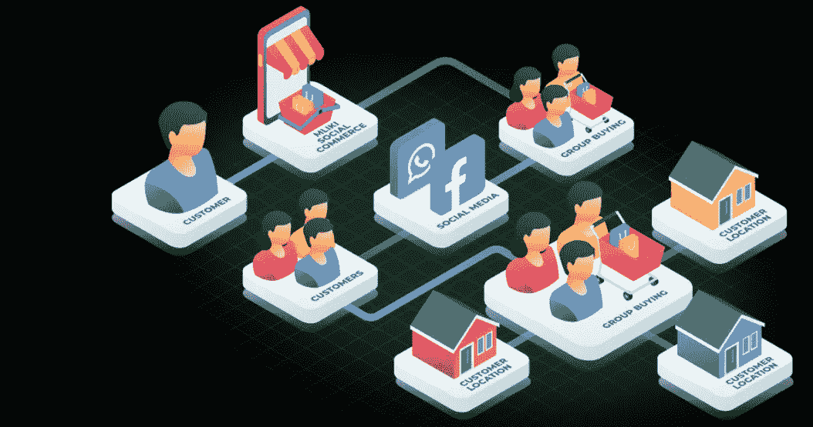
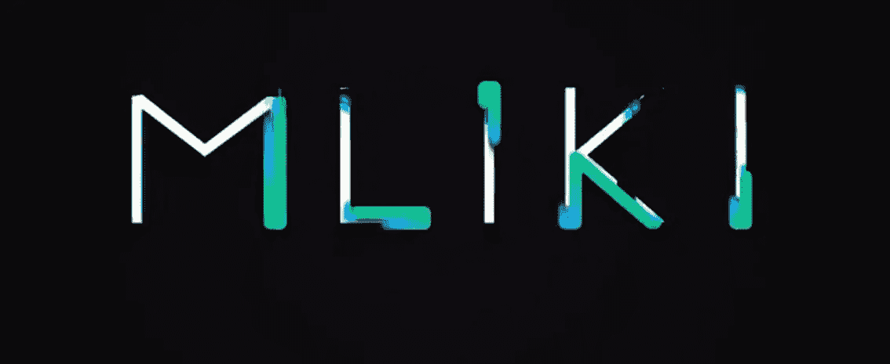

# 你知道你可以通过 MLIKI 生态系统购买、出售商品和实物并获得奖励吗？

> 原文：<https://medium.com/coinmonks/do-you-know-you-can-buy-sell-goods-and-physical-properties-and-receive-incentives-through-the-8136ab1a1584?source=collection_archive---------57----------------------->

是的，这绝对是真的！你可以通过 MLIKI 生态系统购买、出售商品和物理属性，并获得奖励，该生态系统呈现在由区块链技术支持的面向加密的平台上。众所周知，这是另一个有趣的平台，可以增加你作为一个密码爱好者的收入或回报，我总是想出一个有信誉的项目。但在继续之前，我将对该项目的一些简要介绍，这将使您对他们的操作、功能、使用案例以及如何购买本国货币(包括如何与项目所有者联系)有一个清晰的认识。

**什么是 MLIKI？
他们的目标是展示 hybrid，这是一个简单的购物中心或中心，个人可以不受任何限制地联系和执行他们的购买和销售目标，完全通过他们的生态系统构建和部署到币安智能链来提供动力。哇，太激动人心了吧？是的，它是！**

**它是如何运作的？众所周知，MLIKI 是一个集中和分散的市场，通过多边形网络进行配置。MLIKI marketplace 将弥合安全和安全性的差距，为买家和卖家提供一个混合市场，以互动和执行业务，而不会被诈骗或欺诈。您可以通过在钱包中持有 MLIKI token 获得奖励，这来自交易 MLIKI token 时发生的买卖的市场反映。**

**采用区块链技术增强安全性** 传统电子商务平台的绝大多数安全性和安全性都得到了缓解，因为区块链仍然是最安全的可用技术之一。除了用于 KYC 目的的电子邮件地址，他们不会要求您提供个人凭据。区块链常见的隐私功能保护你免受窥探。端到端加密使得数字项目更难被窃取。该平台和用户的端到端加密将黑客足迹降至最低，尤其是使用集成链技术。因此，网站上与账号和角色相关的黑客活动将会大幅减少。或者，由于该技术是开源和公开的，网络上或网络外的任何人都可以查看所有交易及其相关时间戳。在这方面，Mliki 一直在积极开展活动并追踪所有相关信息。

**便捷的支付选项** Mliki 支付系统和市场变得有效、高效并受到监管，以保证在其电子商务上购买的任何商品在适用的情况下都要支付相同的费用。无需担心价格的变化，因为它们已经在各地得到控制、监管和一致。任何拥有本国货币的人在每笔交易中都会被收取较低的费用，这是为了扩大他们的客户基础。

**奖励/多次购买** 在这方面，Mliki 平台将为个人提供更低的成本价，以便团队通过他们的平台购买和销售产品，这将使他们从这种交易中获得更低的成本和收益。Mliki venture 还提供推荐计划和忠诚度奖励，以在其生态系统和全球范围内推广他们的项目。这将使客户能够邀请他们的朋友和家人参加活动。

**MLIKI 使用案例**
原币
返现和代金券
附属计划
交易赚取
赌注
治理

**如何购买本国货币**
关于 tokensale 的信息将很快发布，您可以加入他们的[电报组](https://t.me/mlikitokenid)与项目业主取得更多联系。
推荐钱包有；MEW，MetaMask，信任钱包。

**代币信息** 代币名称:MLIKI
代币符号:MLIKI
代币最大供应量:1，000，000，000
代币小数:18
代币合约:0x 59d 97d 6 b4e 706702 da 274 CEE 79 CD 893 b 5 DEA 6606
买卖税:6%

太棒了，对吧？是的，现在我希望您访问该网站了解更多详细信息和更新，包括如何与团队成员保持联系以获得资金和合作。

[网站](https://mliki.com/) | [白皮书](https://mliki.gitbook.io/mliki-whitepaper-v1.0.0/) | [电报](https://t.me/mlikitokenid) | [推特](https://twitter.com/Mliki_id) | [POA](https://bitcointalk.org/index.php?topic=5390629.msg59595737#msg59595737) |用户:[rig money](https://bitcointalk.org/index.php?action=profile;u=3380226)
@ 0x polygon @ Mliki _ id*$*Mliki*#*商务 *#* NFT *#* 投资 *#*

> 加入 Coinmonks [电报频道](https://t.me/coincodecap)和 [Youtube 频道](https://www.youtube.com/c/coinmonks/videos)了解加密交易和投资

# 另外，阅读

*   [如何在 CoinDCX 上购买柴犬(SHIB)币？](https://coincodecap.com/buy-shiba-coindcx)
*   [CBET 回顾](https://coincodecap.com/cbet-casino-review) | [库币 vs 比特币基地](https://coincodecap.com/kucoin-vs-coinbase) | [拜比特 vs 比特币基地](https://coincodecap.com/bybit-vs-coinbase)
*   [折叠 App 回顾](https://coincodecap.com/fold-app-review) | [本地比特币回顾](/coinmonks/localbitcoins-review-6cc001c6ed56) | [Bybit vs 币安](https://coincodecap.com/bybit-binance-moonxbt)
*   [加密保证金交易交易所](/coinmonks/crypto-margin-trading-exchanges-428b1f7ad108) | [赚取比特币](/coinmonks/earn-bitcoin-6e8bd3c592d9) | [Mudrex 投资](https://coincodecap.com/mudrex-invest-review-the-best-way-to-invest-in-crypto)
*   [WazirX vs CoinDCX vs bit bns](/coinmonks/wazirx-vs-coindcx-vs-bitbns-149f4f19a2f1)|[block fi vs coin loan vs Nexo](/coinmonks/blockfi-vs-coinloan-vs-nexo-cb624635230d)
*   [比斯勒评论](https://coincodecap.com/bitsler-review)|[WazirX vs coin switch vs coin dcx](https://coincodecap.com/wazirx-vs-coinswitch-vs-coindcx)