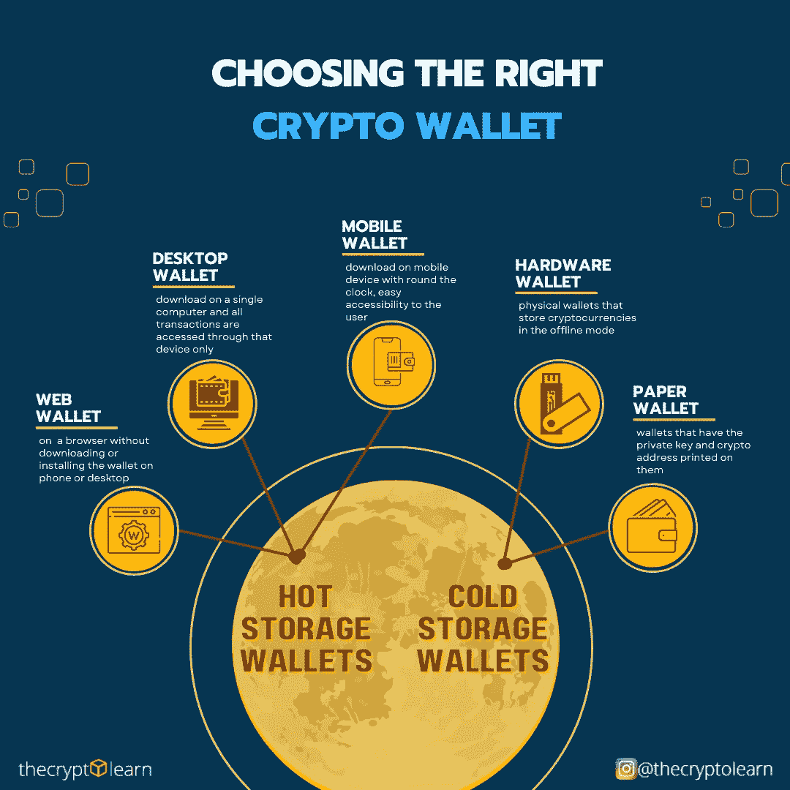

# 你有加密钱包吗？选择一个符合你需要的

> 原文：<https://medium.com/coinmonks/do-you-own-a-crypto-wallet-choose-one-that-fit-your-needs-8d01c2f69739?source=collection_archive---------25----------------------->

# 什么是加密钱包？

加密钱包是允许你与你的区块链帐户互动的软件程序。把它想象成一个类似于互联网银行的应用程序，但是没有银行。您可以使用钱包来查看余额、发送交易和连接应用程序。

要汇款和管理加密货币，你需要一个钱包。

你的钱包只是你区块链账户的一个管理工具。这意味着你可以随时更换钱包提供商。许多钱包还允许你从一个应用程序管理多个账户。

这是因为钱包没有保管你的资金的权利，这些资金基本上都在区块链上；你知道。它们只是管理真正属于你的东西的工具。

因此，钱包是:

*   **一款管理你的资金的应用**:你可以通过你的钱包发送和接收钱，它还会显示你的余额和交易历史。
*   **您区块链账户的访问点**:您的钱包是您账户所有功能的入口，包括您的余额和交易历史。但在任何时候，你都可以更换钱包提供商。
*   **区块链上应用程序的登录点**:你可以使用你的账户通过你的钱包连接到任何分散的应用程序。它的功能类似于 dApps 的通用登录。

# 钱包关键术语

首先，您需要了解与加密钱包相关的基本关键术语:

*   钱包:一个可以让你管理账户的产品，比如，查看账户余额，发送交易等等。
*   **加密货币账户**:允许用户发送交易并有余额的实体
*   **公钥**:类似于银行账号，可以与任何人共享接收资金。从技术上讲，它是一大串字母数字密码，使用户只能接收消息、硬币和代币，并用于加密数据。公钥用于在数据通过互联网发送之前对其进行安全加密。
*   **私钥**:类似于 PIN 或验证码。你不应该和任何人分享它。它也是一个大的字母数字代码，用于认证和解密。如果您丢失了私钥，您将无法访问您的加密钱包。

*比特币上的私钥示例:e 9873d 79 c 6d 87 DC 0 FB 6a 5778633389 f 4453213303 da 612 f 20 BD 67 fc 233 aa 33262*

*   **钱包地址**:这是一组随机生成的数字和字母，您可以分享这些数字和字母来接收资金。公钥生成一个钱包地址，它基本上是公钥的简化版本，以便于使用。地址就像有电子邮件地址的收件箱。您可以使用该地址发送和接收资金。

*钱包地址示例:3 fzbgi 29 cpjq 2 gjdwv 8 eyhujjnkltktzc 5*

*   **种子短语**:种子短语或种子恢复短语或备份种子短语是由加密钱包生成的 12 到 24 个可读字的序列，用于访问链上资金。这是您的加密钱包的主密码。只要您有一个种子短语，您就可以访问钱包中的所有资金。如果您丢失了钱包，种子短语将帮助您找回钱包。

*种子短语的一个例子是:女巫崩练馈羞开绝望溪路再冰最少*

> 作为用户，您只对钱包地址和种子短语感兴趣。钱包提供商处理所有其他事情。

# 之前你需要知道的:

有许多基于需求的免费区块链钱包可用于所有流行的设备和操作系统。例如，你可以在电脑上安装一个只用于在线支付的钱包，或者在移动设备上安装一个日常使用的应用程序。无论如何，挑选一个钱包很简单，只需要几分钟，但是要找到适合你需要的钱包，问问你自己以下的问题。

## 1.你将如何使用钱包？

在挑选钱包之前，你应该考虑如何使用它:

*   是需要钱包进行常规购买，还是可以只购买加密货币并作为投资持有？
*   你想要使用多种货币还是只使用一种？
*   您需要能够在任何地方访问您的数字钱包，还是只在家里？

## 2.有哪些不同类型的加密钱包？

有各种类型的加密钱包，如下所示:

**手机钱包的好处:**

*   便携方便；面对面交易时的理想选择
*   旨在使用二维码进行快速无缝的交易

**手机钱包弊端:**

*   App marketplaces 可能会删除钱包，使其难以接收未来的更新
*   设备损坏或丢失可能会导致资金损失

**桌面钱包的好处:**

*   环境使用户能够完全控制资金
*   一些桌面钱包提供硬件钱包支持，或者可以作为完整节点运行

**桌面钱包缺点:**

*   进行交易时难以使用 QR 码
*   容易被窃取恶意软件/间谍软件/病毒

**硬件钱包的优势:**

*   储存资金最安全的方法之一
*   非常适合存储大量代币

**硬件钱包缺点:**

*   移动时难以使用；不是为扫描二维码而设计的
*   丢失设备而没有适当的备份会使资金无法收回

## 3.不同的加密货币需要不同的钱包吗？

从技术上讲，每种加密货币都需要不同的钱包。例如，BTC 有比特币钱包，ETH 有以太坊钱包，ATOM 有宇宙钱包。你不能在比特币钱包中存储 ETH，反之亦然。但是您可以在以太坊钱包上存储多边形(自动)令牌，因为它与以太坊区块链兼容。然而，也有多资产钱包，如 Exodus 或 Ledger，它们提供了在一个设备或软件上拥有许多不同钱包的能力。通过币安或比特币基地等交易所的钱包，它们也是多资产钱包，但钱包属于交易所，而不属于用户，因为你不拥有钥匙。

## 4.你需要什么样的钱包？

您可能需要一个钱包来执行各种操作:

*   **用卡购买密码**
*   **探索 dApps** :连接区块链 dApps
*   **访问 DeFi** :直接从你的钱包里借钱、贷款并赚取利息
*   **提取到银行**:直接提取现金到您的银行账户，无需通过兑换
*   **大量采购**
*   **分散代币交换**:直接从你的钱包里交易加密代币
*   **多签名账户**:授权特定交易的多个账户

## 5.哪些标准对你来说很重要？

您需要定义哪些标准对您选择钱包更重要:

*   **控制**:一些钱包让你完全控制你的加密货币。这意味着没有第三方可以冻结或拿走你的资金。
*   **透明性**:一些钱包是开源的，这确保了代码没有被篡改
*   隐私:一些钱包通过改变地址来增加监视你交易的难度。
*   **验证**:一些钱包有能力作为一个完整的节点来操作。这意味着在处理交易时不需要信任第三方。
*   **环境**:一些钱包可以加载到易受恶意软件攻击的电脑上。
*   费用:一些钱包让你在交易前完全控制支付给网络的费用

# 哪个钱包最适合你？

你对钱包的选择取决于你拥有的多种货币以及你希望如何组织它们。

你可以保持几个加密货币钱包活跃，要么持有各种货币或几个相同的硬币。您可以使用多种加密货币钱包中的一种，或者拥有许多数字钱包，以便在一个位置保存所有替代货币。

有些人可能会发现，有很多钱包是管理他们的钱和增加安全性的一个聪明的方法。但是，如果它们都保存在不同的位置，可能很难管理。

最好是让大量的加密货币完全离线，如果你确实需要硬币来日常消费或工作，那么在网上以更小和更安全的数量使用它们。

找到最适合你的策略！

**另外，看看这些:**

*   Bitcoin.org 的[为你提供选择，通过简单的步骤找到满足你需求的比特币钱包。](https://bitcoin.org/en/choose-your-wallet)
*   Ethereum.org 的[还提供了根据你想要的功能搜索和寻找钱包的选项。](https://ethereum.org/en/wallets/find-wallet/)
*   观看下面的视频，了解有关“什么是加密钱包”的更多详细信息:

使用 Ledger 保护您的加密——使用我的[推荐链接](https://shop.ledger.com/?r=66d5ba17d771)让您高枕无忧！

准备好展示你对加密的热爱了吗？访问我们的[在线商店](https://store.thecryptolearn.com/)获取最新最棒的加密主题商品。今天就来看看我们的系列吧！

> 加入 Coinmonks [电报频道](https://t.me/coincodecap)和 [Youtube 频道](https://www.youtube.com/c/coinmonks/videos)了解加密交易和投资

# 另外，阅读

*   [比斯勒评论](https://coincodecap.com/bitsler-review)|[WazirX vs coin switch vs coin dcx](https://coincodecap.com/wazirx-vs-coinswitch-vs-coindcx)
*   [7 大副本交易平台](https://coincodecap.com/copy-trading-platforms) | [BuyCoins 点评](https://coincodecap.com/buycoins-review)
*   《XT.COM 评论》的[《币安评论》的](https://coincodecap.com/profittradingapp-for-binance)|
*   [SmithBot 评论](https://coincodecap.com/smithbot-review) | [4 款最佳免费开源交易机器人](https://coincodecap.com/free-open-source-trading-bots)
*   [杠杆代币](/coinmonks/leveraged-token-3f5257808b22) | [最佳密码交易所](/coinmonks/crypto-exchange-dd2f9d6f3769) | [Paxful 点评](/coinmonks/paxful-review-4daf2354ab70)
*   [加密套利](/coinmonks/crypto-arbitrage-guide-how-to-make-money-as-a-beginner-62bfe5c868f6)指南| [如何做空比特币](/coinmonks/how-to-short-bitcoin-568a2d0b4ae5)