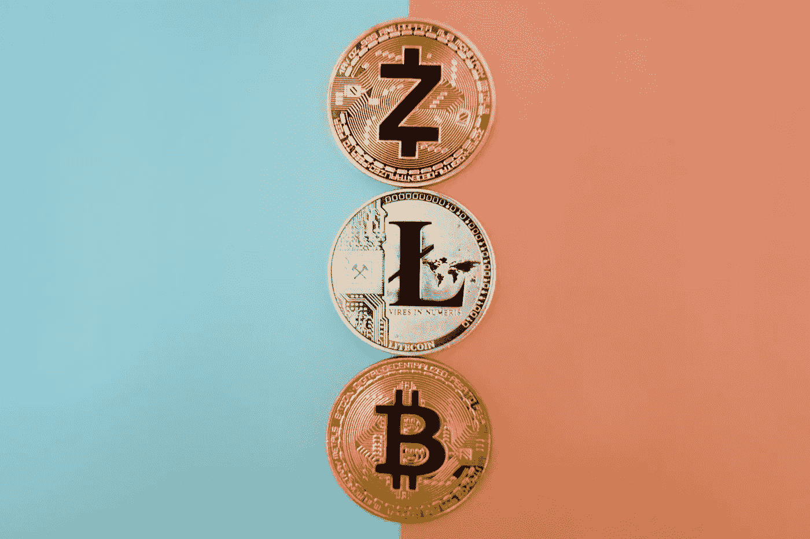

# 你有加密货币吗？葡萄柚愿意为 15-30 分钟的通话支付 45 美元。

> 原文：<https://medium.com/coinmonks/do-you-own-any-cryptocurrency-4d287ca51adb?source=collection_archive---------64----------------------->

有人有兴趣在葡萄柚上赚钱吗！

您不仅可以通过参与调查获得更多奖励，还可以参与我们的跟进电话。这些通常持续 15 到 30 分钟，您将被要求讨论调查的主题！

除非您同意，否则我们不会共享您的个人信息/身份，我们会对所有讨论内容保密。

你有加密货币吗？您可以与我们通话，用 15-30 分钟的时间赢取 **$45** ！

联系我们在 support@grape-data.com 和使用我的参考电子邮件 crispcormac@gmail.com。

> 加入 Coinmonks [电报频道](https://t.me/coincodecap)和 [Youtube 频道](https://www.youtube.com/c/coinmonks/videos)了解加密交易和投资

# 另外，阅读

*   [如何在 FTX 交易所交易期货](https://coincodecap.com/ftx-futures-trading) | [OKEx vs 币安](https://coincodecap.com/okex-vs-binance)
*   [OKEx vs KuCoin](https://coincodecap.com/okex-kucoin) | [摄氏替代品](https://coincodecap.com/celsius-alternatives) | [如何购买 VeChain](https://coincodecap.com/buy-vechain)
*   [ProfitFarmers 点评](https://coincodecap.com/profitfarmers-review) | [如何使用 Cornix Trading Bot](https://coincodecap.com/cornix-trading-bot)
*   [如何匿名购买比特币](https://coincodecap.com/buy-bitcoin-anonymously) | [比特币现金钱包](https://coincodecap.com/bitcoin-cash-wallets)
*   [瓦济里克斯 NFT 评论](https://coincodecap.com/wazirx-nft-review)|[Bitsgap vs Pionex](https://coincodecap.com/bitsgap-vs-pionex)|[Tangem 评论](https://coincodecap.com/tangem-wallet-review)
*   [如何使用 Solidity 在以太坊上创建 DApp？](https://coincodecap.com/create-a-dapp-on-ethereum-using-solidity)