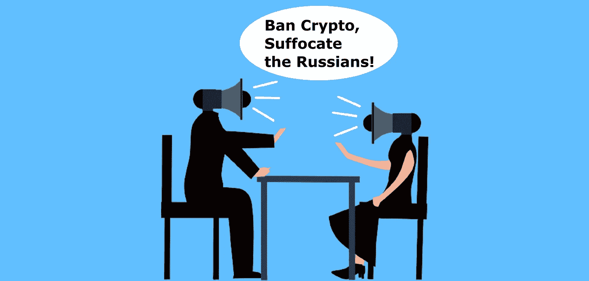

# 你真的认为密码是普京的终极游戏吗？—真可笑！

> 原文：<https://medium.com/coinmonks/do-you-seriously-think-crypto-is-putins-end-game-how-ridiculous-b371250b2ebc?source=collection_archive---------76----------------------->

Source: Author

有人会想出像朝鲜用加密技术资助核计划这样疯狂的事情吗？

一定是氦元素，对吧？只是这次抽的是 BBC 记者。

我没开玩笑。BBC 居然在 2 月 6 日写了这样一篇文章，归功于联合国的调查结果。