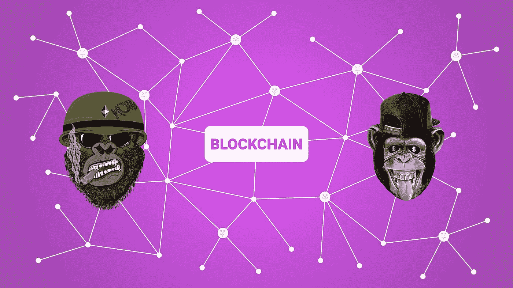

# 你了解 NFTs 吗？

> 原文：<https://medium.com/coinmonks/do-you-understand-nfts-856cd9b5d60b?source=collection_archive---------26----------------------->

如果你不在这里阅读。

NFTs in blockchain by Chetraruc on Pixabay

2020 年至 2021 年间，体育产业损失了约 180 亿美元。当然，这是球迷参与体育直播中断的后果。这也是疫情带来的。但是我们知道挑战创造机遇。因此，大约在同一时期，我们记录了高达 15 亿美元的 NFTs 交易。这可能比不上损失，但值得关注。

你可能听说过[NFT(](https://derbymatoma.com/2021/11/15/derbymatoma-com-nfts/)不可替代代币)及其独特性。但是，除了 NFTs 还有别的吗？

我会说是的。

看， [NFTs](https://derbymatoma.com/2021/11/15/derbymatoma-com-nfts/) 主要是恢复和维系粉丝和创作者之间失去的联系。对我来说，这就像拥有我最喜欢的一级方程式车手马克斯·维斯塔潘的签名照片。

我可以确定两件事，我可能是唯一一个有这张照片的人。第二，也许马克斯知道这张照片，潜意识里在马克斯和我之间创造了一种联系的印象。尽管这一切可能完全不真实，但它仍然在向我兜售梦想方面起了很大作用；别叫醒我。

Apes by Sayyid98 on Pixabay

# 拯救艺术家。

多年来，艺术家一直被大公司所欺骗。另一方面，盗版抢走了他们的作品。例如，在过去，电枢会试图复制著名画家的艺术作品；幸运的是，你可以区分赝品和原作。

但是，在这个数字世界中，“ *command + c 和 command+v”*使得无法区分原始数据和复制数据。数码产品可以复制粘贴；重复这个过程将会创建大量相同数据的文件夹。最终破坏了其独特性和价值，尤其是在数字艺术的情况下

NFT 在某种程度上是艺术产业的救星。对于大多数试图收支平衡的艺术家来说，这个行业的回报一直在减少。这是通过恢复唯一性来实现的。

非关税壁垒是在区块链上发行的。区块链指定资产的所有权是不变的。更确切地说，与存储在区块链中的单个数据文件相关联的数字支持就是我们所说的 NFT。

媒体文件通过一个称为“制作”的过程转换为 NFT。这发生在以太坊区块链平台上，如 opensea.io 和 mintable，其中 NFT 被写入适用的区块链数据库。媒体文件可以是. jpg，png，mp3，mp4，MOV，你能想到的。任何你拥有版权的数字文件都可以被制作。

是的，一些来自亚洲的家伙通过自拍赚了数千美元。毕竟，这家伙不是布拉德皮特我属于一个魅力杂志的类型，可笑，对不对？

# 非母语教学中的价值问题

GaryVee explaining NFTs on Youtube

NFTs 的价值并不简单。你看，我们通常给有内在价值的东西赋值。我的意思是，当你拿着智能手机时，很容易理解铂金的价值，或者当你的脚踩在汽车的油门上时，很容易理解汽油的价值。

那么问题就变成了，NFTs 是怎么回事？

大多数非功能性食物没有与其价格相符的功能价值。

但这也打开了我们不必要购买的潘多拉魔盒。比如古驰滑梯和路易威登手袋。

给我们一个快速的答案，也许吹牛的权利是 NFT 存在的一些主要原因。

记住，NFT 是粉丝和艺术家之间的分散媒介。如果你想起来了，我们喜欢吹嘘我们和名人的关系。NFT 是确认我们与超级明星关系的最接近的数字签名。这听起来可能很愚蠢，但请记住，我们并不像自己想象的那样理性。

# 功能价值 NFTs

另一方面，还有具有功能价值的代币。我更喜欢给这样的 NFTs 实用令牌配音。因为他们可以做一些事情。

典型的例子是游戏功能；一些 NFT 允许持有者访问游戏关卡、附件和工具。

堡垒之夜允许其用户购买服装、舞蹈动作和枪支定制。现在，把服装想象成 NFTs。每套服装都是独一无二的，这意味着购买这套服装的玩家实际上拥有这套服装，并可以转售获利。

这已经在许多平台上实现了，但是还有更多的平台。品牌可以出售给持有者独家优惠的 NFT。音乐乐队和运动队可以通过 NFTs 为粉丝提供对组织关键决策的投票权。这个想法是给那些全心全意支持自己球队的球迷一些特权。

公用事业 NFTs 扩展到房地产和物流智能合同等领域。但这是另一天的讨论。

如果 NFT 要经受住时间的考验，实用令牌将最有可能脱颖而出。

# 收藏品 NFTs

https://www.youtube.com/watch?v=4se4_ZqkcKw&t = 1469s

除了实用代币，我们还有收藏品。他们的价值结构模仿棒球卡。这都是以稀缺性和交易为前提的。

它们通常包括伟大的艺术作品或令人瞠目结舌的体育视频表演。这些是你的密码猫，5 000 天由 Beeple 和 NBA 顶级投篮。

这个类别包含了大量平庸的艺术作品。那是因为造图的门槛太低了。只要有版权，任何人都可以从几乎任何东西制作收藏品。

相反，尽管收藏品在技术上看起来很糟糕，但它们在单个代币上的销售价值最高。一幅引人入胜的作品是迈克尔·温克尔曼的《5 000 天》,它以破纪录的 6900 万英镑售出。也许有些收藏品值得收藏。

# NFTs 的主要优势

非功能性测试有其缺点，因为它们和任何区块链产品一样仍处于早期开发阶段。但是让我们看看它们在未来可能意味着什么。

1.  减轻品牌融资的负担

公司可以发行代币来扩大他们的项目。事实上，这对于品牌和客户来说都是一个双赢的局面，因为发行的代币是公用代币。

目前，企业必须与投资者联系以获得资金。这可能是一个艰苦的平静的过程。令牌可能会逐渐绕过这个耗时的过程。

1.  为创作者创造可持续的收入来源

NFT 带有智能合同，其中可能包含指定给令牌原始创建者的版税百分比。这样，艺术家就可以从 NFTs 的后续销售中获益。

在我看来，这是革命性的。在一个大公司付给艺术家的报酬如此之少，而他们的作品却卖得如此之高的世界里，创作者相对来说是因为他们的汗水而得到回报的。

# 交易 NFT

非金融交易最吸引人的地方在于，它们可以通过交易获利。截至 2021 年底，市场参与者共实现利润 210 亿美元。此外，根据 nonfungible.com 的数据，买家数量从 75 000 人激增至 210 万人。

像任何商品一样，交易 NFTs 指的是买卖媒体文件。技术上来说，你是在买卖 jpegs。然而，这些 jpegs 是在区块链铸造的。这样，媒体文件包含了不可改变的所有权历史和可以在其上构建的特殊程序。

收藏品是目前主导市场的东西。创造它们是一件设计艺术品和铸造艺术品的事情。如果你的艺术技能几乎为零，你可以在 fiver 上外包这部分。至于铸造，没有特殊的技能要求。这是一个口袋足够深的问题，以维持汽油费。

# 常用技术术语

对于要在区块链中记录的交易，计算工作需要付费。测量这个功的单位叫做气体。所需的最低气体量约为 21 000 单位。这就是 21K 气体极限这个术语的由来。然而，你可以选择你愿意为每 21 000 单位支付多少钱；你想要的是你的汽油价格。较高的汽油价格意味着您的交易将执行得更快，因此您为紧急交易分配较高的汽油价格。

所以你的气费是气限和气价的乘积(气限(21K) x 气价)

实际上，你需要支付更多的费用，包括与你用来交易非功能性交易的平台相关的费用；例如，opensea.io 占其平台上所有交易的 2.5%。

在做任何愚蠢的决定之前被警告；它们是 NFT 市场上的掠夺行为。如果说有什么不同的话，那就是密码产业已经被滥用成了所有邪恶活动的中心。所以你应该小心。

收藏品的价值是非常投机和不理性的。

我刚刚读了一个故事，一个人以 250 万美元买了一幅 NFT，然后试图以 3500 万美元卖出。结果得到了 3500 美元的最高出价。我的朋友这叫做损失；我希望那不是他奶奶一生的积蓄。

## 来源

 [## 报告称，2021 年，非金融交易飙升 21，000%，超过 170 亿美元

### 根据 NFT 数据公司的一份新报告，2021 年，不可伪造代币的销售额跃升至 170 多亿美元

www.cnbc.com](https://www.cnbc.com/2022/03/10/trading-in-nfts-spiked-21000percent-to-top-17-billion-in-2021-report.html) 

收养自 derbymatoma.com 和 youthvisionoverload.com

> 加入 Coinmonks [电报频道](https://t.me/coincodecap)和 [Youtube 频道](https://www.youtube.com/c/coinmonks/videos)了解加密交易和投资

# 另外，阅读

*   [Bookmap 点评](https://coincodecap.com/bookmap-review-2021-best-trading-software) | [美国 5 大最佳加密交易所](https://coincodecap.com/crypto-exchange-usa)
*   最佳加密[硬件钱包](/coinmonks/hardware-wallets-dfa1211730c6) | [Bitbns 评论](/coinmonks/bitbns-review-38256a07e161)
*   [新加坡十大最佳加密交易所](https://coincodecap.com/crypto-exchange-in-singapore) | [购买 AXS](https://coincodecap.com/buy-axs-token)
*   [红狗赌场评论](https://coincodecap.com/red-dog-casino-review) | [Swyftx 评论](https://coincodecap.com/swyftx-review) | [CoinGate 评论](https://coincodecap.com/coingate-review)
*   [投资印度的最佳密码](https://coincodecap.com/best-crypto-to-invest-in-india-in-2021)|[WazirX P2P](https://coincodecap.com/wazirx-p2p)|[Hi Dollar Review](https://coincodecap.com/hi-dollar-review)