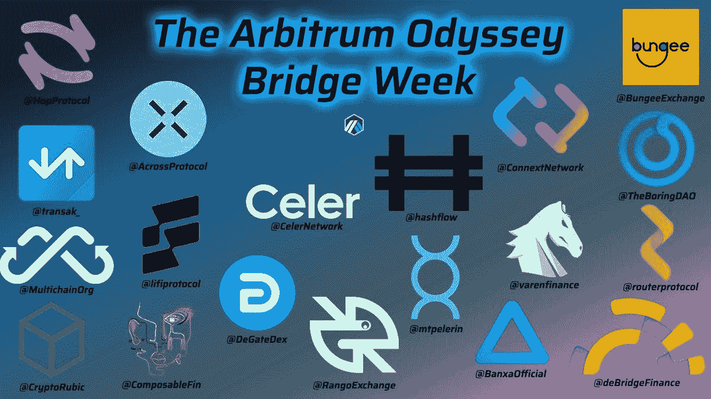
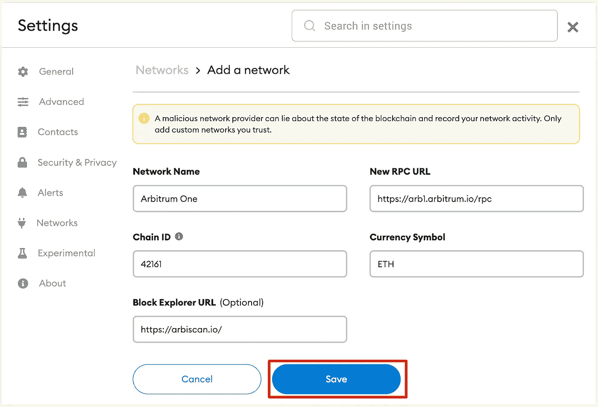
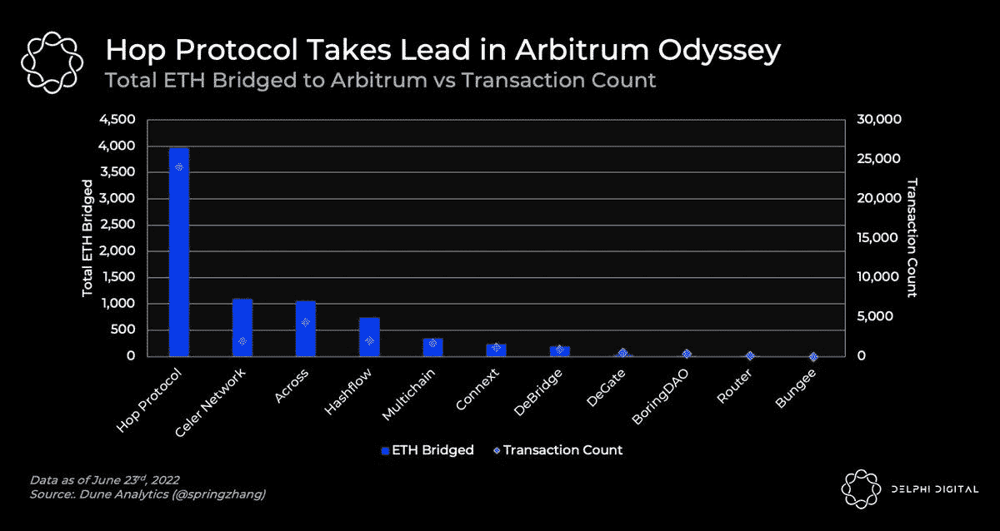

# 记录我的 Arbitrum Odyssey 之旅(第一部分)

> 原文：<https://medium.com/coinmonks/documenting-my-journey-into-arbitrum-odyssey-part-1-e90b3f764e35?source=collection_archive---------16----------------------->

如果你还没听说过，Arbitrum 是一个 L2 乐观的以太坊扩展解决方案。目前，它是最大的乐观汇总解决方案，有 90 多个协议，锁定的总价值超过[【8 亿美元(TVL)](https://defillama.com/chain/Arbitrum) 。

区块链最近宣布了一个与 Ratwell、Sugoi 和 Project Galaxy 合作的名为 [Arbitrum Odyssey](https://twitter.com/arbitrum/status/1539292126105706496) 的项目。这是一个长达 8 周的旅程，探索 Arbitrum 的生态系统，并获得由秘密知名艺术家 Ratwell 和 Sugoi 独家设计的免费 NFT 奖励。在第一周之后，每周 2 个项目，持续 7 周，将要求用户执行与他们的协议相关的链上活动。任何人只要收集到 15 个 NFT 中的至少 12 个，就可以获得由 Ratwell 和 Sugoi 设计的最独特的 NFT。

所以…我决定在这次熊市中踏上旅程，教育自己，尝试我曾经不愿意尝试的事情。每周，我将记录我的旅程和我完成的任务，所以让我们加油吧。

**第一周**

对于将于美国东部时间 2359 年 6 月 27 日结束的第一项任务，您将需要使用下图所示的桥或平面入口至少一次将 ETH 桥接到 Arbitrum 网络。

Source: Arbitrum

首先，您需要将 Arbitrum 添加到 Metamask 中。

Source: Binance Academy

单击 Metamask 中的 add network，并使用上面提供的信息填写详细信息。一旦完成，你就可以成功地与区块链仲裁者互动。

现在进入第一周最激动人心的任务:搭桥。

就我个人而言，我以前从未在区块链桥接过任何资产，因为我听说过导致数百万损失的桥接黑客攻击。所以我决定用我的 100 美元以下的 metamask 钱包来试试这些桥。我保证下次朋友会更有冒险精神:')

所以，我决定尝试两种桥接方案:[跳协议](https://twitter.com/HopProtocol)和 [Hashflow](https://twitter.com/hashflow) 。

跳协议是一个可扩展的网桥，允许令牌以安全和不可信的方式跨汇总及其共享的 L1 网络传输。

Hashflow 是一个 defi 交易平台，具有无桥跨链互换功能，可以实现无滑动的本地到本地互换。

Hop 协议目前**在桥接到 Arbitrum 的 ETH 值和事务计数方面处于领先地位。**

**额外 NFT:** 如果您使用的协议桥接的以太网数量最多，您将在以后收到额外的 NFT。

目前，桥接至 Arbitrum 的 ETH 价值最高的 5 个协议是:

1.  **跳协议**
2.  Celer 网络
3.  穿过
4.  哈希流
5.  多链

Source: Delphi Digital

所以我想说，使用 Hop 和 Hashflow 连接到 Arbitrum 的桥梁是无缝的，我真的很喜欢这种体验。

使用 Hop 桥接至 Arbitrum:

1.  参观 https://app.hop.exchange/#/send?token=ETH 的
2.  然后连接您的 metamask 钱包，并选择您要传输以太网的网络(以太坊主网)。确保你的元掩码在这个阶段使用以太坊主网。
3.  选择您希望接收 ETH 的网络。(仲裁网络)
4.  确保你有足够的钱支付油费。
5.  批准 metamask 中的交易，然后就大功告成了！

对于 Hashflow 也可以说是类似的过程。点击这里访问他们的网站[。](https://app.hashflow.com/)

一旦完成，只需等待一周结束，你就可以在银河计划上领取你的 NFTs [了。在银河计划中，不要忘记连接你的元掩码并切换到 Arbitrum 网络。](https://galaxy.eco/arbitrum/)

今天就到这里，让我们一起享受旅程吧！:D

> 加入 Coinmonks [电报频道](https://t.me/coincodecap)和 [Youtube 频道](https://www.youtube.com/c/coinmonks/videos)了解加密交易和投资

# 另外，阅读

*   [最佳以太坊钱包](https://coincodecap.com/best-ethereum-wallets) | [电报上的加密货币机器人](https://coincodecap.com/telegram-crypto-bots)
*   [交易杠杆代币的最佳交易所](https://coincodecap.com/leveraged-token-exchanges) | [购买 Floki](https://coincodecap.com/buy-floki-inu-token)
*   [3Commas 对 Pionex 对 Cryptohopper](https://coincodecap.com/3commas-vs-pionex-vs-cryptohopper) | [Bingbon 评论](https://coincodecap.com/bingbon-review)
*   [加密复制交易平台](/coinmonks/top-10-crypto-copy-trading-platforms-for-beginners-d0c37c7d698c) | [如何在 WazirX 上购买比特币](/coinmonks/buy-bitcoin-on-wazirx-2d12b7989af1)
*   [CoinLoan 评论](https://coincodecap.com/coinloan-review)|【Crypto.com 评论】T2