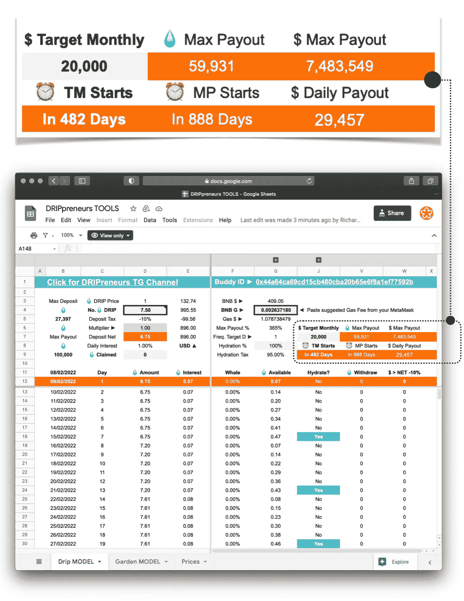

# 避免脱水

> 原文：<https://medium.com/coinmonks/dodging-dehydration-7051792244d7?source=collection_archive---------6----------------------->

## 我应该多长时间复合一次点滴？

Photo by [Arka Roy](https://unsplash.com/@royarka?utm_source=medium&utm_medium=referral) on [Unsplash](https://unsplash.com?utm_source=medium&utm_medium=referral)

这是一个常见的问题，无论是新手、经验丰富的滴头，还是经验丰富的滴头。

如果你是第一次接触[滴滴网](http://drip.community/faucet?buddy=0x44A64ca69Cd15Cb480cBa20B65E6F8A1Ef77592b)，请阅读我下面的[财务自由](/coinmonks/financial-freedom-for-the-masses-without-the-morasses-573f3a75bd58)文章。

 [## 大众的财务自由，没有泥沼。

### 关于发表这篇文章，我已经深思熟虑了很久。

medium.com](/coinmonks/financial-freedom-for-the-masses-without-the-morasses-573f3a75bd58) 

根据币安智能连锁(BSC)交易气费的市场价格(在 BNB 支付),每次您与滴水龙头合同交易时，费用约为 0.80 美元至 1.20 美元。交易可以是购买、交换、存款、复利(又名补水)、索赔或出售你的点滴。与其他区块链网络相比，这被认为是相对便宜的。

# ⚠️事实上，在写这篇文章的时候，使用手机版的 MetaMask，这些油费要低得多，大约 40%。

我不知道为什么。至少目前是这样。

虽然在这里或那里节省 0.40 美元乍看起来似乎并不重要，但它会影响你应该多长时间补充一次水。

脱水是由于相对于你所沉积的水滴量而言，复合或水合过于频繁，因此你每天 1%的投资回报将投入到你的可用的索赔或复合中。

为了避免脱水，汽油费的成本与你补水的可用量不成比例，我开发了一个自动化的动态经验法则，确保你不需要几天、几周甚至几个月就能收回复合汽油费的成本。

如果你从小处着手，然后逐步积累，这只是一个潜在的陷阱。正确设置任何形式的复利都将确保你能够尽可能快地、经济高效地实现你的财务目标。

如果你想从点滴开始，阅读我的文章并下载我的免费入门指南+手册迷你书[水龙头不要强迫它](https://richardconner.medium.com/faucet-dont-force-it-d8988b94ebdf)。

 [## 水龙头不要用力

### 在不到一年的时间里，将每月 1000 美元变成超过 20000 美元的被动收入。

richardconner.medium.com](https://richardconner.medium.com/faucet-dont-force-it-d8988b94ebdf) 

我们的目的是确保过于频繁的补水不会阻碍你，无意中限制你滴下的水分。

为了帮助这一点，我创建了一个 [**免费的自动化 Google Sheets 电子表格**](http://bit.ly/DRIPpreneurs_TOOLS) ，它可以根据您最初或现有的存款量以及 DRIP 和 BNB 的实时价格来计算最有效的水合计划。

我有几个处于不同发展阶段的滴滴钱包，所以我发现这个工具非常有用，尤其是在滴滴价格波动的时候。确实如此。向上、向下和横向，就像任何其他加密货币、DeFi 项目或传统市场股票一样。这是周期性的。

水滴价格的重大变化会影响您将每日 1%的可用投资回报率水滴注入存款的频率。关于滴滴价格波动、周期和评估的更多信息，请阅读我的 [DRIPredictable Pricing](/coinmonks/dripredictable-pricing-7df5b1b198cd) 文章。

 [## dri 可预测定价

### 更新【2022 年 3 月 17 日】潮流在转向，可想而知？

medium.com](/coinmonks/dripredictable-pricing-7df5b1b198cd) 

# **动态复利计划**

为了最大限度地提高水合效率，请随意使用我的 [**DRIPreneurs TOOLS**](http://bit.ly/DRIPpreneurs_TOOLS) 查看自动动态经验法则滴水水龙头水合时间表，计划您的滴水购买和存款策略，并查看您将多快达到您改变生活的财务目标。

**【示例】**3 月 24 日**滴水龙头补水时间表**当有 1.34 滴或更多水滴可用时补水，以实现最大效率当达到 142 滴时每天补水基于水滴@ $44.02、BNB @ $410.53 和 MetaMask Mobile BSC Gas Fee @ approx。0.00137

你可以在[drip reneurs TOOLS](http://bit.ly/DRIPpreneurs_TOOLS)Google 电子表格的“说明工作表”选项卡中找到这个动态的自动经验法则，或者定期发布在我策划的 [DRIPreneurs](https://t.me/dripreneurs) Telegram 频道上。

**💧 DRIP Faucet Goal Planning + Hydration Schedule + Price Decrease Risk MODEL**

点击上面的图片，当文件打开时，进入文件>复制当前的 [DRIPreneurs 工具](http://bit.ly/DRIPpreneurs_TOOLS)(随着更多工具和功能的开发，它会定期更新)并试验你可以开始使用的滴液量，或者你已经知道你应该多久补充一次水分。

如果你尽可能长时间地推迟申请和提取，同时“买入”你的投资的平均成本(DCA ),你的钱包将逐渐积累，直到你可以经济有效地每天补充水分，而不会损害或抑制你的 DRIP investment 被动收入存款的整体增长。

记住这一点，如果你开始只滴了一点点，你可以用不过度水合(脱水)省下的汽油钱再买一两滴，这反过来会加快你的合成进度。

每个人都有自己的目标、抱负和做事方式。

我知道我会推迟从我的可用资金中索取和提取任何东西，只是继续补水和复利，以尽快使我的回报最大化。在这一点上，我会策划我的索赔。

你的存款基金、水合率和最大支出越大，加上更长的复利期，你就会变得越富有、越富有、越有财务保障。真的就这么简单。

# 💧加入 DRIPreneurs

**每月累积 1000 美元>20000 美元以上< 1 年**

💧加入[滴滴创业者](https://t.me/dripreneurs)的策划指导和与[理查德康纳](https://transformerpreneur.squarespace.com/richard-conner)的一对一支持，通过[滴滴网络](http://drip.community/faucet?buddy=0x44A64ca69Cd15Cb480cBa20B65E6F8A1Ef77592b)在不到一年的时间内将 1K 美元变成每月超过 20K 美元的被动收入。

💧始乱终弃的电报频道
>[t.me/dripreneurs](http://t.me/dripreneurs)

💧你的组长+电报上的滴滴导游
>[t.me/richardconner](http://t.me/richardconner)

💧目标规划+补水进度+降价风险模型
【bit.ly/DRIPpreneurs_TOOLS】>

💧免费入门手册+迷你书
>[bit.ly/drip-passive-income](https://bit.ly/drip-passive-income)

💧**bit.ly/flowcastic-money-kit
>当你和 DRIPreneurs
成为好友时**

💧好友 ID 地址
>[0x 44 a 64 ca 69 CD 15 CB 480 CBA 20 b 65 e 6 f 8 a1 ef 77592 b](http://drip.community/faucet?buddy=0x44A64ca69Cd15Cb480cBa20B65E6F8A1Ef77592b)

💧与[理查德·康纳](https://www.transformerpreneur.com/richard-conner)
>[bit.ly/DRIP_Setup](https://bit.ly/DRIP_Setup)进行 1–2–1 次点滴准备活动，享受九折优惠

💧获得设置
> [滴滴网](http://drip.community/faucet?buddy=0x44A64ca69Cd15Cb480cBa20B65E6F8A1Ef77592b)每月**$ 1K>$ 20K+1 年**

*当您开始使用[滴滴网络](http://drip.community/faucet?buddy=0x44A64ca69Cd15Cb480cBa20B65E6F8A1Ef77592b)时，DM 您的电子邮件和公共钱包地址，以便使用**flow castic**Money Kit。

你的组长>【transformerpreneur.com/richard-conner】T4

# **财务免责声明**

在任何情况下，本出版物和相关团体、网站以及口头、电子邮件或聊天信件中包含的任何信息都不应被误解为财务规划指导或专业投资建议。

*   作者不是金融专业人士或金融顾问。
*   图和数字仅用于说明。
*   只投资你能承受损失的东西。
*   投资[滴滴](http://drip.community/faucet?buddy=0x44A64ca69Cd15Cb480cBa20B65E6F8A1Ef77592b)之前先做好自己的调研。
*   阅读[滴滴白皮书](https://drip.community/docs/DRIP_LIGHTPAPER_v0.8_Lit_Version.pdf)了解更多详情。

> 加入 Coinmonks [电报频道](https://t.me/coincodecap)和 [Youtube 频道](https://www.youtube.com/c/coinmonks/videos)了解加密交易和投资

# 另外，阅读

*   [分散交易所](https://coincodecap.com/what-are-decentralized-exchanges) | [比特 FIP](https://coincodecap.com/bitbns-fip) | [Pionex 评论](https://coincodecap.com/pionex-review-exchange-with-crypto-trading-bot)
*   [用信用卡购买密码的 10 个最佳地点](https://coincodecap.com/buy-crypto-with-credit-card)
*   [最好的卡达诺钱包](https://coincodecap.com/best-cardano-wallets) | [Bingbon 副本交易](https://coincodecap.com/bingbon-copy-trading)
*   [印度最佳 P2P 加密交易所](https://coincodecap.com/p2p-crypto-exchanges-in-india) | [柴犬钱包](https://coincodecap.com/baby-shiba-inu-wallets)
*   [八大加密附属计划](https://coincodecap.com/crypto-affiliate-programs) | [eToro vs 比特币基地](https://coincodecap.com/etoro-vs-coinbase)
*   [最佳以太坊钱包](https://coincodecap.com/best-ethereum-wallets) | [电报上的加密货币机器人](https://coincodecap.com/telegram-crypto-bots)