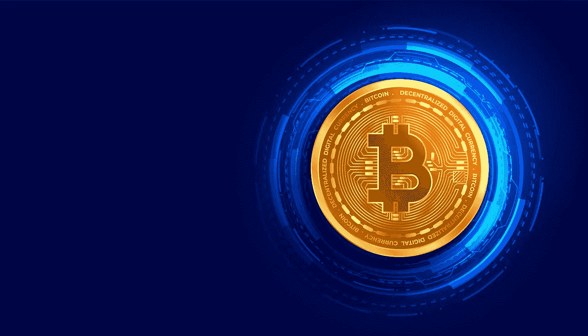
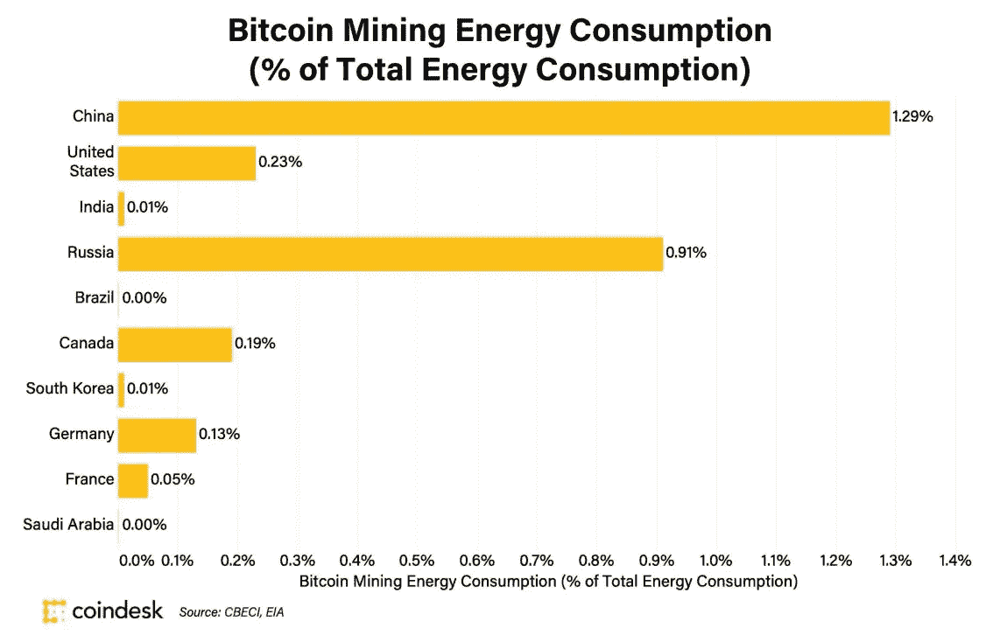
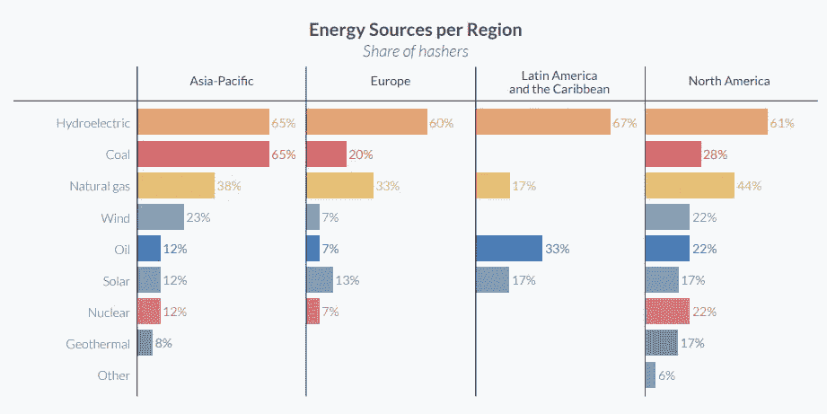

# 比特币对全球变暖有贡献吗？

> 原文：<https://medium.com/coinmonks/does-bitcoin-contribute-to-global-warming-f5e69c165192?source=collection_archive---------77----------------------->

Bitcoin

如果你已经听说过任何提到特斯拉因其环境影响而抛售比特币的新闻，并且你对是否应该投资比特币持怀疑态度，那么这篇文章就是为你准备的。

没错，比特币的确是能源密集型的。由此，我们主要将比特币挖掘称为一个能源密集型过程。2015 年，比特币消耗了全球能源消耗总量的 0.02%。根据剑桥替代金融中心(CCAF)的估计，2018 年，这一数字为 0.16%。现在它消耗了全球总能耗的 0.58%左右。如果比特币是一个国家，它在能源消耗方面将排在第 28 位，在乌克兰和埃及之间(截至 2021 年)。

因此，根据批评家的说法，无论是谁使用了这么多能量，都应该引起注意。他们就在这里。但这个论点有一个缺陷，即比特币不是一个国家。它的网络遍布全球。所以，它的能源消耗对国家的能源消耗有贡献。让我们看看它对主要以采矿为主的国家的能源消耗有多大贡献

以美国为参照点，视频游戏机占能源消耗的 0.25%，而建筑(~2.2%)、商业制冷(~2.7%)、商业通风(~2.9%)和商业照明(~3.0%)分别占能源消耗的大约 2-3%。

你看，这是微不足道的能量。现在，无论它消耗多少能源，它主要来自所有地区的水电能源

来源— [CCAF 第三次全球加密资产基准研究](https://www.jbs.cam.ac.uk/wp-content/uploads/2021/01/2021-ccaf-3rd-global-cryptoasset-benchmarking-study.pdf)

但是…但是…但是…

在这里，我不会只描绘美好的前景。如您所见，在亚太地区，大量能源来自煤炭本身。我们必须在这方面努力，尽可能减少对不可再生能源的依赖。有一些好的趋势表明—

例如，Argo Blockchain 和 DMG Blockchain Solutions 推出了一个完全由清洁能源驱动的采矿池。Gryphon Digital Mining 最近筹集了 1400 万美元，用于在美国建立可再生能源驱动的比特币采矿业务。

加密气候协议由三个非营利组织(能源网、落基山研究所、创新监管联盟)联合 25 个以上的企业和非政府组织支持者发起，其中包括一些比特币矿工。Crypto Climate Accord 是一项由私营部门牵头的倡议，旨在消除加密货币行业的碳排放。它的目标是将所有的采矿转变为 100%的可再生能源。该协议本身并不是法律，但它计划与关键的政策制定者合作，以鼓励采矿的去碳化，并为市场参与者的加入铺平了道路。

它的目标是崇高的，但趋势是正确的。所以，我认为它有着光明的未来。

*~再见*

参考—[https://static . coin desk . com/WP-content/uploads/2021/04/Does-bit coin-Have-an-Energy-Problem-coin desk-Research-2021.04 . pdf](https://static.coindesk.com/wp-content/uploads/2021/04/Does-Bitcoin-Have-an-Energy-Problem-CoinDesk-Research-2021.04.pdf)

让我们成为朋友吧—

**推特:** [*@* syntnsrkr](https://twitter.com/syntnsrkr)

> 加入 Coinmonks [电报频道](https://t.me/coincodecap)和 [Youtube 频道](https://www.youtube.com/c/coinmonks/videos)了解加密交易和投资

# 另外，阅读

*   [Bookmap 评论](https://coincodecap.com/bookmap-review-2021-best-trading-software) | [美国 5 大最佳加密交易所](https://coincodecap.com/crypto-exchange-usa)
*   最佳加密[硬件钱包](/coinmonks/hardware-wallets-dfa1211730c6) | [Bitbns 评论](/coinmonks/bitbns-review-38256a07e161)
*   [新加坡十大最佳加密交易所](https://coincodecap.com/crypto-exchange-in-singapore) | [购买 AXS](https://coincodecap.com/buy-axs-token)
*   [红狗赌场评论](https://coincodecap.com/red-dog-casino-review) | [Swyftx 评论](https://coincodecap.com/swyftx-review) | [CoinGate 评论](https://coincodecap.com/coingate-review)
*   [投资印度的最佳密码](https://coincodecap.com/best-crypto-to-invest-in-india-in-2021)|[WazirX P2P](https://coincodecap.com/wazirx-p2p)|[Hi Dollar Review](https://coincodecap.com/hi-dollar-review)