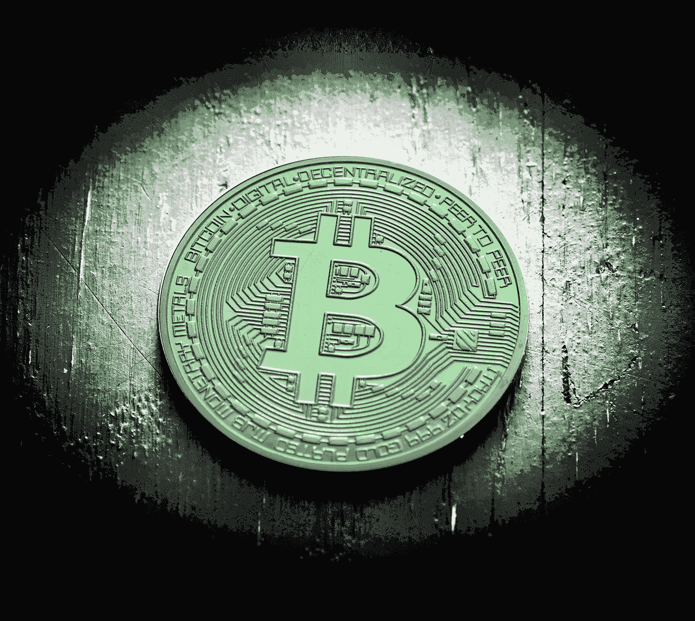

# 比特币有什么内在价值吗？

> 原文：<https://medium.com/coinmonks/does-bitcoin-have-any-intrinsic-value-eb4279b9dacf?source=collection_archive---------18----------------------->

这个月我想做点特别的事情，把你们都介绍给我的投资伙伴亚历克斯·弗莱舍曼。当亚历克斯提出要为你们写一篇文章时，我非常激动。我不知道当你听到“先锋加密投资者”时，你会想到什么但无论你想到什么，让我告诉你，亚历克斯不像你在 Twitter 上看到的浮华、吹牛的加密兄弟。事实上，你永远不会看到亚历克斯吹嘘或谈论别人的秘密意识形态。相反，他只会忙着赚钱。亚历克斯是这些家伙中的一员，他非常聪明，实际上了解加密背后的技术和代码，并且满足于悄无声息的成功。他碰巧还拥有大脑和情绪控制能力，这在投资艺术中非常有用。最重要的是，他是一个很好的人，我很荣幸能和他成为搭档。

顺便说一下，因为亚历克斯不会吹嘘自己，让我告诉你，他有一个记录，在过去的 8 年里，他产生了 4 倍的比特币回报。如果你想知道这有多令人印象深刻，那就做一下数学计算。

我想你们都会非常喜欢 Alex 的这篇文章。亚历克斯·弗莱舍曼不再多说:

关于比特币，人们最常问的一个问题是它是否有内在价值——尤其是当一些货币甚至不如用来铸造它们的纸张(或金属)时。黄金爱好者经常引用他们最喜欢的石头至少被用于珠宝和电子产品——而“比特币根本没有任何用途！”在不偏离 gold 的价值主张(我也喜欢闪亮的物体)的情况下，回答这个问题需要一点关于“价值”概念的客观性，以及对社会中最重要的东西之一:能源的更深刻理解。

让我们从价值的概念开始:一个一般的定义是，它是具有某种重要性、价值或有用性的东西。理解价值之所以困难，是因为它有一种内在的主观性。在经济学中，我们主要通过观察和记录各种互动和交换来衡量价值。是交易帮助我们理解价值；互动讨论它，交流决定它。我们将价值理解为一种可以与另一种“事物”交换的“事物”——每种“事物”的确切交换量由相关方决定，在结算所述交易后，每种“事物”都会产生一种“价值”如果我们同意用你的一个椰子换我的五个香蕉，那么我们就已经为每一个商品建立了一个价值——我们现在可以用它作为与他人交易的参考。一个更现代的例子可能是用一个卡通猿的数字图像换取 25 万英镑的“所有债务的法定货币，无论是公共债务还是私人债务”——不管这意味着什么。

以这种对价值的解读为基础，似乎比特币的“内在价值”本质上来源于能量，从某种意义上说，来源于时间和注意力(或称“迷因力”)。比特币的迷因力量源于一个不太明显的理由——顺便提一下，这与美元的理由类似。“完全信任和信用”的概念建立在信任的基础上，而这种信任几乎是无法衡量的。不过现在，我将专注于比特币内在价值背后的逻辑，因为它来自能源。

为了处理交易，保护自己免受不良行为者的影响，并产生新的硬币，比特币网络使用所谓的“工作证明”挖掘。比特币挖矿的简短解释是，计算机必须比赛解决一个数学问题，当一台计算机成功解决时，它们将获得新的比特币和用户支付的一些交易费。成功解决数学问题会创建一个新的事务“块”，然后将其添加到“块”链的末端——引入一个新的数学问题，然后循环重复。当然，计算机依靠电力运行，因此“输入”是电力，“输出”是比特币。

在早期，任何人都可以在一台基本的笔记本电脑上挖掘比特币——因为当时比特币几乎没有公共价值或吸引力——解决数学问题的“竞赛”相对容易。随着比特币获得了更多爱好者和投机者的关注，其价格也随之上涨，更多的计算机加入了网络，希望抓住比特币的一些潜在优势(和利润)。2013 年，当我第一次进入这个行业时，比特币矿工看到了专门计算机的推出，这种计算机被称为 ASICs，其唯一目的是开采比特币。我记得我的第一个 ASIC，Antminer S1，我在 NYU 的宿舍里运行过，惊讶地发现它比我的电脑挖掘比特币快 40-50 倍！在那些日子里，比特币在 60-200 美元之间，让大声的 ASIC 粉丝 24/7 每 1-2 天挖掘 0.01 个比特币(合理地)让我的室友感到讨厌。所以我做了任何一个理性的人都会做的事情，把矿工搬到了我朋友的宿舍——但是我跑题了。

比特币网络对这些更新、更快的机器的解释非常巧妙:难度调整。简而言之，计算能力越强，越难以解决数学问题。每隔 2016 块，网络就会调整数学问题的难度，这样每块的平均“求解”时间约为 10 分钟。安装这个是为了避免硬件制造商开发 ASIC，用它比其他人更快地挖掘比特币，并占用网络。随着软件开发商和硬件制造商开始专门致力于这一新行业，随着新用户的涌入，比特币随着时间的推移发展了“价值”——这很像互联网的早期。

那么这是如何赋予比特币价值的呢？通过越来越多的经济理性行为者投入时间、精力和资源。虽然这听起来很明显并不令人满意，但这是一项努力的资源分配给了它一个下限，或“最小”值。考虑到最普通或最先进的采矿计算机的效率，有很多模型可以提出在特定电价下比特币的最低价格——其中一些模型比其他模型更全面。这些预测往往没有考虑矿工利润、网络效应和增长，或者比特币的其他各种无形的上行催化剂——但这些是改天的话题。回到能源问题:既然我们已经根据比特币的输入找到了其可能的最小值，那么可能导致比特币价值超过这个下限的另一个因素是什么？不是重复，而是，嗯，能量！或者更具体地说，能源生产。

正如环境、社会和治理(或“ESG”)倡导者喜欢提醒我们的那样:每年用于比特币开采的能源数量是巨大的——目前比挪威的年用电量还要多。为什么有人会在表面上没有价值的东西上花费如此多的精力？要回答这个问题，我们必须更深入地了解比特币矿工正在使用何种能源，以及它如何在加密之外造福社会。

在过去几年中，比特币矿工一直在稳步从煤炭能源转向天然气、水电和核能能源。不仅仅是为了环保——例如，煤炭作为一种能源已经变得越来越昂贵，比特币矿工寻求利润最大化。根据国际可再生能源机构的说法，可再生能源是最便宜的发电形式，因此比特币矿工向绿色能源转型既是利他的，也是有利可图的。此外，核能是比特币矿工正在探索的另一种(技术上不可再生的)零排放能源，作为煤炭的廉价替代品。为什么这很重要？联合国欧洲经济委员会的一份报告指出，如果没有核能生产，巴黎协议设定的碳排放目标将无法实现。

这一切与比特币的价值有什么关系？好吧，比特币挖矿创造了一个非常简单的经济等式:尽可能高效地使用电力来开采比特币。ESG 的批评指向比特币今天使用的能源，而不是它为未来创造的能源补贴。比特币矿工或许是廉价高效能源建设背后最受激励的盈利玩家。因此，比特币矿工帮助开发、建设和补贴可再生和零碳能源生产基地。比特币矿工正在为美国各地的项目做出贡献，例如:

1.塔伦能源公司位于宾夕法尼亚州伯威克的核能数据中心(1 . 75 亿美元)

2.能源投资者在德克萨斯州的天然气矿场
( 4300 万美元)

3.计算北方公司在内布拉斯加州科尔尼的电网扩展项目
( 3 . 85 亿美元)

4.清洁火花公司在乔治亚州诺克罗斯的碳中和项目
(1 . 45 亿美元)

甚至在世界各地，比如德国和俄罗斯的合资企业 Cyberian Mine，它利用西伯利亚产生的水能，利用寒冷的环境温度来降低机器的冷却成本，或者 Kryptovault 在挪威的 100%可再生能源数据中心。

如果没有比特币，这些项目还会继续吗？也许吧。但是，无论如何，由于比特币，这些项目在经济上变得更加可行——特别是对于那些需要基础设施建设的项目，那里可能没有市场来支持如此巨大的资本支出。比特币采矿一旦运营，需要的人工参与相对较少，因此采矿农场位于人迹罕至的地方，比如靠近需要燃烧天然气的石油生产基地，或者水电大坝和发电能力过剩的核电站。在某些情况下，这些生产场所不能有效地(甚至是物理地)向任何其他用例提供它们产生的能量。因此，比特币矿工正在与这些网站签订协议，双方都可以从能源中获得更大的利润，否则这些能源可能会被浪费掉。

综上所述，比特币使用了大量的能量。但它也补贴并加速了可再生和低排放能源生产基地的发展。它还为这些基础设施项目和比特币矿场创造了就业机会。随着世界努力承诺“到 2050 年实现净零”，比特币激励人们转向可持续的低成本能源生产，这目前意味着可再生或零排放生产来源。这当然有价值。

在某些方面，比特币充当了 ESG 理想的电池。在这篇文章中，我探讨了比特币矿工对廉价、稳定电力的需求是如何将他们推向零碳能源生产场所的。通过让这些站点在今天盈利(因为矿商可以承包否则会被浪费的廉价电力)，它增加了对市场的渗透，这些市场不相信他们是否可以将一个新的可再生能源生产站点货币化。比特币是无处可去的清洁能源的价值储存手段，并补贴能源电网削减，这为清洁能源成为社会越来越必要的一部分提供了增长条件。为可能无法盈利的企业转移价值只是比特币电池的一部分，但比特币如何影响环境、社会和治理投资的“社会”或“治理”方面？那么，一定要继续阅读[尼克·哈拉里斯的《利润](http://www.nickhalaris.com)》来寻找答案！

Nick Halaris 是一名房地产投资者和开发商。他是[*Metros Capital*](http://www.metroscapital.com/)*的创始人和总裁，也是盈利的发行人。*

*订阅 Profit，每月获得 Nick 的投资展望、他当前的投资建议以及他对社会和最佳生活的看法。访问*[*【www.nickhalaris.com】*](http://www.nickhalaris.com/)*报名。*

> 加入 Coinmonks [电报频道](https://t.me/coincodecap)和 [Youtube 频道](https://www.youtube.com/c/coinmonks/videos)了解加密交易和投资

# 另外，阅读

*   最佳[加密借贷平台](/coinmonks/top-5-crypto-lending-platforms-in-2020-that-you-need-to-know-a1b675cec3fa) | [杠杆代币](/coinmonks/leveraged-token-3f5257808b22)
*   最佳[加密制图工具](/coinmonks/what-are-the-best-charting-platforms-for-cryptocurrency-trading-85aade584d80) | [最佳加密交易所](/coinmonks/crypto-exchange-dd2f9d6f3769)
*   [比斯勒评论](https://coincodecap.com/bitsler-review)|[WazirX vs coin switch vs coin dcx](https://coincodecap.com/wazirx-vs-coinswitch-vs-coindcx)
*   [7 大副本交易平台](https://coincodecap.com/copy-trading-platforms) | [BuyCoins 点评](https://coincodecap.com/buycoins-review)
*   [my constant Review](https://coincodecap.com/myconstant-review)|[8 款最佳摇摆交易机器人](https://coincodecap.com/best-swing-trading-bots)