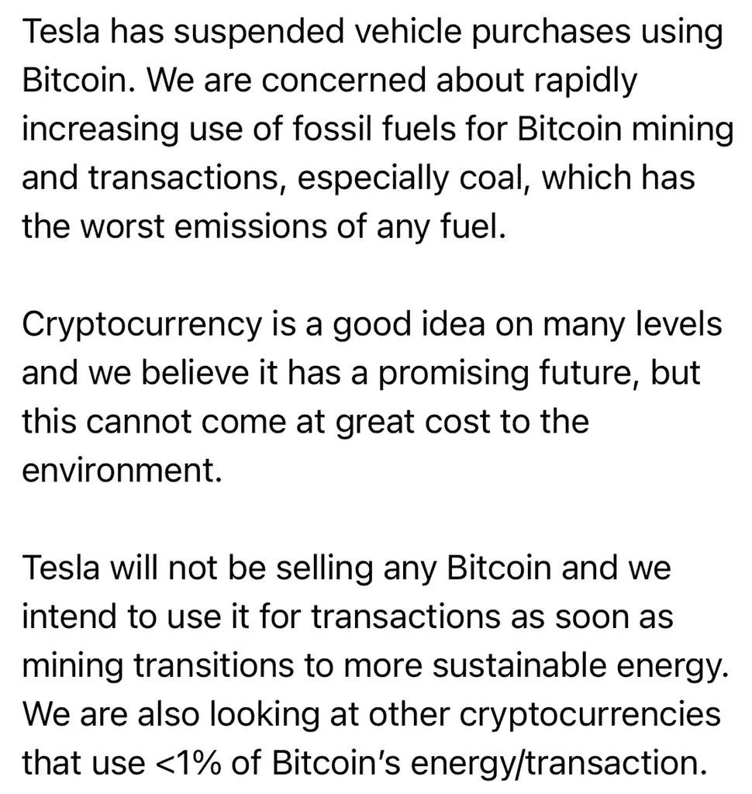
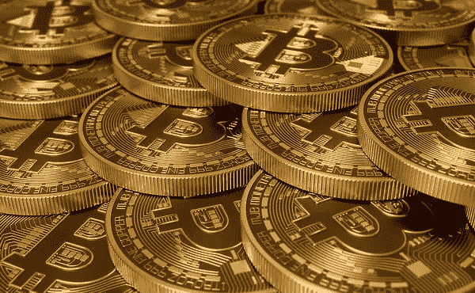

# 加密货币有机会变得可持续吗？

> 原文：<https://medium.com/coinmonks/does-cryptocurrency-have-any-chance-of-becoming-sustainable-d552e2a5c675?source=collection_archive---------37----------------------->

加密会破坏环境吗？

**让我们从**比特币开始，它对环境有害**，因为高能耗的工作验证过程需要大量电力来持续为数百万台服务器供电**

**加密最明显的环境影响是采矿过程所需的电力**，这就是新的数字硬币是如何被创造出来的。虽然大多数人都知道这是比特币挖掘，但许多形式的加密货币都依赖于挖掘。

贝娄是伊隆面具的推特:

一枚比特币中有多少二氧化碳？

分析师们发现，在 2020 年，一笔比特币交易的气候影响估计相当于约 402 千克二氧化碳排放。这相当于一个普通荷兰家庭月排放量的三分之二(每月 611 千克二氧化碳)。

根据 Digiconomist 的数据，截至 2021 年 12 月，一笔以太坊交易的碳足迹为 **102.38 千克二氧化碳**，这“相当于 226，910 笔 VISA 交易或 17，063 小时观看 YouTube 的碳足迹”。

区块链的运行对环境的危害有多大？生态学家和其他数字黄金的批评者是否夸大其词？让我们一起深入探讨这些问题。

最近，关于比特币采矿对环境影响的讨论愈演愈烈。

意见领袖倾向于夸大其词，他们的观点经常被夸大和操纵。越来越多的矿工选择可再生能源，其成本正在下降。

权威环保组织绿色和平(Greenpeace)已暂停接受首款加密货币的捐赠。

“随着时间的推移，运行比特币所需的能量越来越明显，因此这一政策似乎不再合理，”绿色和平组织的一名发言人表示。

该组织于 2014 年开始接受比特币。然后绿色和平组织指出了数字黄金的环保优势，即与银行相比，交易处理费用更低。

中华人民共和国国务院副总理刘鹤宣布，该国当局打算通过建立更严格的监管，对加密货币的开采和比特币交易采取措施。第一种加密货币的价格在当时加速下跌。

据记者科林·吴(Colin Wu)称，这是中国高层官员首次直接提出禁止加密货币开采。他认为这可能是由于高能耗造成的。

2018 年，一项研究闹得沸沸扬扬，该研究称比特币开采排放的二氧化碳将使地球气温升高 2 摄氏度。这项研究的论文被许多出版物引用，包括《纽约时报》。

许多行业参与者已经启动了加密气候协议等举措，旨在减少比特币采矿的碳足迹，并在 2030 年前实现加密货币空间的绿色化。

事实上，对数千万人来说，第一种加密货币是在恶性通胀条件下为基本需求储蓄资金的一种方式，也是绕过资本管制的一种工具。对他们来说，比特币的能源强度是合理的，与荷兰的比较几乎是不恰当的。

为了继续竞争，矿商需要最大限度地降低成本。为此，他们越来越多地转向更便宜的可再生资源。鉴于这一趋势以及中国对该行业的压制措施，我们可以预计，未来采矿业将继续分散，而“肮脏”的电力来源在其中所占的份额将会减少。

现在了解了上述所有因素，我们应该开始精确关注我们为投资组合选择的每种加密货币的生态得分。可以肯定的是，来自克罗诺斯链的最新消息非常及时:[crypto.com](http://crypto.com)计划抵消比#克罗诺斯链产生的更多的碳排放。

这意味着 CRODO 对环境的影响最小，这是减少全球变暖非常重要的一步。

所以手指交叉，等待他们的下一部分信息。

再见，宝贝们💋

# CRODO # CRONOS @ CRONOS _ chain $ CROD @ crypto com

> 加入 Coinmonks [电报频道](https://t.me/coincodecap)和 [Youtube 频道](https://www.youtube.com/c/coinmonks/videos)了解加密交易和投资

# 另外，阅读

*   [NFT 十大市场造币集锦](https://coincodecap.com/nft-marketplaces)
*   [AscendEx Staking](https://coincodecap.com/ascendex-staking)|[Bot Ocean Review](https://coincodecap.com/bot-ocean-review)|[最佳比特币钱包](https://coincodecap.com/bitcoin-wallets-india)
*   [Bitget 回顾](https://coincodecap.com/bitget-review)|[Gemini vs block fi](https://coincodecap.com/gemini-vs-blockfi)|[OKEx 期货交易](https://coincodecap.com/okex-futures-trading)
*   [美国最佳加密交易机器人](https://coincodecap.com/crypto-trading-bots-in-the-us) | [经常性回顾](https://coincodecap.com/changelly-review)
*   [在印度利用加密套利赚取被动收入](https://coincodecap.com/crypto-arbitrage-in-india)