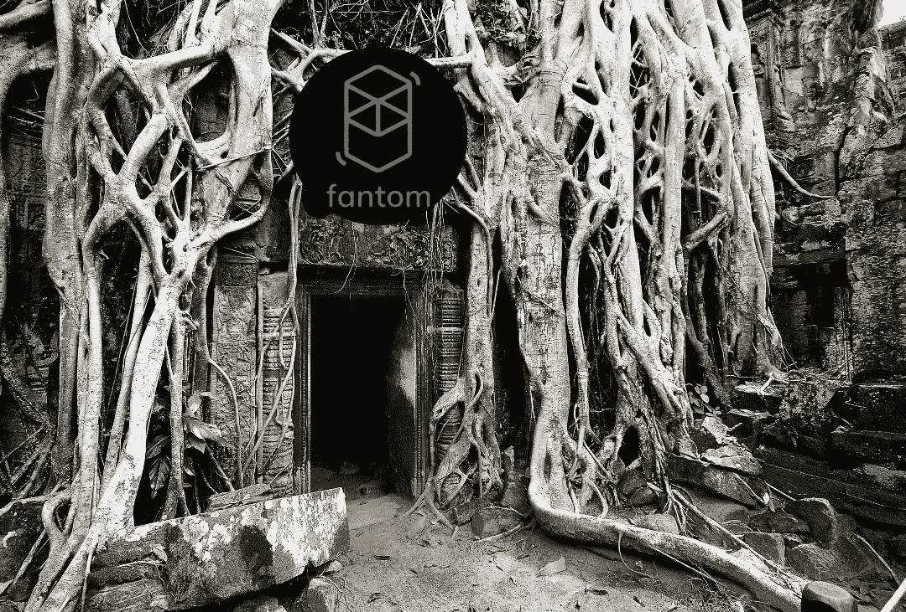

# Fantom ($FTM)有前途吗？

> 原文：<https://medium.com/coinmonks/does-fantom-ftm-have-a-future-9f2f5375b97a?source=collection_archive---------1----------------------->

$FTM 从历史高点下跌了近 90%。这是一个很好的购买机会，还是一个死链？

Image: PixTeller

# 幽灵

首先，我是 FTM 的受益持有人。在我的 DeFi [狒狒探险](/coinmonks/defi-conservative-goes-full-degen-ape-how-i-doubled-my-bag-in-a-week-b8efd9129df0)之前，我没有使用过链条。今天，它是我目前首选的交易链。