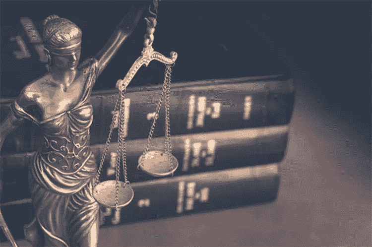

# DeFi 中是否存在知识产权？

> 原文：<https://medium.com/coinmonks/does-intellectual-property-exist-in-defi-e90a222ba87e?source=collection_archive---------12----------------------->

## By [0xG]Beeks

**About [0xG]Beeks**: [0xG]Beeks is a Billboard-charting music producer, audio engineer, and investor writing about their learnings and discoveries in the crypto space. You can reach [0xG]Beeks on Twitter @beeksvybe or Email [beeksvybe@gmail.com](mailto:beeksvybe@gmail.com)

我对加密有一个深刻的认识，那就是它不是一个行业，而是一场运动。Crypto 超越所有行业和各行各业。这是加密之旅中最伟大的部分之一。你在其中发现的社区。就我而言，我有音乐背景，从版权和法律的角度来看，我的整个职业生涯都在激烈地争取属于我的东西。版权是知识产权的一种形式，音乐是知识产权如此重要的一个很好的例子。如果你用别人的作品创作了一首歌，并将其货币化，那么在衍生版本中使用该作品，原创作者将获得奖励和经济补偿。这就是所谓的抽样，这是一个行业标准的概念。

随着我进入 crypto ventures 和去中心化金融(特别是 DeFi)的旅程，我了解到开源代码似乎是构建任何去中心化应用程序(dApp)的现状。这样做的一个主要理由是安全性。拥有透明的开源代码，并由社区广泛使用和测试，可以确保代码中不存在错误，并允许开发人员更容易地创建和构建值得信赖的项目。然而，在使用开源代码作为创造性表达的新媒介之后，更不用说大量的盈利能力，它回避了一个问题:知识产权是否存在于 DeFi？

根据世界贸易组织的定义，知识产权是赋予人们创造思想的权利。我们知道，从美国法律的角度来看，被视为语言的计算机代码被视为言论自由和创造性表达。

让我们将 UniSwap 作为 DeFi 中使用开源代码的项目的一个例子。Uniswap 是 DeFi 领域首屈一指的自动做市商(AMM)。它的第二代版本 Uniswap v2 在整个 DeFi 领域被无数次地分叉或复制，至今仍是最受欢迎的 AMM 分叉之一。这一切之所以成为可能，是因为创建 Uniswap v2 的代码是开源的——这意味着它在法律上可以免费使用，任何人都可以在 GitHub 上看到。因此，全区块链的模仿竞争对手因此能够使用原始 Uniswap v2 代码创建他们自己看起来相似的 DeFi 协议，这反过来又永久地威胁 Uniswap 作为一个正常运行的 AMM 的流动性。

2021 年 3 月，Uniswap 对其协议进行了升级，并推出了 Uniswap v3。这一次，他们首次引入了一个全新的政策:为了使用他们的 v3 AMM 源代码，需要一个延时的商业许可。根据他们的商业许可协议，您目前必须等待 2 年，直到您有权使用他们的更新代码。这与过去 DeFi 中的开源精神形成了鲜明的对比，有一种感觉是，在未来，DeFi 可能会偏离完全开源代码的做事方式。以下是 Uniswap 网站的摘录，解释了他们对新营业执照的立场:

“我们坚信，去中心化的金融基础设施最终应该是免费的开源软件。同时，我们认为 uni WAP 社区应该率先围绕 Uniswap v3 核心代码库构建一个生态系统。

考虑到这一点，Uniswap v3 Core 将在 Business Source 许可证 1.1 下发布，这实际上是一个延时的 GPL-2.0 或更高版本的许可证。许可证限制在两年内将 v3 源代码用于商业或生产环境，两年后将转换为 GPL 许可证，永久有效。"

Uniswap 正在改变他们在 DeFi 领域前进的方式，以及谁可以使用他们的代码以及为什么。V1 是 Uniswap 的概念证明。V2 很快成为事实上的行业领先的 AMM，成为复制所有 DeFi 空间和几乎每一个区块链。现在，在开源代码对 web3 的创造者和开发者来说已经变得无处不在的时候，Uniswap v3 告诉业界，“嘿，这是我们做的。这是我们的，我们想先用它。那我们就让你用，从中获利。”即使在今天，dApp 仍然是建立在 Uniswap 的 v2 代码之上，因为他们没有更好的选择。但是 Uniswap v3 代码对所有人来说都是完全可见的，你只是不允许复制它，否则他们会起诉你。这就是知识产权的力量。

然而，并非 DeFi 中的所有代码都是开源的。即使是基于开源代码或使用 Uniswap v2 代码构建的项目，也会构建私有代码，这些代码通常是隐藏的，被认为是至关重要的，或者是项目成功的“秘方”。如果该代码被黑客攻击、利用或泄露，将会对项目未来的成功造成巨大的损害，因为它的竞争对手能够直接克隆该软件。因此，知识产权的法律保护至关重要。

开源代码的倡导者会争辩说，智能合约代码并不打算对公众隐藏，主要是出于安全考虑。智能合约代码处理你的钱，没有任何中央权力来修复错误，如果他们发生了。归根结底，我们正在构建点对点的无信任可验证系统。我们基本上被迫对这些开发人员寄予极大的信任，他们中的许多人是匿名的或使用假名的，他们有时证明他们并不完美，过去在他们的代码中留下了非常小的错误。因此，利用这样的代码是很危险的，因为我们只有非常有限的工具来了解这个财务软件是如何工作的。可以说，这正是 Uniswap 让他们的代码首先被分叉的原因。随着行业的成熟，某些开源代码继续成为该领域的主要基础设施，我们可能会接近一个转折点，行业将不得不决定什么是最好的发展方向以及知识产权的重要性。