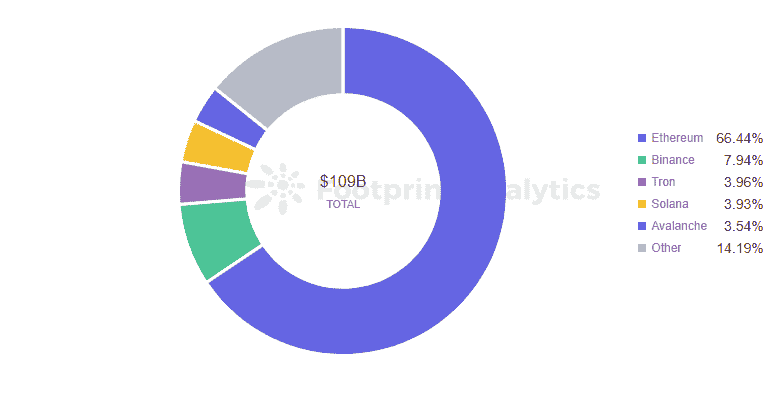
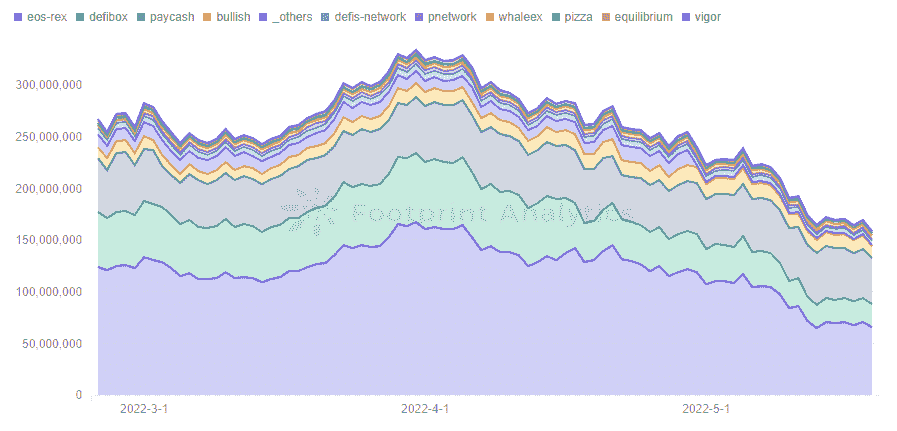
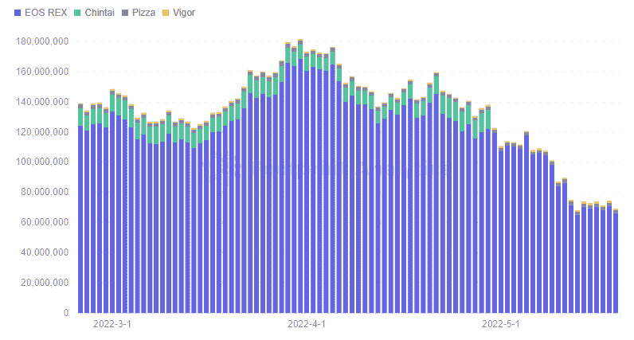
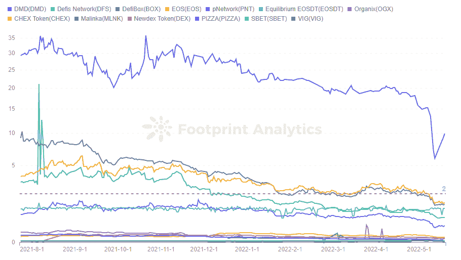
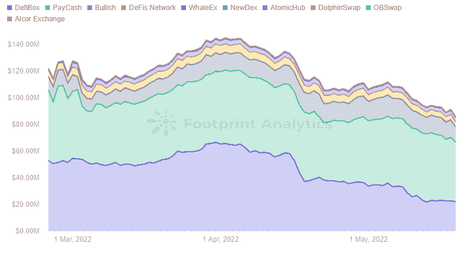
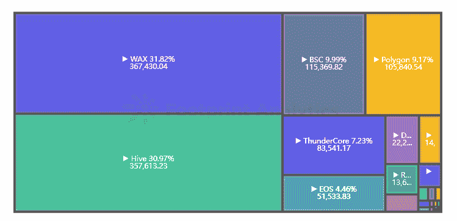
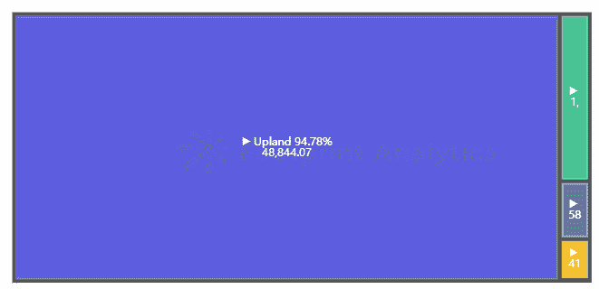
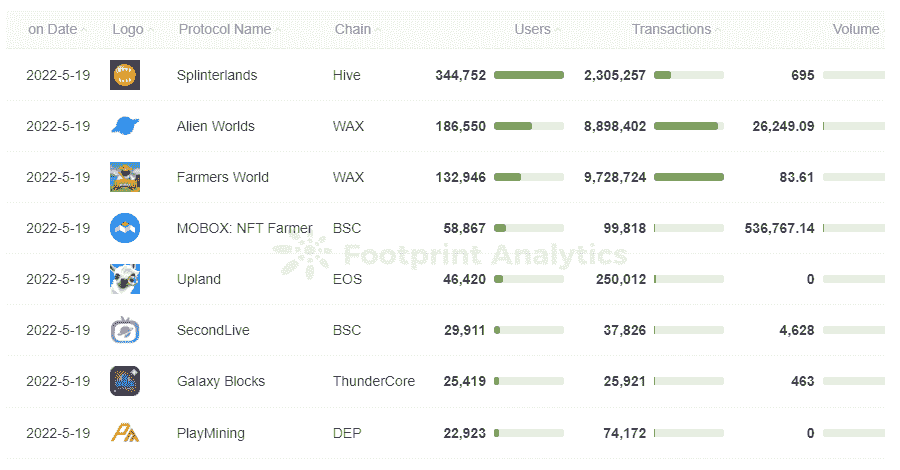

# 曾经很有前途的 EOS 还有未来吗？

> 原文：<https://medium.com/coinmonks/does-the-once-promising-eos-still-have-a-future-9256fe6f82fb?source=collection_archive---------53----------------------->

2022 年 5 月

数据来源:[足迹分析 EOS 生态仪表板](https://www.footprint.network/@DamonSalvatore/EOS-Ecology-Dashboard?date=past90days&chain=EOS&symbol=eos&channel=ENG-258)

于 2018 年推出的 [EOS](https://www.footprint.network/@DamonSalvatore/EOS-Ecology-Dashboard?date=past90days&chain=EOS&symbol=eos&channel=ENG-258) 是最初的“以太坊杀手”之一。作为早期的连锁之一，它看到了以太坊的问题，想出了解决方案。然而，EOS 的 TVL 现在排名第 29 位。

EOS 既没有在 2020 年的 [DeFi](https://www.footprint.network/guest/dashboard/de-fi-data-analytics-footprint-network-fp-102523be-d937-4133-bf2d-71b1c6c8886f?days=past30days&name=sushiswap&channel=ENG-258#secret=9DE4C2DBE2CF8005EF752DE3F20CE2B3) 夏天爆发，也没有在 2021 年的 [GameFi](https://www.footprint.network/guest/dashboard/dashboard-for-game-fi-industry-fp-f7d88ee8-9341-49ae-b497-088bee7ec038?date=past60days&channel=ENG-258#secret=2E95108712AF5CB1949BCFBB804F139C) 浪潮中爆发。它唯一显著的成功是托管了游戏《高地》,这款游戏确实有很多用户。

为什么 EOS 会半途而废，它与高地的联系会成为再次成为领先生态系统的跳板吗？

**什么是 EOS？**

2018 年，Block.one 推出了 EOS，代表企业运营系统，目标是创建一个生态系统，避免以太坊经常提到的主要问题:高额的燃气费和拥堵。

在包括 BitShares 和 Steem 创始人兼首席技术官 Daniel Larimer 在内的经验丰富的团队的领导下，EOS 寻求通过并行链和 dpo(委托股权证明)的新共识模型实现无费用和高吞吐量。

虽然以太坊每秒只能处理 40 个交易，但 EOS 可以处理数千个交易。而且$EOS 持有者拥有网络的所有权，而不是像以太坊 POW 模型中那样“租用”计算机容量。

EOS 最初的计划看起来不错，但现在，四年后，我们看到以太坊仍然是第一，随后是近十几个新的连锁店分割市场。EOS 显然没有达到预期。

*Footprint Analytics — Market Share of TVL by Chain*

EOS 表现不佳的原因包括治理问题引起对去中心化的担忧、缺乏开发者以及整个生态系统的弱点，特别是 EMD，这是一个流动性挖掘项目，仅在线 13 小时就转移了用户的资金，打击了用户的信心。

为了评估哪里出了问题，让我们看看数据，包括基于[足迹分析](https://www.footprint.network/?channel=ENG-258)的 EOS 上的 DeFi 和 [GameFi](https://www.footprint.network/guest/dashboard/dashboard-for-game-fi-industry-fp-f7d88ee8-9341-49ae-b497-088bee7ec038?date=past60days&channel=ENG-258#secret=2E95108712AF5CB1949BCFBB804F139C) 项目。

# EOS 上的 DeFi 项目

EOS 的 DeFi 生态系统在主要连锁店中排名相当低，截至 5 月 19 日，总 TVL 仅为约 1.6 亿美元。这个链条上没有流行的协议，比如[曲线](http://curve)或者 Uniswap。

*Footprint Analytics — EOS TVL by Protocol*

有 3 个 DEX 项目与 WAX 链重叠，还有一个跨链桥 pNetwork，而其他的只部署在 EOS 上。最大的项目 EOS REX 的 TVL 只有 6800 万美元。

EOS 还是以借贷和 DEX 项目为主。只有 4 个贷款项目，主要由 REX 牵头。但是 REX 在利率上仍然没有其他 DeFi 项目的竞争力，也没有 Aave、Compound 这样已经被市场认可的平台有优势。

*Footprint Analytics — EOS Lending Project TVL by Protocol*

EOS 上发行的各种代币价格较低，较小的项目流动性和资金池深度较差，这导致价格频繁大幅波动。像[复利](https://www.footprint.network/@Sulli/Compound-Dashboard?date_filter=past6months~&channel=ENG-258)这样的过度抵押贷款项目，往往会在价格大幅波动时被清算。因此，EOS 生态系统对贷款项目并不友好。

正如 [Footprint Analytics](https://www.footprint.network/?channel=ENG-258) 所见，EOS 上的原生项目价格普遍较低，截至 5 月 19 日最高 DMD 不到 10 美元，其他所有项目均已跌破 2 美元。

*Footprint Analytics — EOS Project Token Price*

DeFiBox 和 Pay Cash 占 DEX 项目的大部分。DeFiBox 不仅是一个 DEX 平台，还聚合了 stablecoins 和 stakes 来借钱。然而，协议仍然主要围绕 EOS 和来自 EOS 上其他协议的令牌之间的交换或赌注，并且没有流行的项目，DEX 平台的活动非常有限。

*Footprint Analytics — EOS DEX Project TVL by Protocol*

# EOS 上的 GameFi 项目

根据 [Footprint Analytics](https://www.footprint.network/?channel=ENG-258) 的数据，EOS 的平均游戏用户数量位居第六。以太坊排名第 14 位——至少 EOS 可以说在这方面它是以太坊杀手。

*Footprint Analytics — EOS Market Share of Avg Gamers in 30D*

EOS 之所以取得这样的成绩，主要得益于其旗下的一款地产 NFT 交易游戏 Upland，该游戏占据了 94.78%的用户。用户使用 UPX 在他们喜欢的城市购买房产，目前像三藩市和曼哈顿这样的城市已经完全售罄。

*Footprint Analytics — EOS GameFi Market Share of Avg Gamers in 30D*

在 Upland，用户购买房产，每三个小时收取一次租金，固定年利率为 14.7%。或者，通过即将推出的 NFT 对美元计划，用户可以出售其房产以获得更可观的收入，该计划将允许将房产 NFT 直接兑换为美元。

另外，每个城市都有不同的收集任务，购买的房产在匹配任务时会有额外的奖金收入。玩家每天登录游戏还将免费获得 500 UPX。

这种易玩性使得 Upland 不仅是 EOS 上的顶级项目，也是 GameFi 整体上的顶级项目。足迹分析公司的 GameFi 用户排名显示，虽然这是用户数量第五大的游戏，但它仍然远远落后于 leaders Splinterlands、Alien Worlds 和 Farmers World。

*Footprint Analytics — EOS DEX Project TVL by Protocol*

# 摘要

EOS 凭借零手续费和交易速度快的先天优势推出，但在 DeFi 上仍然远远落后。这说明一个链的生态系统和拉拢开发者和底层技术一样重要。

然而，GameFi 部门给了 EOS 一个生存的机会——只要它能够超越其单一的成功头衔——Upland。

本文由[足迹分析](https://www.footprint.network/?channel=ENG-258)社区提供。

Footprint 社区是一个世界各地的数据和加密爱好者相互帮助了解和获得关于 Web3、元宇宙、DeFi、GameFi 或区块链新兴世界任何其他领域的见解的地方。在这里，你会发现活跃的、不同的声音相互支持，推动着社区向前发展。

> 加入 Coinmonks [电报频道](https://t.me/coincodecap)和 [Youtube 频道](https://www.youtube.com/c/coinmonks/videos)了解加密交易和投资

# 另外，阅读

*   [最佳以太坊钱包](https://coincodecap.com/best-ethereum-wallets) | [电报上的加密货币机器人](https://coincodecap.com/telegram-crypto-bots)
*   [交易杠杆代币的最佳交易所](https://coincodecap.com/leveraged-token-exchanges) | [购买 Floki](https://coincodecap.com/buy-floki-inu-token)
*   [3Commas 对 Pionex 对 Cryptohopper](https://coincodecap.com/3commas-vs-pionex-vs-cryptohopper)|[Bingbon Review](https://coincodecap.com/bingbon-review)
*   [加密复制交易平台](/coinmonks/top-10-crypto-copy-trading-platforms-for-beginners-d0c37c7d698c) | [如何在 WazirX 上购买比特币](/coinmonks/buy-bitcoin-on-wazirx-2d12b7989af1)
*   [CoinLoan 评论](https://coincodecap.com/coinloan-review)|[Crypto.com 评论](/coinmonks/crypto-com-review-f143dca1f74c)