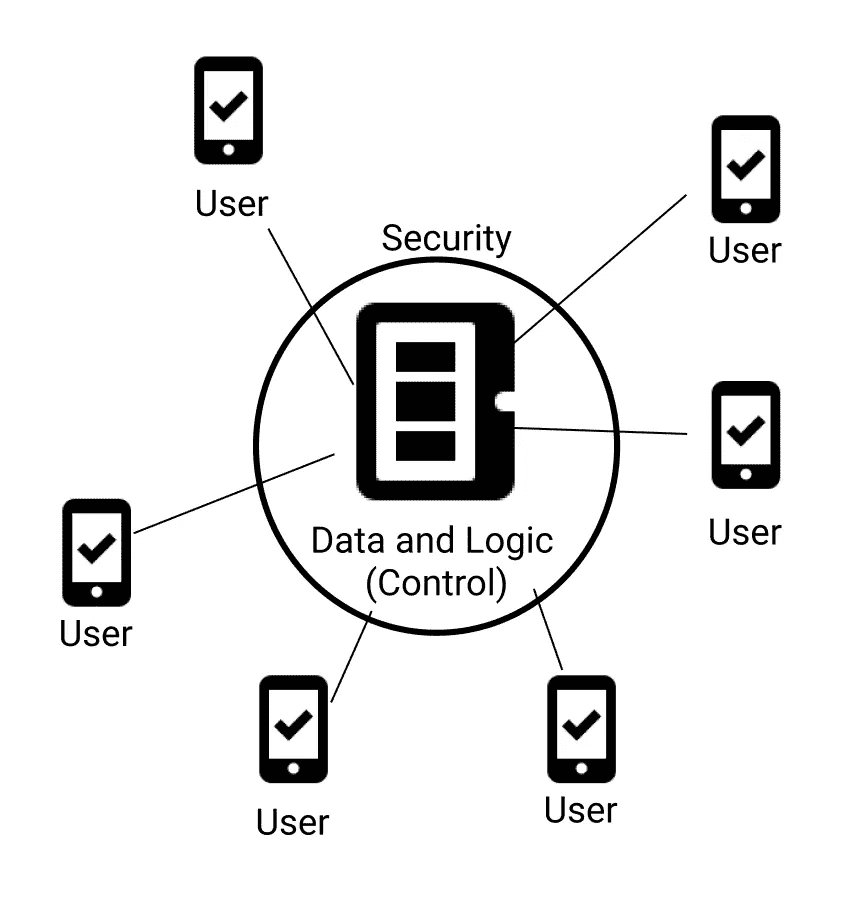
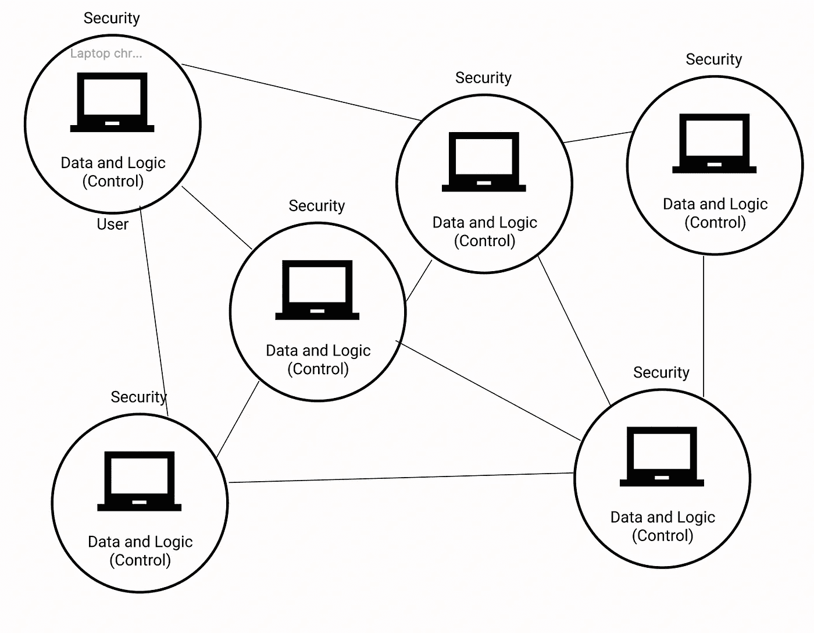

# 你的产品创意真的需要区块链吗？

> 原文：<https://medium.com/coinmonks/does-your-product-idea-really-need-blockchain-though-a3f6c4aad4d3?source=collection_archive---------33----------------------->

在我学习区块链的早期，我曾想过在脸书的优步建立一个去中心化的网站——基本上就是在区块链建立所有受欢迎的网站或应用程序。随着我对区块链研究的深入，我意识到区块链很好地解决了一些问题——但是有一个问题，区块链只很好地解决了少数几个问题。剩下的最好用传统方式解决。那么我们如何知道哪些问题可以用区块链来解决呢？

在回答这个问题之前，我们先来谈谈‘区块链三难问题’。以太坊的创始人 Vitalik Buterin 首先提出的区块链三难困境解释了区块链开发者如何在安全性、可伸缩性或去中心化之间做出妥协。以去中心化为代价，传统的应用程序变得可扩展和安全。而当前的公共区块链是安全的和分散的，代价是可扩展性。让我们举一个在手机上运行的应用程序的例子，比如 Instagram。Instagram 非常快(肯定比以太坊快，尽管公平比较有点困难)，任何想使用 Instagram 的人都可以从 play store 或 Mac store 下载，在几秒钟内创建一个帐户并开始使用它。Instagram 数据和代码的大多数重要方面都存储在远离我们家的服务器上，我们通过互联网访问它们。

以下是其工作原理的一个极其简化的版本:

正如您所看到的，应用程序的控制权在服务器中，用户可以在他们被授权的范围内访问应用程序的数据和逻辑。每当用户想要使用该应用程序时，他所要做的就是向服务器发送请求，他就会得到他想要的东西，而 instagram 的所有开发人员所要做的就是确保服务器的安全。

与传统模型相比，以太坊这样的公共区块链看起来如下所示:

在这个模型中，每个节点都拥有在自己的机器上运行应用程序所需的所有数据和逻辑。并且每个节点试图连接到网络中的其他节点(或对等点)以更新应用程序的状态(数据或逻辑或两者)。

在第一种情况下，应用程序完全集中在一个中央服务器上，控制所有的数据和逻辑。在第二种情况下，应用程序的控制分散在网络的所有参与者中。但是这种权力下放是有代价的。由于我们不能在安全性上妥协，大多数流行的公共区块链网络在可扩展性上妥协。以太坊几乎没有传统支付系统那么快，并且将用户作为节点加入以太坊比获得信用卡要困难得多(如果我们认为我们的用户是技术不可知论者，而大多数用户都是)。

以太坊社区正试图通过转移到工作证明和探索各种其他解决方案(如汇总)来解决扩展问题，但在我们的文章中，在决定您需要使用区块链之前，您的想法或解决方案可能需要以下要求:

1.  你需要存储数据:如果我们的应用程序不需要存储数据，我们就不必担心很多事情，包括使用区块链。
2.  多个用户应该能够添加数据:如果你不能写数据，那么在你的笔记本电脑上保存应用程序的数据和逻辑就没有任何意义，网络上的其他用户也是如此。
3.  网络上的用户互相不信任，或者他们通过互相利用来获利:
    如果网络中的所有用户都互相信任，你就不必真的使用区块链。如果爱丽丝支付给我 10 个比特币，并且比特币网络上的每个用户都信任爱丽丝不是恶意用户，那么我们实际上不必首先检查爱丽丝是否有 10 个比特币来支付给你。在现实世界中，你不能相信互联网上的人会公平竞争，尤其是当他们从网络诈骗中获得经济利益的时候。
4.  网络上的用户无法信任一个中心化的第三方:
    这大概是 Web2 应用区别于 Web3 的最重要因素。并不是所有的应用程序都需要集中式第三方是可信的——大多数时候，如果集中式第三方不可信，他们的损失会超过应用程序的任何单个用户。

回顾以上四点，

如果您的应用程序需要存储数据，并且网络的多个(通常是所有)用户应该能够将数据添加到网络中，并且您不相信集中的第三方来存储您的数据或应用程序逻辑，那么每个节点都必须将数据和应用程序逻辑存储在它们自己的机器中，并且当网络中的一个用户向网络中添加新数据时，它必须传播到网络中的其他所有用户。

当网络中的用户不值得信任或网络“不可信”时，每个用户都必须保护其机器中的数据，以防止其他人的攻击。

如果你再看一下上面区块链是如何工作的图表，你会发现事实确实如此。

本文原载于 https://blockchainiseasy.in/:
[https://blockchainseasy . in/Does-your-product-idea-really-need-区块链-though/](https://blockchainiseasy.in/Does-your-product-idea-really-need-blockchain-though/)

下次见！

> 加入 Coinmonks [电报频道](https://t.me/coincodecap)和 [Youtube 频道](https://www.youtube.com/c/coinmonks/videos)了解加密交易和投资

# 另外，阅读

*   [最佳网上赌场](https://coincodecap.com/best-online-casinos) | [币安评论](/coinmonks/binance-review-ee10d3bf3b6e) | [BitMEX 评论](https://coincodecap.com/bitmex-review)
*   [麻雀交换评论](https://coincodecap.com/sparrow-exchange-review) | [纳什交换评论](https://coincodecap.com/nash-exchange-review)
*   [美国最佳加密交易机器人](https://coincodecap.com/crypto-trading-bots-in-the-us) | [经常性回顾](https://coincodecap.com/changelly-review)
*   [在印度利用加密套利赚取被动收入](https://coincodecap.com/crypto-arbitrage-in-india)
*   [Godex.io 评审](/coinmonks/godex-io-review-7366086519fb) | [邀请评审](/coinmonks/invity-review-70f3030c0502) | [BitForex 评审](https://coincodecap.com/bitforex-review)
*   [最佳比特币保证金交易](/coinmonks/bitcoin-margin-trading-exchange-bcbfcbf7b8e3) | [萝莉点评](/coinmonks/lolli-review-e6ddc7895ad8) | [比特币保证金交易](https://coincodecap.com/bityard-margin-trading)