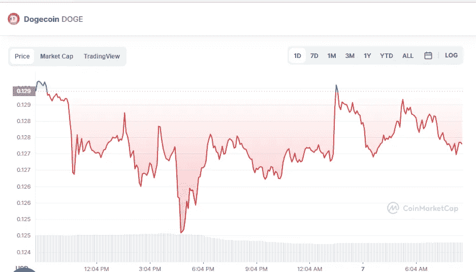

# 5 月 7 日 DogeCoin 和 Shiba Inu 价格分析

> 原文：<https://medium.com/coinmonks/dogecoin-and-shiba-inu-price-analyse-on-7th-of-may-865eb272b959?source=collection_archive---------34----------------------->

# DogeCoin (-1.39%)

Source photo [Dogecoin price today, DOGE to USD live, marketcap and chart | CoinMarketCap](https://coinmarketcap.com/currencies/dogecoin/)

# 市值 168.7 亿美元

DogeCoin 目前的价格为 0.1287 美元，24 小时交易量为 8.593 亿美元。

在过去的 24 小时里，DogeCoin 的使用率下降了 1.39%。