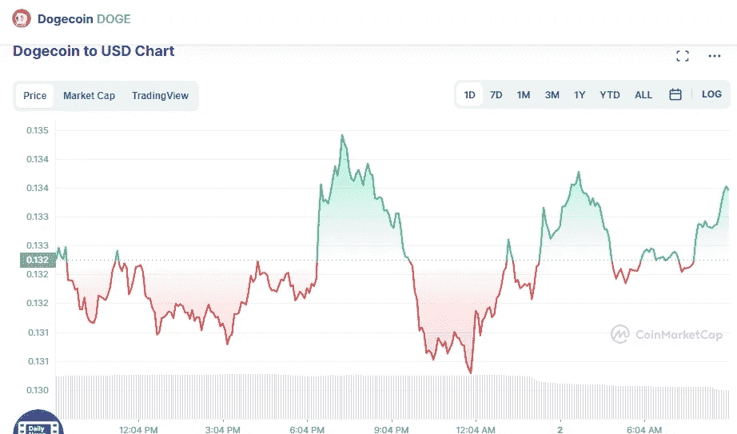

# 5 月 2 日 DogeCoin 和 Shiba Inu 价格分析

> 原文：<https://medium.com/coinmonks/dogecoin-and-shiba-inu-price-on-analyse-2nd-of-may-4b26086f8c0b?source=collection_archive---------43----------------------->

# DogeCoin (+1.37%)

Source photo [Dogecoin price today, DOGE to USD live, marketcap and chart | CoinMarketCap](https://coinmarketcap.com/currencies/dogecoin/)

# 市值 1769 万美元

DogeCoin 目前的价格为 0.1349 美元，24 小时交易量为 7.776 亿美元。在过去的 24 小时里，DogeCoin 的使用量增加了 1.37%。目前在受欢迎程度方面排在第 12 位。

## 这是什么…