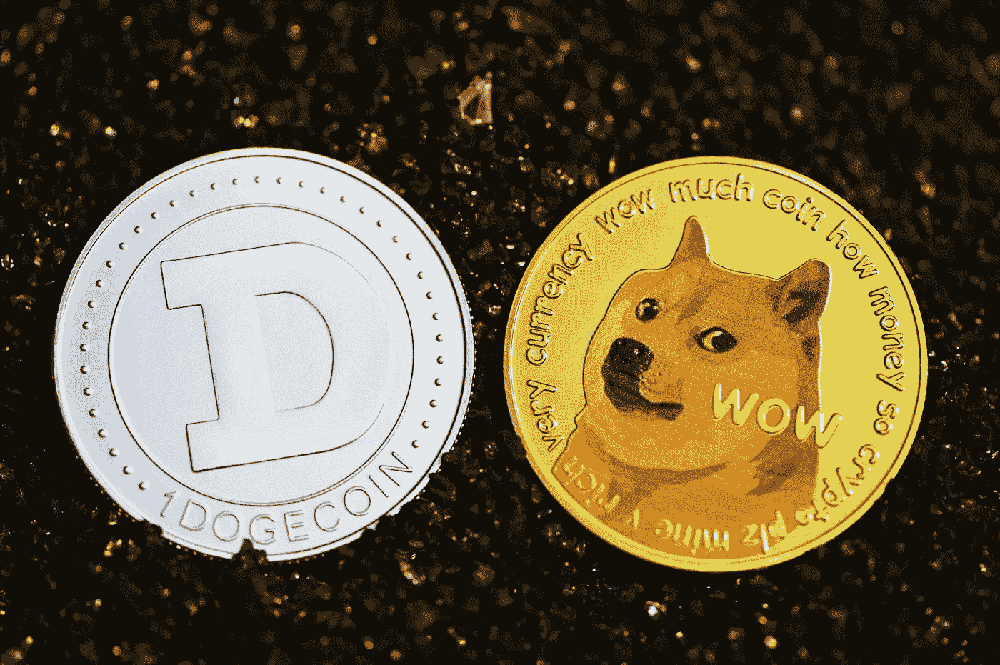

# Dogecoin Crypto 正势如破竹，卷土重来

> 原文：<https://medium.com/coinmonks/dogecoin-crypto-is-on-a-roll-and-making-a-comeback-dbccad88fc45?source=collection_archive---------31----------------------->

## Cryptos

Dogecoin (DOGE-USD)越来越受欢迎，并且正在上升

Photo by [Kanchanara](https://unsplash.com/@kanchanara?utm_source=unsplash&utm_medium=referral&utm_content=creditCopyText) on [Unsplash](https://unsplash.com/s/photos/dogecoin?utm_source=unsplash&utm_medium=referral&utm_content=creditCopyText)

*   最近，3 块价值 1 亿美元的 **Dogecoin** ( [DOGEUSD](https://www.barchart.com/crypto/quotes/%5EDOGEUSD/overview) )被一个大型“鲸鱼”投资者搬走了。
*   **robin HOOD Markets**([HOOD](https://www.barchart.com/stocks/quotes/HOOD/overview))现在是 Dogecoin 的最大持有者，包括相关的数字钱包，几乎占价值的 30%。