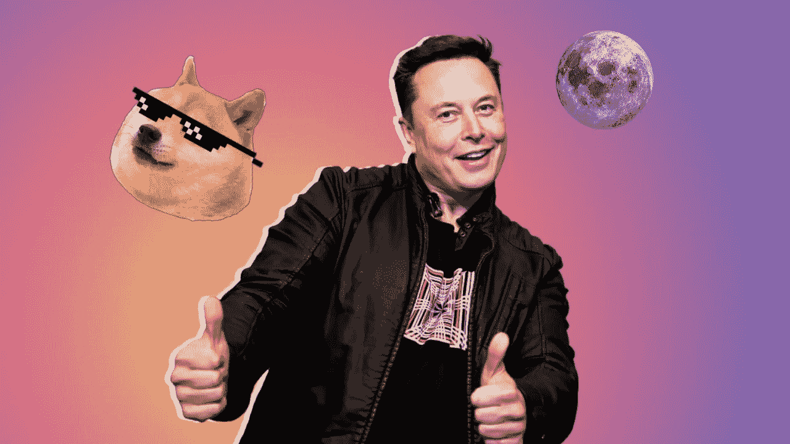

# DOGE coin(DOGE)60 秒解说

> 原文：<https://medium.com/coinmonks/dogecoin-doge-explained-in-60-seconds-6e525d43b2e5?source=collection_archive---------68----------------------->

Dogecoin 是一种加密货币，因其标志中半开玩笑的狗模因而闻名。社交媒体平台上有一种轻松愉快的内容和笑话的总体趋势，这个微笑硬币也报以赞赏的微笑。

Dogecoin 是由程序员 Billy Markus 开发的，作为一种“玩笑货币”用于互联网迷因社区。但它很快开始在 Reddit 和 Twitter 等平台上被用作在线小费服务，以奖励优质内容的创作或分享。2013 年，Dogecoin 是第一批强调“愤怒因素”超过用户大规模采用的加密货币之一。这种迷因风格的硬币是为那些对加密货币不熟悉的人和生活在传统投资方法之外的人准备的。它始于一个小但非常活跃的社区，这个社区接受了 Doge 愚蠢而善良的本性。

在我了解更多关于 Dogecoin 的历史之前，它似乎只是一个有趣的迷因，让我微笑。在我更多地了解了它作为比特币的更友好、更平易近人的替代品的目的后，我发现了它变得如此多产背后的激情。Dogecoin 不仅仅是一个有趣的模因，因为它有广泛的基础，已经发展成为一个新的全球社区。它为人们提供了一个新的平台，让他们觉得他们可以按照自己的方式取得成功。

 [## 你准备好迎接加密经济了吗？加密派

### 每次你打开新闻，阅读报纸，或者浏览你的推特，你很可能会看到一些故事…

www.thecryptopie.com](https://www.thecryptopie.com/) 

> 加入 Coinmonks [电报频道](https://t.me/coincodecap)和 [Youtube 频道](https://www.youtube.com/c/coinmonks/videos)了解加密交易和投资

# 另外，阅读

*   [OKEx vs KuCoin](https://coincodecap.com/okex-kucoin) | [摄氏替代品](https://coincodecap.com/celsius-alternatives) | [如何购买 VeChain](https://coincodecap.com/buy-vechain)
*   [ProfitFarmers 回顾](https://coincodecap.com/profitfarmers-review) | [如何使用 Cornix Trading Bot](https://coincodecap.com/cornix-trading-bot)
*   [如何匿名购买比特币](https://coincodecap.com/buy-bitcoin-anonymously) | [比特币现金钱包](https://coincodecap.com/bitcoin-cash-wallets)
*   [瓦济里克斯 NFT 评论](https://coincodecap.com/wazirx-nft-review) | [比茨盖普 vs 皮奥克斯](https://coincodecap.com/bitsgap-vs-pionex) | [坦吉姆评论](https://coincodecap.com/tangem-wallet-review)
*   [如何使用 Solidity 在以太坊上创建 DApp？](https://coincodecap.com/create-a-dapp-on-ethereum-using-solidity)