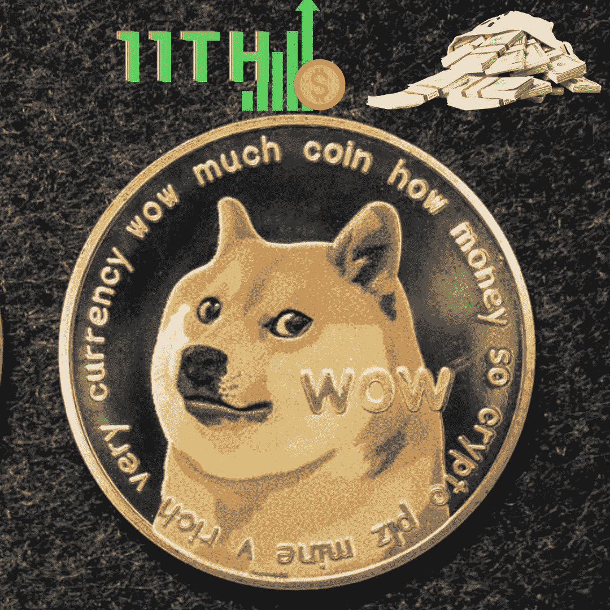

# Dogecoin 在继续前进，但这值得吗？

> 原文：<https://medium.com/coinmonks/dogecoin-is-moving-on-up-but-is-it-worth-it-eb57c999743b?source=collection_archive---------90----------------------->

11th in market valuation — DOGECOIN

lon Musk 最喜欢的加密货币 Dogecoin 已经取代了 Terra USD，在加密货币世界中占据了市场价值的第 11 位。Dogecoin 是最近几个月成为新闻的几种加密货币之一，原因是价格上涨和它作为一种迷因加密货币的特性，拥有狂热的追随者。

**doge coin 到底是什么？**

*Dogecoin 最初是一个笑话，它的名字和标志来自于 2013 年在网上疯传的一个柴犬迷因。它是由 Adobe 软件工程师杰克逊·帕尔默创建的，他后来退出了这个项目。*

帕尔默打开了不同的窗口，一个是 CoinMarketCap(加密货币数据聚合器)，另一个是关于 2013 年最佳模因 Doge 的新闻。帕尔默在选项卡之间浏览时有了将这两个方面结合起来的想法，并迅速在推特上发布了一种名为 Dogecoin 的热门新加密货币，并购买了网站域名。

不久之后，IBM 程序员 Billy Markus 通过 Twitter 联系了 Palmer，询问他是否准备构建一种实际的 Dogecoin 加密货币，该货币于 2013 年 12 月 6 日正式推出。2013 年 12 月 25 日，多个 Dogecoin 钱包遭到黑客攻击，然而，Dogecoin 社区联合起来，向受影响的客户退款。这是 Dogecoin 社区发起的许多大规模活动中的第一个。

Dogecoin 主要用于给 Reddit 和 Twitter 用户小费，尽管它也被一些商家接受。它可以用来购买食品、家居用品和域名。然而，它主要是为了消除围绕加密货币的禁忌，加密货币在当时具有负面含义。帕尔默还将它与他在加密货币行业目睹的贪婪形成了对比，Dogecoin 旨在通过其挖掘算法保持永久的负价格来吸引投资者。

它是如何工作的？

当你将一个区块链分成两条可选路径时，就会出现分叉，这可能导致协议的彻底改变，并最终创造出一种全新的加密货币。例如，比特币现金成立于 2017 年，是比特币网络硬分叉的结果。Dogecoin 是 Luckycoin(现已不存在)的一个分叉，它本身是 Litecoin 的一个‘分叉’。

Dogecoin 的区块链每秒可以执行大约 30 笔交易，比比特币快得多。它采用了一种被称为辅助工作证明的工作证明共识机制，允许挖掘其他工作证明加密货币(主要是莱特币)的个人免费挖掘 DOGE。这被称为合并开采。

Dogecoin 最初的块奖励最初是随机创建的，范围在零到一百万 DOGE 之间，这一直存在到 2018 年 2 月，当时它达到了 1000 亿的供应量。从那时起，每开采一个矿块，就奖励矿工 10，000 多吉。

每分钟开采一个区块，Dogecoin 没有供应限制。帕默声称这是一个错误，他们可能应该设置一个。这是有意离开'不固定的',以保持 DOGE 的成本较低。

Dogecoin 和 Litecoin 一样，采用了 Scrypt 技术，该技术的哈希速率(衡量每秒处理能力的指标)更低，比比特币的 SHA-256 挖掘算法消耗的能量更少。总体而言，Dogecoin 与比特币有很大不同，比特币的供应上限为 2100 万枚，其中超过 1850 万枚已经生产出来。

Dogecoin 值得投资吗？

Dogecoin 或任何加密货币都不可能预测未来会发生什么。比特币社区中的许多评论者、博客和 YouTubers 在这个问题上的观点两极分化(相信比特币和其他加密货币会去月球)。

对投机性资产兴趣的增加推动了当前的兴趣上升。法国兴业银行(Société Générale SA)的量化策略主管安德鲁·拉普索恩(Andrew Lapthorne)提到了越来越多的“奇怪而惊人的市场过剩迹象”。根据 CoinMarketCap 的数据，目前已有超过 50 种 meme 加密货币上市。

它发展的最大障碍是无法使用它进行交易，所有加密货币都是如此。迷因加密货币有一个独特的问题，即它们的使用主要取决于用户是否被所讨论的迷因吸引。简单来说，如果投资者对迷因失去兴趣，Dogecoin 的价格就会下跌。