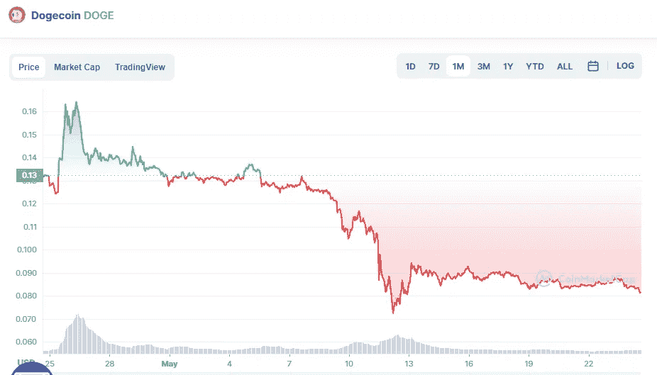

# 5 月 24 日 DogeCoin 价格分析

> 原文：<https://medium.com/coinmonks/dogecoin-price-analyse-24th-of-may-a53de1f2022d?source=collection_archive---------35----------------------->

Source photo [Dogecoin price today, DOGE to USD live, marketcap and chart | CoinMarketCap](https://coinmarketcap.com/currencies/dogecoin/)

本周一以来，多吉价格一直在一个重要的十字路口交易，这可能是多头的转折点。

上周中期，Dogecoin 的价格从大约 0.0810 美元的水平开始反弹，但多头目前似乎缺乏持续向上的动力。

目前交易价格为 0.086 美元，以狗为主题的 meme 货币当天上涨约 1%，试图…