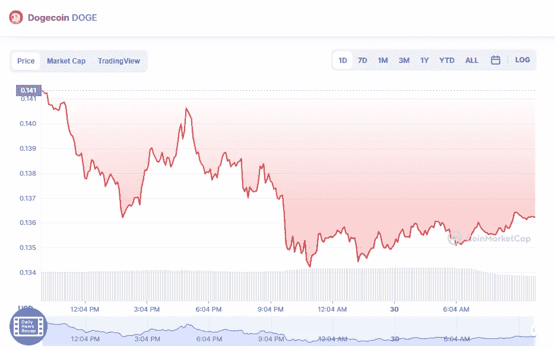

# DogeCoin 价格分析 4 月 30 日

> 原文：<https://medium.com/coinmonks/dogecoin-price-analysis-30th-of-april-728e929640af?source=collection_archive---------33----------------------->

Source photo [Dogecoin price today, DOGE to USD live, marketcap and chart | CoinMarketCap](https://coinmarketcap.com/currencies/dogecoin/)

Dogecoin 的 24 小时交易量为 1，307，736，159 美元，现在的交易价格为 0.139515 美元。过去 24 小时，Dogecoin 上涨了 1.62%。尽管在目前的价格水平下，卖出活动有所增加，但交易量在过去一天有所减少。altcoin 的交易量与市值之比为 0.07065。

截至周四，大多数主要加密货币略有上涨，但这仍然是一个…