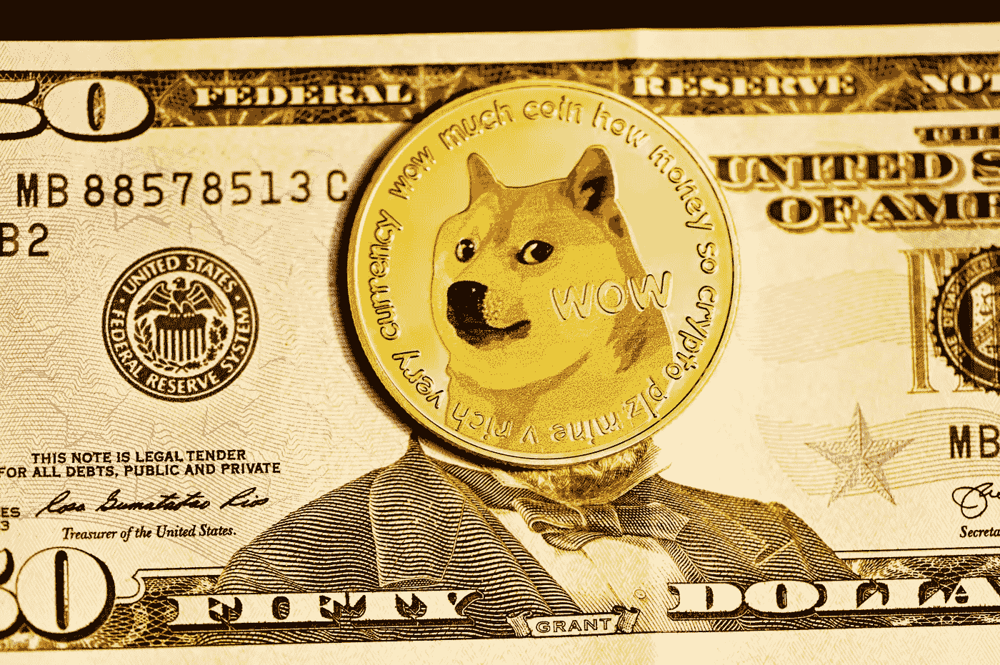

# Dogecoin 价格预测 DOGE 会在 2022 年触及 0.50 美元吗？

> 原文：<https://medium.com/coinmonks/dogecoin-price-forecast-will-doge-hit-0-50-in-2022-683e12329255?source=collection_archive---------4----------------------->

Source photo Unsplash

Dogecoin (DOGE)的价格在 2021 年飙升，建立了新的历史新高，并将普通投资者吸引到加密货币行业。

DOGE 越来越受欢迎，部分原因可能是该令牌在 2021 年的巨额回报，以及特斯拉首席执行官埃隆·马斯克(Elon Musk)等名人的支持，他最近授权 DOGE 用于购买特斯拉(纳斯达克…