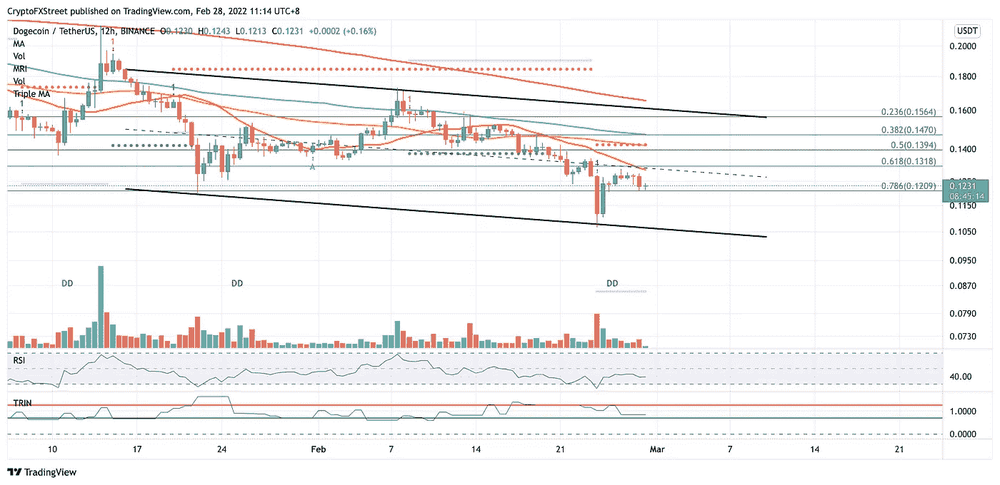

# Dogecoin 价格预测:由于购买者无法避免 14%的下跌，DOGE 的兴趣减少

> 原文：<https://medium.com/coinmonks/dogecoin-price-prediction-doge-interest-dwindles-as-purchasers-are-unable-to-avert-a-14-drop-5a1ee849b2bc?source=collection_archive---------38----------------------->

Source photo TradingView.com

由于代币陷入低迷，Dogecoin 价格可能无法避免 14%的下跌。在跌至 0.104 美元之前，DOGE 正在尝试其在 0.120 美元附近的最后防线。为了使看跌趋势模式无效，Dogecoin 必须在 0.156 美元上方切片。