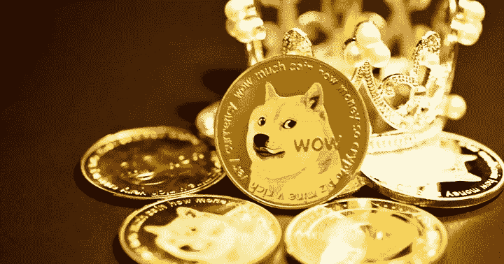

# Dogecoin 在顶级 BSC 鲸鱼中排名最广泛使用智能合同

> 原文：<https://medium.com/coinmonks/dogecoin-ranks-most-widely-utilized-smart-contract-among-top-bsc-whales-c26851f92baa?source=collection_archive---------57----------------------->

Dogecoin 是过去 24 小时内 BSC 排名前 500 的鲸鱼中使用最多的智能合约之一。Dogecoin 的交易量在鲸鱼的效用中飙升，这使 DOGE 成为顶级 BSC 鲸鱼中使用最多的智能合约之一。

除此之外，Dogecoin 还位列百强 BSC 鲸的前 10 大持股。最近的数据显示，Dogecoin 看到了鲸鱼或加密货币最大持有者的新活动。

链上数据分析公司 IntoTheBlock 提供的数据显示，链上 Dogecoin 交易量超过 10 万美元，总价值在 4 月 25 日飙升至 25.9 亿美元的高点。这家连锁分析公司指出，这是自 3 月下旬以来的最高成交量，因为它占总成交量的近 94%。

周一，价值至少 10 万美元的交易数量上升至 2，440 笔，为 1 月 14 日以来的最高水平。

加密分析师 Ali Martinez 指出,“这种市场行为可以作为鲸鱼活动的代理，表明它们可能正在为价格的大幅波动做准备。"

根据 CoinMarketCap 的数据，Dogecoin 也重返市值前十的加密货币行列，目前的估值为 185.7 亿美元。Dogecoin 在抹去了 Elon Musk 推动的收益的最大份额后，离开了前 10 名。在特斯拉首席执行官埃隆·马斯克(Elon Musk)与 Twitter 达成 440 亿美元的收购协议后，迷因加密货币上周一开始了大规模反弹。

另一个积极的方面是，首批比特币用户之一罗杰·韦尔(Roger Ver)在最近的采访中表示，他认为迷因加密货币 Dogecoin 优于领先资产。

与比特币相比，最早的加密货币支持者之一觉得这个笑话加密货币“更便宜、更可靠”。

事实上，Ver 和亿万富翁埃隆·马斯克一样，认为 Dogecoin 有潜力成为世界主导货币。

> 加入 Coinmonks [电报频道](https://t.me/coincodecap)和 [Youtube 频道](https://www.youtube.com/c/coinmonks/videos)了解加密交易和投资

# 另外，阅读

*   [Cloudbet 赌场评论](https://coincodecap.com/cloudbet-casino-review) | [点火赌场评论](https://coincodecap.com/ignition-casino-review)
*   [加密套利](/coinmonks/crypto-arbitrage-guide-how-to-make-money-as-a-beginner-62bfe5c868f6)指南| [如何做空比特币](/coinmonks/how-to-short-bitcoin-568a2d0b4ae5)
*   [如何在加拿大购买加密货币？](https://coincodecap.com/how-to-buy-cryptocurrency-in-canada)
*   [无聊猿游艇俱乐部(BAYC)回顾](https://coincodecap.com/bored-ape-yacht-club-bayc-review) | [拜比特 vs 比特币基地](https://coincodecap.com/bybit-vs-coinbase)
*   [5 款最佳加密交易终端](https://coincodecap.com/crypto-trading-terminals) | [最佳 DeFi 应用](https://coincodecap.com/best-defi-apps)