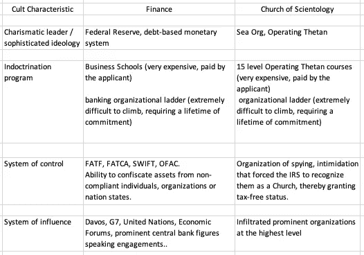
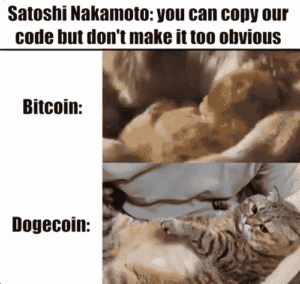
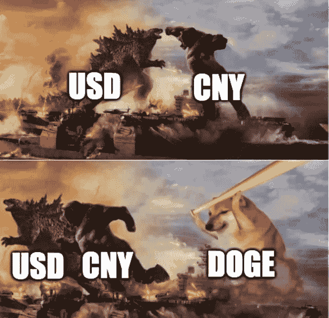

# Dogecoin 与美联储欧洲美元崇拜

> 原文：<https://medium.com/coinmonks/dogecoin-vs-the-fed-eurodollar-cult-6694286e913e?source=collection_archive---------28----------------------->

尤瓦尔·赫拉利很好地解释了人类拥有无与伦比的想象力和信仰能力:

1.  社会结构(法律、民族国家、金钱、婚姻、家庭)
2.  没有真实世界证据的叙述(宗教、邪教、死后)
3.  有证据支持的叙述(通货膨胀、真/假新闻、埃隆·马斯克)

事实上，全球 79 亿人头脑中的绝大多数想法都植根于模因，而这些模因并不客观地存在于社会共识之外。我们所知的现代金融始于 1913 年美联储的建立，最终重申了罗斯柴尔德家族基于债务的货币体系在美国的影响力。但是这里有一个问题——钱是虚构的。

甚至连传统金融 PnL 意义上的*赚钱*和*赔钱*的定义都是编造的。严重过度杠杆化的现代银行系统正在与名义上的数万亿(100，000，000，000，000)美元争夺几个基点(1%的 1/100 %),使得和*每天损失*数十亿(10，000，000，000)美元的“市值计价”。按市值计价资产的原则是金融媒体和银行监管机构推动的标准，这使得整个部分准备金制度极其脆弱。拥有数万亿美元资产负债表的全球银行有专门的部门通过再抵押优化资产收益率(任何一天，对一项资产都有多达 17 层的债权)。

金融兄弟们用复杂的行话解释定义他们 PnL 的 25 个项目，他们自己也几乎听不懂，同时对美联储怕得要死。高盛(Goldman Sachs)不会启动一个不受监管的离岸实体来交易加密货币，因为担心被视为对其罗斯柴尔德家族的霸主进行套利。

> 一个邪教是一个团体或运动，通过对一个有魅力的领袖或意识形态的共同承诺而团结在一起。

据专家(lmeow！)邪教有四个定义特征:

1.  魅力领袖/复杂的意识形态
2.  灌输计划
3.  控制系统
4.  影响力系统

全球金融行业(美联储/欧洲美元邪教)遵循着与山达基教会相同的模式，规模要大十亿倍，控制着数十亿人的生活

金钱是人类分配时间、精力和努力的方式。一切生活的目的都是为了最大化的自我实现(还有乐趣！)的大多数人类。然而，目前我们正被美联储对债务、税收、压迫和暴力的狂热所统治。这是金融的旧体制——在前互联网时代可能运转良好，但现在它已经过时、僵化，准备进行一场革命。Dogecoin 是在占领华尔街抗议活动中成立的，前提是货币应该是有趣的——复制比特币，添加有趣的柴犬以模仿 maxis 的严肃性，并在 2019 年“任命”(无论这在去中心化的点对点货币背景下意味着什么！)埃隆·马斯克(Elon Musk)将出任首席执行官。

埃隆·马斯克创立 Boring Company 是为了开玩笑，然后人们请他挖一些隧道，最近，该公司的估值达到了 50 亿美元。Dogecoin 的首席执行官拥有久经考验的超能力和将笑话变成现实的记录。

> 最有趣的结果是最有可能的。
> 
> 加入 Coinmonks [电报频道](https://t.me/coincodecap)和 [Youtube 频道](https://www.youtube.com/c/coinmonks/videos)了解加密交易和投资

# 另外，阅读

*   [币安 vs FTX](https://coincodecap.com/binance-vs-ftx) | [最佳(SOL)索拉纳钱包](https://coincodecap.com/solana-wallets)
*   [如何在 Uniswap 上交换加密？](https://coincodecap.com/swap-crypto-on-uniswap) | [A-Ads 审查](https://coincodecap.com/a-ads-review)
*   [加密货币储蓄账户](/coinmonks/cryptocurrency-savings-accounts-be3bc0feffbf) | [YoBit 审核](/coinmonks/yobit-review-175464162c62)
*   [Botsfolio vs nap bots vs Mudrex](/coinmonks/botsfolio-vs-napbots-vs-mudrex-c81344970c02)|[gate . io 交流回顾](/coinmonks/gate-io-exchange-review-61bf87b7078f)
*   [CoinFLEX 评论](https://coincodecap.com/coinflex-review) | [AEX 交易所评论](https://coincodecap.com/aex-exchange-review) | [UPbit 评论](https://coincodecap.com/upbit-review)
*   [AscendEx 保证金交易](https://coincodecap.com/ascendex-margin-trading) | [Bitfinex 赌注](https://coincodecap.com/bitfinex-staking) | [bitFlyer 点评](https://coincodecap.com/bitflyer-review)