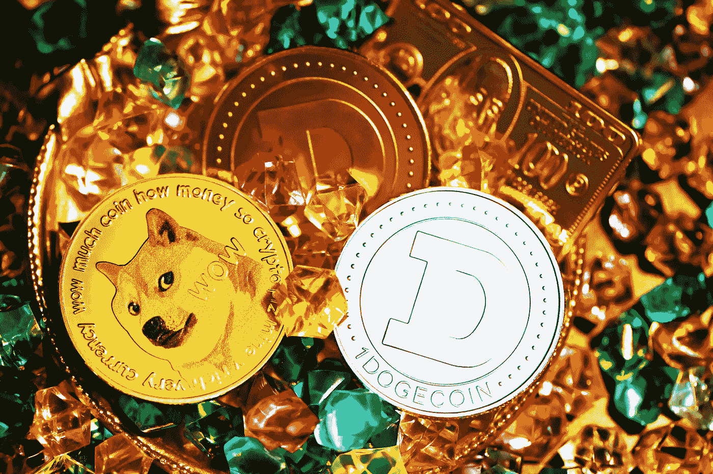

# DogeCoin 的价格看不到 20%的潜在牛市。$0.16

> 原文：<https://medium.com/coinmonks/dogecoins-price-is-losing-sight-of-a-potential-20-bull-run-0-16-4c9ad5834a21?source=collection_archive---------55----------------------->

Source photo Unsplash.com

本周 DogeCoin 突破平行通道。DOGE 的价格可能会飙升 20%，至 0.16 美元。
看涨设置的失效水平为 0.1219 美元。
DogeCoin 的价格应该还会有一波上涨。