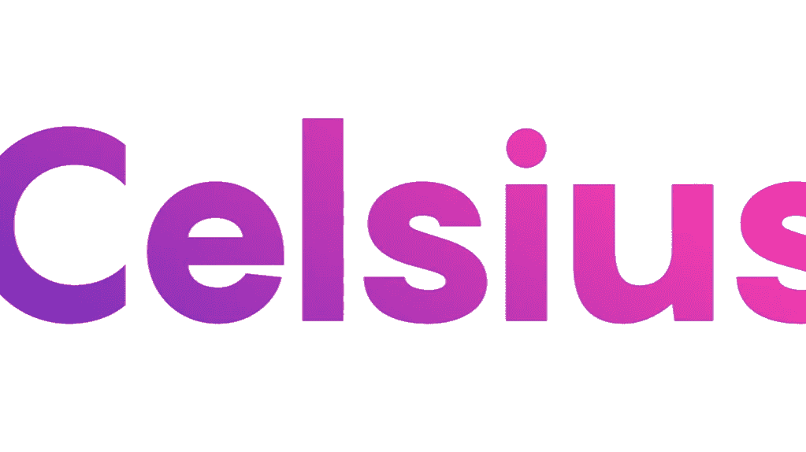
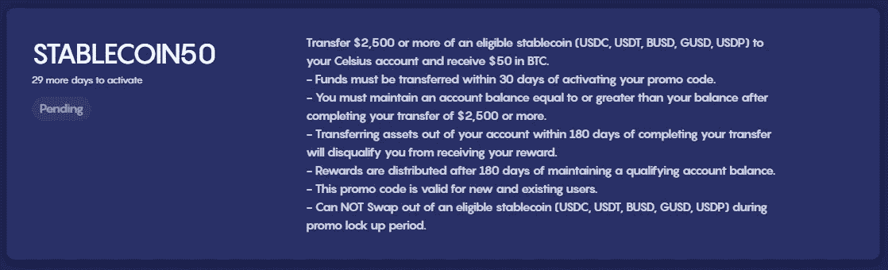
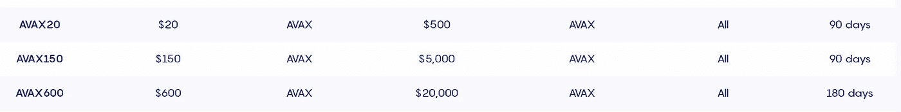
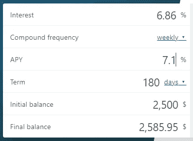
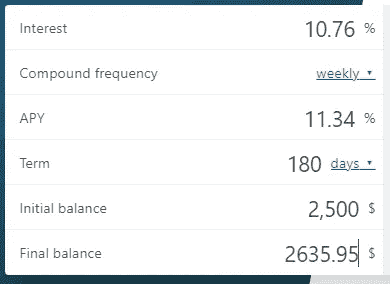

# 计算一下 Celsius 最新的 Stablecoin 促销活动值得吗？

> 原文：<https://medium.com/coinmonks/doing-the-math-is-celsius-newest-stablecoin-promotion-worth-it-3117d8ac51bd?source=collection_archive---------20----------------------->

嘿，伙计们，一如既往，请记住，这些都不是财务建议，而是仅用于教育和娱乐目的。请务必做自己的研究，找到什么投资可能最适合你。

# 快速进入摄氏和他们的促销活动

如果你关注过我的其他帖子，我会例行公事地看看 Celsius 的促销活动的潜在回报是什么，因为有些非常棒(BTC(现已到期)或 T2(仍在进行中)的 AVAX(仍在进行中)，而有些则毫无价值，甚至不值一提。如果你不熟悉[摄氏度](https://celsiusnetwork.app.link/117761912c)，它本质上是一个集中保管的钱包，允许你通过一些借贷功能从你的加密货币中赚取利息，类似于 Nexo。Celsius 作为一个托管平台，允许用户赚取我称之为中等的利息收益率，我假设这是由他们完全不收取任何费用(包括取款或转账)的事实所补贴的。这是一个权衡，人们不得不自己权衡，因为我相信对一些人来说，免费移动 ETH 可能是值得的。老实说，如果你还没有注册 Celsius，用你的第一笔存款在 BTC 赚 50 美元是一个相对简单的方法。除了注册奖金，我持有任何 Celsius 股票的唯一原因是利用他们的一些促销活动，当我看到他们在 stablecoins 上有一个时，我的兴趣无疑达到了顶峰。

# 稳定币宣传片

很快，这次促销与他们的一般促销有点不同，因为它没有分级。通常他们会根据你存款的多少进行分级促销。例如，他们当前的 AVAX one 不仅存款利率不同，而且期限也不同:

很快，这次促销与他们的一般促销有点不同，因为它没有分级。通常他们会根据你存款的多少进行分级促销。例如，他们当前的 AVAX one 不仅存款利率不同，而且期限也不同:

我个人更喜欢分层的，因为你不仅有资格进入每一个不同的层级，还可以决定你想锁定多少。现在，“锁定”可能不是一个正确的词，因为对于这些宣传片中的每一个，你的资产都没有被“锁定”，你可以随时将它们转移出去——唯一的缺点是，如果你决定撤回你的资金，它会使你失去获得宣传片支出的资格。另一件需要考虑的重要事情是，即使你认为你可能不会做宣传片，你还是应该谨慎地注册——宣传片可能会在很少或没有通知的情况下过期。然而，如果你*注册了*，你将有 30 天的时间来决定是否要参加。

# 做数学

此次促销的主要考虑因素是，有 180 天的锁定期，最低存款要求为 2，500 美元，现有的稳定利率为 7.1%的 APY。这基本上意味着，无论你是否做了宣传，如果你持有价值 2500 美元的稳定收入，你将获得 7.1%的 APY 周报(不是每天或每年，因为这是 Celsius 的做法)。将这个代入我们的 APY 计算器，得出净利润为 85.95 美元:

因此，假设你注册了 STABLECOIN50 促销活动，在 180 天的期限后，你将在价值 85.95 美元的 STABLECOIN 之外再获得 50 美元的 BTC，总计 135.95 美元。再一次，把这个代入我们的 APY 计算器，这基本上意味着你的 2，500 美元稳定币存款的利率为 **11.34% APY** :

现在，虽然这超过了许多竞争对手的稳定利率，如 [Voyager (9%)、](https://voyager.onelink.me/WNly/referral?af_sub5=JAM83321F)[【block fi(7%)】](https://app.blockfi.com/signup/?ref=bf0af2ad)或 [Gemini (6.9%)](https://www.gemini.com/share/mlv6qw37) ，但它没有打败的一个竞争对手是 [Midas Investments](https://midas.investments/?p=0191) ，即使在他们最近将稳定利率从 18.1%降至 14.5%后，这意味着无论是否促销，你仍将在 180 天内多赚 31.96 美元。像 Celsius 这样的平台可能会吸引更多的博主和社交媒体影响者，但就保险而言，风险本质上是一样的。Celsius 和 Midas 都有 2-FA 登录，并且都没有保险单。然而，同样重要的是要注意，他们都在数字资产托管机构 [Fireblocks](https://www.fireblocks.com/) 持有资产，而*是*投保的。换句话说，无论你是否决定持有 Celsius 或 Midas 资产，你的资产在持有时基本上都是有保险的。

# 结论:

随着我们进一步陷入这种令人失望的市场下行趋势，我很高兴看到平台正在用 stablecoins 进行促销，但在这种情况下，我可能不会参与，除非 Midas 的费率大幅下降。也就是说，在最近的 [Terra 惨败](/p/5ff1fecb2ce5)之后，我大大低估了分散你的资产的重要性，即使这意味着在不同的 STABLECOIN 之间分散，STABLECOIN50 促销活动基本上可以让你在 GUSD 和 USDP 赚取 11.34%的 APY，这些资产在 Midas 上是无法获得的。因此，为了对冲部分风险，赚取 11.34%的 APY 并不一定是个坏选择。

再说一次，如果你没有钱，可以考虑使用我的推荐链接([https://celsiusnetwork.app.link/117761912c](https://celsiusnetwork.app.link/117761912c))，因为这是用你的第一笔存款赚 50 美元的一个非常简单的方法。此外，我相信这不会是他们的最后一次促销，因为他们似乎每个月都会推出新的促销活动，所以请确保在您创建帐户后，注册他们的邮件列表，因为他们总是会在每周的电子邮件中宣布他们的促销活动。

感谢各位的阅读，请务必在推特上关注我:[https://twitter.com/CryptosWith](https://twitter.com/CryptosWith)

**资源**

1.  [https://www . publish 0x . com/jai k83/is-celsius-newest-BTC-promotion-worth-it-earn-more-20-p-xlzpppxn](https://www.publish0x.com/jaik83/is-celsius-newest-btc-promotion-worth-it-earn-more-than-20-p-xlzppxn)
2.  [https://celsius . network/promo-codes](https://celsius.network/promo-codes)
3.  [https://www.omnicalculator.com/finance/apy](https://www.omnicalculator.com/finance/apy#difference-between-apr-and-apy)
4.  [https://www.fireblocks.com/](https://www.fireblocks.com/)
5.  [https://medium.com/p/5ff1fecb2ce5](/p/5ff1fecb2ce5)
6.  [https://medium.com/r/?URL = https % 3A % 2F % 2 fcelsiusnetwork . app . link % 2f 117761912 c](https://celsiusnetwork.app.link/117761912c)
7.  [https://medium.com/r/?URL = https % 3A % 2F % 2f MIDAS . investments % 2F % 3Fp % 3d 0191](https://midas.investments/?p=0191)

> 加入 Coinmonks [电报频道](https://t.me/coincodecap)和 [Youtube 频道](https://www.youtube.com/c/coinmonks/videos)了解加密交易和投资

# 另外，阅读

*   如何在 Uniswap 上交换加密？ | [A-Ads 评论](https://coincodecap.com/a-ads-review)
*   [WazirX vs CoinDCX vs bit bns](/coinmonks/wazirx-vs-coindcx-vs-bitbns-149f4f19a2f1)|[block fi vs coin loan vs Nexo](/coinmonks/blockfi-vs-coinloan-vs-nexo-cb624635230d)
*   [本地比特币评论](/coinmonks/localbitcoins-review-6cc001c6ed56) | [加密货币储蓄账户](https://coincodecap.com/cryptocurrency-savings-accounts)
*   [什么是融资融券交易](https://coincodecap.com/margin-trading) | [成本平均法](https://coincodecap.com/dca)
*   [支持卡审核](https://coincodecap.com/uphold-card-review) | [信任钱包 vs 元掩码](https://coincodecap.com/trust-wallet-vs-metamask)
*   [Exness 回顾](https://coincodecap.com/exness-review)|[moon xbt Vs bit get Vs Bingbon](https://coincodecap.com/bingbon-vs-bitget-vs-moonxbt)