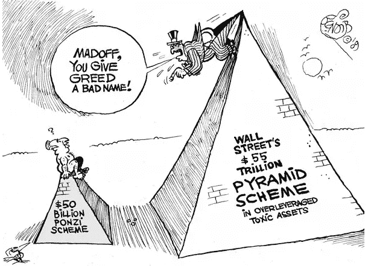
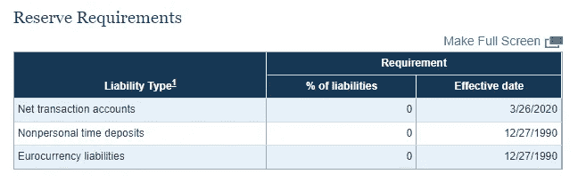
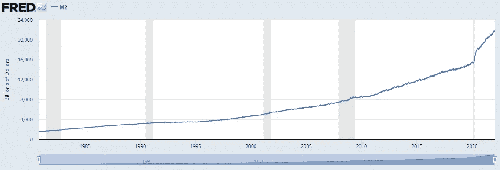
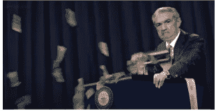
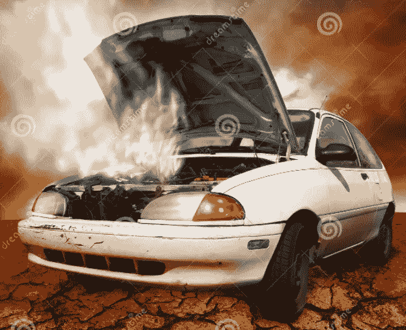
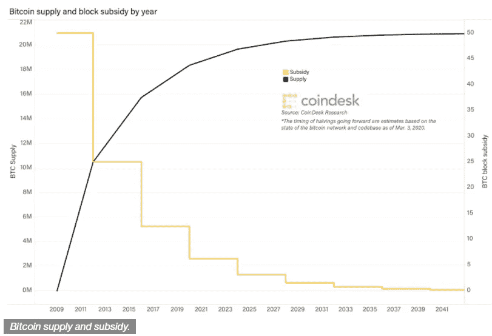
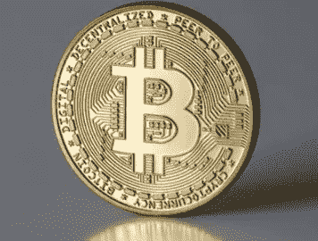
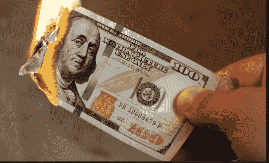

# 美元方案和 BTC(两部分中的两部分)

> 原文：<https://medium.com/coinmonks/dollar-scheme-btc-2-out-of-2-parts-9a65a50a2e5?source=collection_archive---------47----------------------->

*这不是财务建议，仅出于教育目的*。

> ***金钱乘数***

央行可以利用存款准备金率来影响更广泛的供给，他们有三种工具可供使用:

**1。准备金率:**

*   当美联储降低准备金率时，它会增加货币乘数
*   反之亦然，货币供应收缩
*   多年来，准备金率在 3%-10%之间变动，这确保了银行有准备金，但与它们的活动保持一致。

然而，当疫情发生时，所有银行的准备金率降至 0%。他们根本不需要储备。因此，银行现在可以通过向经济中借出他们想要的钱来增加 M2 的货币供应量。

***M2 货币供应量的增加+美联储印制的货币= M2 货币供应量的爆炸***

“通常以缓慢、稳定的增长为特征，M2 供应量从 2019 年底的 15.33 万亿美元增长到 7 月底的 18.3 万亿美元，增长了 20%。”—美国消费者新闻与商业频道

在美联储印钞的整个历史(107 年)中，所有的钱都是在不到一年的时间里印出来的。因为大部分是 M2 的钱，这意味着它的钱是凭空印出来的。

在一次 60 分钟的采访中，尼尔·卡什卡利(明尼阿波利斯美联储银行的行长)和杰伊·鲍威尔都承认向金融系统注入了大量资金，而且他们这样做的能力是无止境的。

这不好；金融系统崩溃了，他们只是增加更多的钱，让系统继续运行，但最终你必须修复整个系统，但这太痛苦，成本太高，不管谁在负责，都不想处理它，印更多的钱，把问题留给下一个负责这个系统的人。

这就像你知道一辆车需要一个新的变速器，因为它漏油，你把它带到机械师那里，机械师告诉你它需要更换变速器，但短期的解决办法是继续添加变速器油，汽车仍将运行。你负担不起更换变速器的费用，所以你只能继续添加液体。这应该可以让车继续运行，直到泄漏变得更严重，现在又有其他问题，散热器坏了，所以现在你刚开始添加防冻剂，车仍然可以工作，但现在你发现自己每天都在添加更多的液体来保持车的运行。然后修理汽车的成本变得更高，不仅仅是变速器坏了，散热器也坏了，你不想处理这个问题，因为你负担不起，而且太贵了。最终你会需要一辆新车。

这就是金融体系正在发生的事情它已经崩溃，再也无法运行了。印钞需要停止，但如果不造成一些经济损失，就无法做到这一点。

将过多的货币留在系统中也是有风险的，它会使货币贬值，通货膨胀率飙升，并且有过多的货币供应追逐有限的商品。

**2。联邦基金利率**

**3。公开市场操作**

> ***比特币***

这就是比特币的用武之地。比特币是法定货币所希望的。最明显的原因是比特币的供应量有限。

*   只会有 2100 万个比特币被开采。
*   这个协议限制不能调整，这是因为比特币是由代码管理的。没有人能够改变这个限制，比特币的开采率是不可改变的。
*   块奖励也是协议定义的，每 10 分钟每块开采 6.25 个比特币，该块奖励数字也在减半事件中减少。

这没有什么好笑的，通过持有自己的比特币，你实质上成为了自己的银行，而不是你把钱存在银行里&银行想怎么用就怎么用，他们把钱借出去，并扩大货币供应量，因为他们可以这么做。比特币也是透明的，没有任何实体可以逆转或没收你的硬币。

> **总结**

*   唯一比法定货币更糟糕的是部分准备金银行
*   法定货币是没有价值的货币
*   部分准备金是不受控制的货币扩张

大多数人都不知道钱是怎么赚的，钱有多不稳定。他们也把他们的储蓄存在银行里，他们把钱存在没有资金支持的银行里。只需要一次流动性紧缩就能引发恐慌，导致可怕的银行挤兑。

比特币是一个有价值的地方，因为供应有限，透明，你成为自己的银行。

现金是垃圾。

希望你觉得这有用！😃。