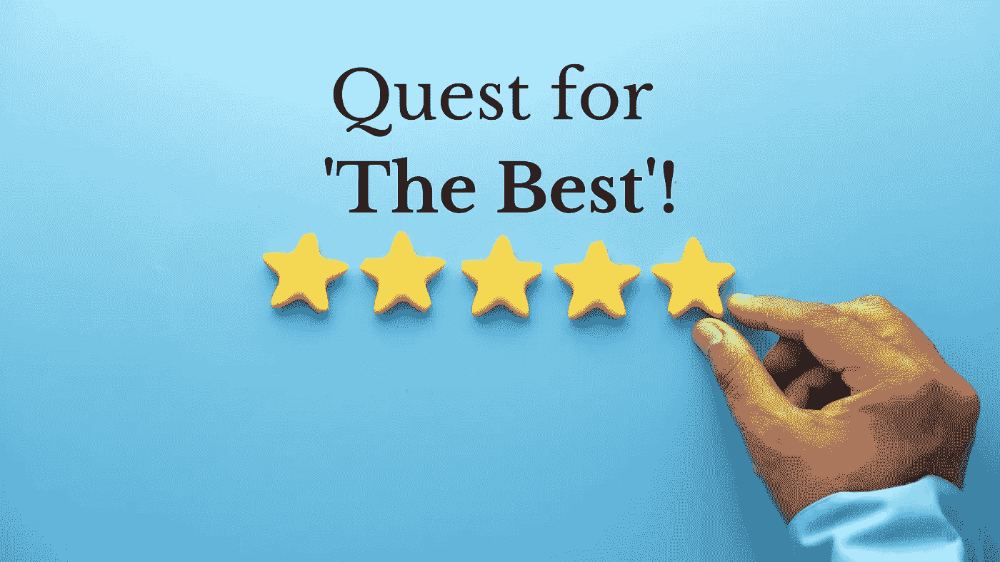

# 对“最好”的永无止境的追求！

> 原文：<https://medium.com/coinmonks/dont-chase-the-best-the-safest-investment-asset-class-do-this-instead-764b81a7aa2?source=collection_archive---------63----------------------->

为什么人们在每件事上都继续追求“最好”，结果却悲惨地失败了？

我的一个朋友(姑且称他为亚历克斯)周末打电话给我，向我寻求一些理财建议。

亚历克斯:嘿，斯里拉姆，我希望你一切都好。我在工作中获得了一笔奖金，我想把它投资出去。