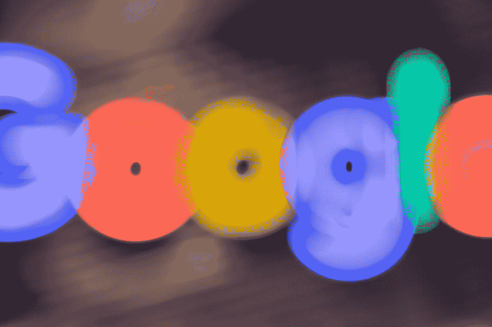
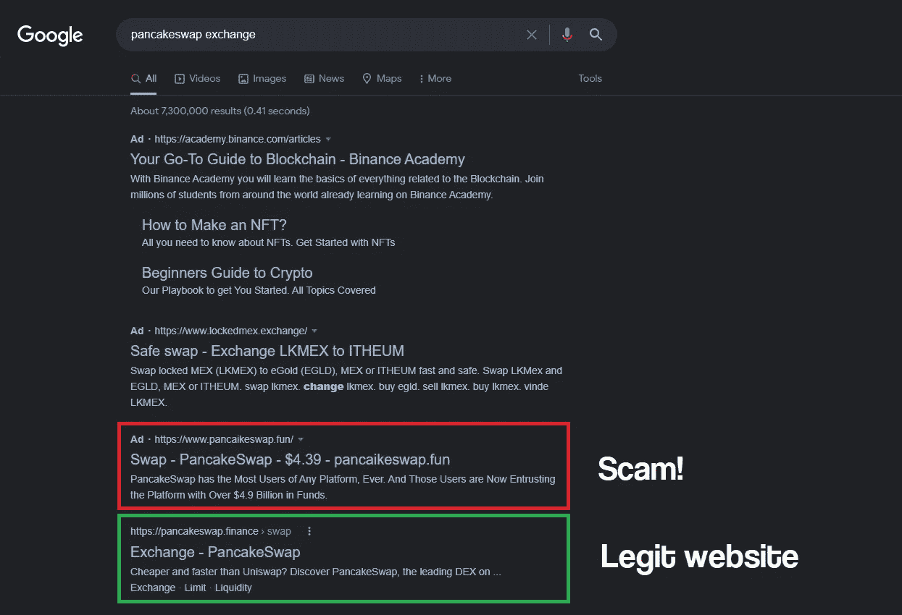
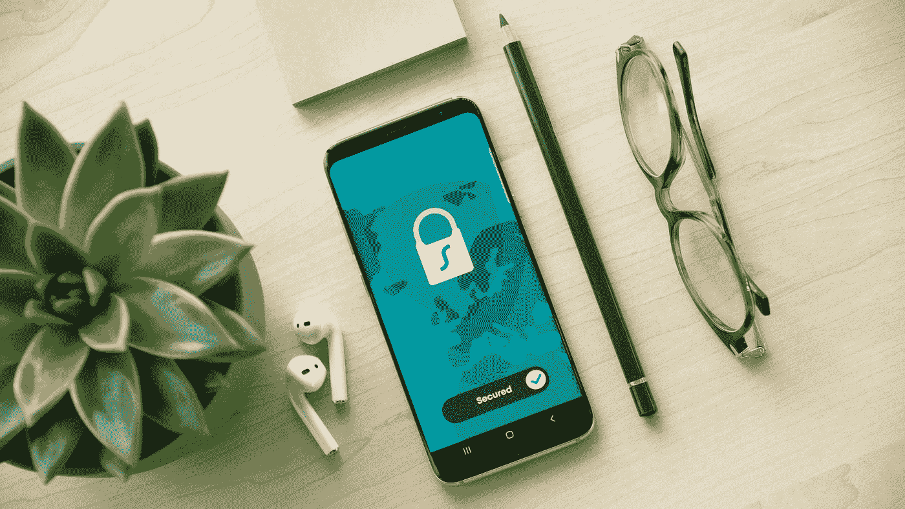

# 不要谷歌加密货币！

> 原文：<https://medium.com/coinmonks/dont-google-cryptocurrencies-200e8d60f2aa?source=collection_archive---------12----------------------->

## 加密和 web3 的安全最佳实践

## 使用谷歌寻找加密项目会导致你破产

Photo by [Mitchell Luo](https://unsplash.com/@mitchel3uo?utm_source=medium&utm_medium=referral) on [Unsplash](https://unsplash.com?utm_source=medium&utm_medium=referral)

如果我告诉你，仅去年一年，密码用户就因骗子而损失了 140 亿美元，你会怎么想？更重要的是，如果你可以随时成为他们中的一员呢？

当你在 crypto 工作一段时间后，开始感到自信是正常的。*那是大多数人落入陷阱的时候。谷歌是加密用户最常见的陷阱之一。*

**以下是你如何通过谷歌搜索丢失你的加密资金**以及如何防范它。

Photo by [Clint Patterson](https://unsplash.com/@cbpsc1?utm_source=medium&utm_medium=referral) on [Unsplash](https://unsplash.com?utm_source=medium&utm_medium=referral)

# 谷歌广告——加密投资者最大的敌人

在 DeFi 的爆发和跨越所有链的数百个协议的出现之后，Google 成为了加密用户的死亡陷阱。

为什么骗子运行谷歌广告活动，导致钓鱼加密网站。这些假网站与合法网站完全相同，所以当你进入时，你几乎分辨不出它们的区别。

> 在谷歌上搜索“Pancakeswap exchange”的结果:

攻击者总是试图使差异尽可能不引人注意。这就是为什么钓鱼网站的网址会是合法网址的小变种。它可以是单个字符或域扩展名。没有注意到这些变化是第一个错误。

用户信心满满地进入假冒网站，并开始使用它，就好像这是他们每天都在使用的 dApp 一样。在某些时候，骗子会要求他们输入私人密钥或签署交易。这是第二个不可逆转的错误。

> 一旦你输入了你的私人密钥，或者允许虚假网站通过签署的交易花费你的资金，**游戏就结束了。**

# 防止上钓鱼网站的当

加密领域每天都有紧急情况发生。也许，你持有的一个令牌正在暴涨，你想在顶部爆炸前获利了结。

UST 崩盘就是最好的例子。在崩溃之前，人们争先恐后地把钱从锚上拿下来，换成另一种稳定的货币。

问题是紧迫性经常会导致注意力分散，从而导致错误。这一点，加上作为一个经常使用 DeFi 的人的自信，是致命的一击。

Photo by [Dan Nelson](https://unsplash.com/@danny144?utm_source=medium&utm_medium=referral) on [Unsplash](https://unsplash.com?utm_source=medium&utm_medium=referral)

幸运的是，您可以采取一些预防措施来抵御网络钓鱼攻击，如谷歌广告活动。

## 仔细检查并标记链接

一个好主意和常见的做法是将你经常使用的所有 dApps 的 URL 加入书签。因此，无论何时你必须处理事务，你只需点击书签链接，就能到达你需要去的地方，从而完全避免使用谷歌。

当然，在标记链接之前，确保你在合法的网站上。

## 来源于官方账号和渠道的链接

大多数项目的官方网站都链接到他们的社交媒体和渠道。

每当我不确定我是否在正确的网站时，我都会反复检查我所在网站的 URL 与该项目的 Twitter 帐户或官方 Discord 频道中显示的链接。这样，我知道我得到的链接可能是最好的。

反复核对网址后，我在浏览器上把它加入了书签。

## 不要直接从谷歌进入网站

虽然我建议不要为了加密的目的使用谷歌，但是如果你因为某些原因不得不这样做，不要点击任何直接链接到网站的链接。

相反，尝试搜索该项目的 Twitter 账户、Telegram 和 Discord 频道、关于它们的社区评论以及任何其他类型的可能包含链接的内容。

Photo by [Alexander Shatov](https://unsplash.com/@alexbemore?utm_source=medium&utm_medium=referral) on [Unsplash](https://unsplash.com?utm_source=medium&utm_medium=referral)

# 当心骗子！

很少有行业能给你加密所提供的自由。然而，它要求责任作为回报。

在 DeFi 生态系统中导航时，确保保持警惕并遵循安全最佳实践，以最大限度地降低风险。经验丰富不重要。所有需要的是一个短暂的分心，陷入一个骗局。

我希望这篇简短的文章能帮助你提防骗子。感谢您的阅读！

## 你喜欢这个故事吗？

我很高兴你这么做了！我叫桑蒂。我喜欢并写作视频游戏、加密货币和流行文化。如果你想阅读更多类似这样的内容，可以考虑关注我的****和 [**Twitter**](https://twitter.com/SantiagoSchw_) 。我真的很感激！****

## ****如果你喜欢这个，我打赌你会喜欢…****

**** [## 这个简单的技巧将为你在寻找加密宝石时节省大量的时间和金钱

### 它将只需要你几秒钟，并帮助你区分真正的宝石从现金攫取骗局。

medium.com](/crypto-universe/this-simple-trick-will-save-you-lots-of-time-and-money-when-looking-for-crypto-gems-4110b07a3bdc)  [## 如何在你睡觉的时候从你的密码中赚取高达 16%的被动收入

### 只需将您的资产存入 Nexo，即可每天赚取利息

medium.com](/coinmonks/nexo-earn-up-to-16-of-passive-income-on-your-crypto-while-you-sleep-dfa3a756e9f7)  [## Step App，一个奖励你锻炼的完整生态系统

### STEPN 最激烈的竞争对手开始制造噪音

medium.com](/coinmonks/step-app-an-entire-ecosystem-that-rewards-you-for-exercising-50ff4d94bb4) 

> 加入 Coinmonks [电报频道](https://t.me/coincodecap)和 [Youtube 频道](https://www.youtube.com/c/coinmonks/videos)了解加密交易和投资

# 另外，阅读

*   [3 商业评论](/coinmonks/3commas-review-an-excellent-crypto-trading-bot-2020-1313a58bec92) | [Pionex 评论](https://coincodecap.com/pionex-review-exchange-with-crypto-trading-bot) | [Coinrule 评论](/coinmonks/coinrule-review-2021-a-beginner-friendly-crypto-trading-bot-daf0504848ba)
*   [莱杰 vs Ngrave](/coinmonks/ledger-vs-ngrave-zero-7e40f0c1d694) | [莱杰 nano s vs x](/coinmonks/ledger-nano-s-vs-x-battery-hardware-price-storage-59a6663fe3b0) | [币安评论](/coinmonks/binance-review-ee10d3bf3b6e)
*   [Bybit Exchange 评论](/coinmonks/bybit-exchange-review-dbd570019b71) | [Bityard 评论](https://coincodecap.com/bityard-reivew) | [Jet-Bot 评论](https://coincodecap.com/jet-bot-review)
*   [3 commas vs crypto hopper](/coinmonks/3commas-vs-pionex-vs-cryptohopper-best-crypto-bot-6a98d2baa203)|[赚取加密利息](/coinmonks/earn-crypto-interest-b10b810fdda3)
*   最好的比特币[硬件钱包](/coinmonks/hardware-wallets-dfa1211730c6) | [BitBox02 回顾](/coinmonks/bitbox02-review-your-swiss-bitcoin-hardware-wallet-c36c88fff29)
*   [BlockFi vs 摄氏](/coinmonks/blockfi-vs-celsius-vs-hodlnaut-8a1cc8c26630) | [Hodlnaut 点评](/coinmonks/hodlnaut-review-best-way-to-hodl-is-to-earn-interest-on-your-bitcoin-6658a8c19edf) | [KuCoin 点评](https://coincodecap.com/kucoin-review)****