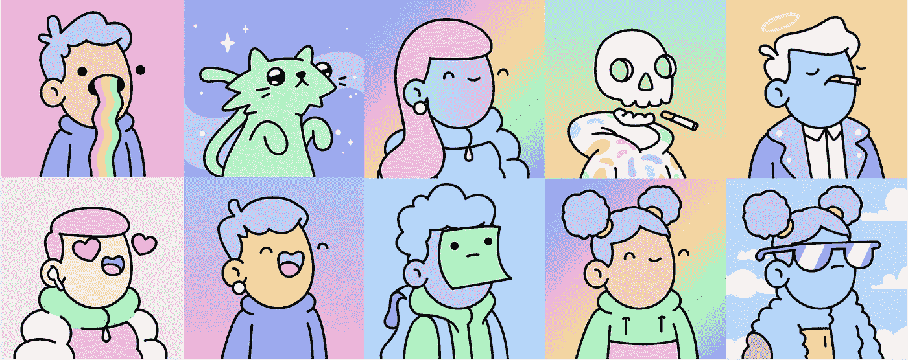
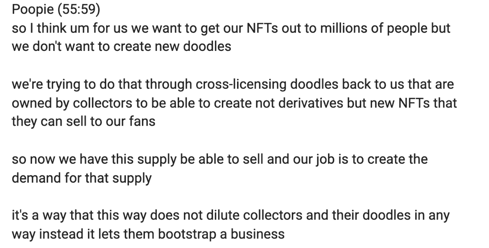
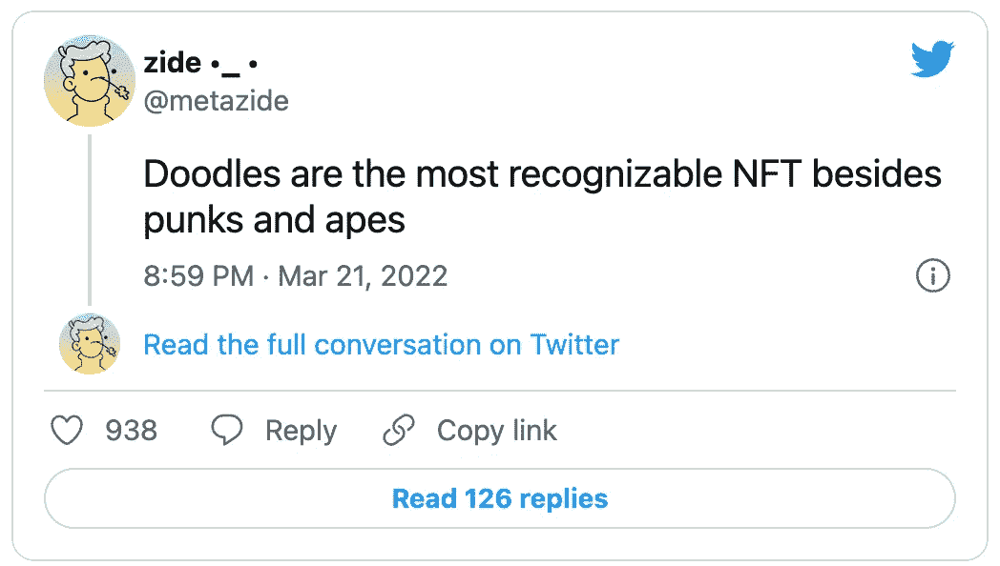
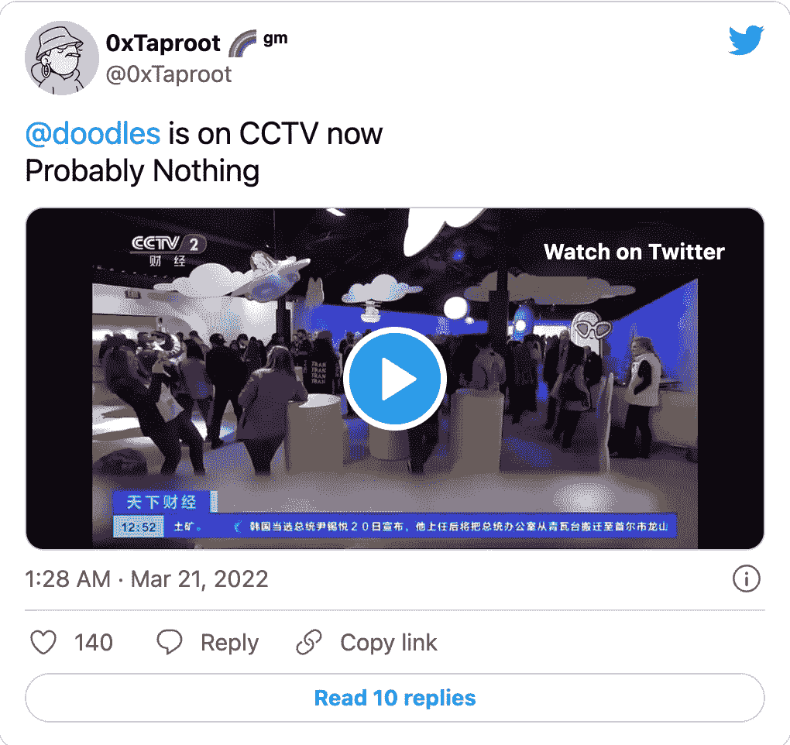

# Doodles 对交叉授权的看法

> 原文：<https://medium.com/coinmonks/doodles-vision-on-cross-licensing-explained-c0d3abdb3cfd?source=collection_archive---------41----------------------->

声明:这是试图解释 Doodles 的交叉许可的观点。以下信息完全由我自己解释，我欢迎各种评论/建议来调整我的理解。

在最近的[西南偏南](https://mobile.twitter.com/sxsw)炉边聊天[和](https://www.youtube.com/watch?v=Jo1yEkNeQlI&t=1440s) [Carly Preilly](https://mobile.twitter.com/carlypreilly) 关于[定价过高的 JPEGs 图像](https://www.youtube.com/watch?v=-5NeYlq6-Mw&t=3359s)的采访中，doodles 的联合创始人 Poopie 多次暗示了他们向持有人交叉授权 Doodles 的计划。

以下是 Poopie 与 Carly Preilly 的一段对话:

通过这次谈话，Doodles 打算把重点放在交叉授权上。一个例子是，如果有人持有涂鸦，他们可以将其许可给 Doodle LLC。持有人支付涂鸦版税或一些小的许可费，然后持有人拿着这个被许可的涂鸦创造一些新产品。

**交叉许可的三大优势**

1.  这些新产品显然将体现出**非稀释性**和个性化的特性。这种涂鸦产品永远不会损害最初的持有者，事实上，在他们的明确许可下运营，同时创造某种收入流。涂鸦旨在授予持有者权力和灵活性，使用他们的涂鸦来推出自己的产品。
2.  另外，嘟嘟的艺术风格是这个领域最具包容性的风格之一。艺术品可以引起所有性别和种族的共鸣。他们还提供独特的版本，如咖啡，鲜花，猿，外星人等等，为众多产品打开了大门，如咖啡豆，鲜花，玩具，衣服，以及任何你能想到的东西。
3.  对于创业来说，每个老板最担心的就是曝光和流量。涂鸦已经为你建立了品牌，节省你的时间和资源，同时让你只关注生产，并开始看到利润快得多。

**可能会发生什么？**

正如 Poopie 提到的，空间涂鸦将帮助你赢得"**延长许可 NFTs** "作为对持有者的奖励，这使持有者能够在涂鸦的未来体验中商业化他们的涂鸦。

涂鸦的角色

涂鸦者的工作是成为支持收藏者的中坚力量，帮助他们创造对产品的需求。

就像普皮说的，

> “我们(将)引入主流用户，向他们出售你的涂鸦的官方授权衍生品，由我们来限制它的发行量、数量、稀缺性和设计。作为收藏者，你拥有一些有形的东西，这些东西是你作为涂鸦收藏者获得的。”

因此，我们可以认为涂鸦在未来将成为持有者的市场，在吸引注意力的同时帮助持有者以最好的形式展示他们的产品。

**打造全球品牌**

通过支持他们的持有者，并确保他们在未来成功推出产品，Doodles 现在做的一件事是建立品牌并获得曝光。

这里有一个例子:

[https://twitter.com/metazide/status/1506072983609126919?ref_src=twsrc%5Etfw%7Ctwcamp%5Etweetembed%7Ctwterm%5E1506072983609126919%7Ctwgr%5E%7Ctwcon%5Es1_&ref_url=https%3A%2F%2Fmirror.xyz%2Fhowardli.eth%2FEam181DN2xtFgiA6AJFbXFpqv4pcFbiNvvyo_uhw1lM](https://twitter.com/metazide/status/1506072983609126919?ref_src=twsrc%5Etfw%7Ctwcamp%5Etweetembed%7Ctwterm%5E1506072983609126919%7Ctwgr%5E%7Ctwcon%5Es1_&ref_url=https%3A%2F%2Fmirror.xyz%2Fhowardli.eth%2FEam181DN2xtFgiA6AJFbXFpqv4pcFbiNvvyo_uhw1lM)

最近的 SXSW 是人们关注涂鸦的一个完美举动。甚至中国国家电视台也报道了涂鸦。

正如 Doodles 的另一位联合创始人埃文在炉边谈话中提到的那样，Doodles 确实有一个在国际上发展的计划。未来，Doodles 将更加努力地在美国以外扩展自己的品牌，并为其收藏者利用他们的 NFT 走上任何创造性道路奠定基础。

**前途无量**

说够了，充满创意的头脑和天才的工程师， **Doodles 决定成为这个领域的先锋，为他们的持有者探索前所未有的可能性，同时将 NFTs 带到下一个水平**。在这种情况下，真的，天空是极限，我们将看到这个旅程能带我们去哪里。

最后但同样重要的是，我喜欢涂鸦！

该帖子最初于 2022 年 3 月 23 日发布在 Twitter 上

[最初的推特帖子](https://twitter.com/Howard27836449/status/1506729255593459718)

> *加入 Coinmonks* [*电报频道*](https://t.me/coincodecap) *和* [*Youtube 频道*](https://www.youtube.com/c/coinmonks/videos) *了解加密交易和投资*

# 另外，阅读

*   [3 商业评论](/coinmonks/3commas-review-an-excellent-crypto-trading-bot-2020-1313a58bec92) | [Pionex 评论](https://coincodecap.com/pionex-review-exchange-with-crypto-trading-bot) | [Coinrule 评论](/coinmonks/coinrule-review-2021-a-beginner-friendly-crypto-trading-bot-daf0504848ba)
*   [莱杰 vs Ngrave](/coinmonks/ledger-vs-ngrave-zero-7e40f0c1d694) | [莱杰 nano s vs x](/coinmonks/ledger-nano-s-vs-x-battery-hardware-price-storage-59a6663fe3b0) | [币安评论](/coinmonks/binance-review-ee10d3bf3b6e)
*   [Bybit Exchange 评论](/coinmonks/bybit-exchange-review-dbd570019b71) | [Bityard 评论](https://coincodecap.com/bityard-reivew) | [Jet-Bot 评论](https://coincodecap.com/jet-bot-review)
*   [3 commas vs crypto hopper](/coinmonks/3commas-vs-pionex-vs-cryptohopper-best-crypto-bot-6a98d2baa203)|[赚取加密利息](/coinmonks/earn-crypto-interest-b10b810fdda3)
*   最好的比特币[硬件钱包](/coinmonks/hardware-wallets-dfa1211730c6) | [BitBox02 回顾](/coinmonks/bitbox02-review-your-swiss-bitcoin-hardware-wallet-c36c88fff29)