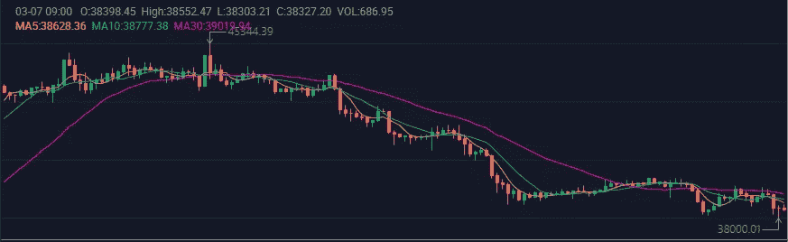

# 双 A 连锁|周报№202(2022 . 2 . 28–2022 . 3 . 6)

> 原文：<https://medium.com/coinmonks/double-a-chain-weekly-report-202-2022-2-28-2022-3-6-693d9f293784?source=collection_archive---------45----------------------->

# — —本周市场趋势— —

AAC 本周走势。

周高点:0.009523 美元

一周低点:0.007109 美元

写作时的价格:0.008765 美元

AAC Trend this week.

BTC 本周的趋势。

周高点:45344.39 美元

一周低点:38000.01 美元

写作时的价格:38323.25 美元

BTC Trend this week.

# ———运营进度———

1.  双 A 链 mainnet 的开发和内部测试已接近完成，mainnet 预计在三月中旬推出。
2.  我们非常高兴地向您介绍我们双 A 连锁的新官方网站和白皮书，已于 2022 年 3 月 3 日星期三发布。请在我们的官方社区分享您的反馈，我们很乐意看到这一点。
3.  本周，在全球 200 多个国家拥有数千名订户的全球数字媒体网站 Digital Journal 报道了双 A 链的成就:“双 A 链的吞吐量更高，交易效率更高，汽油费更低。可以给用户带来更好的体验。”
4.  Dailyherald、泰晤士报和其他媒体本周也发表了他们对双 A 链的评论，潜在地影响更多用户加入我们的社区。
5.  请订阅我们的官方公告和社区发展，了解更多最新进展。

# — ——新闻——

1.  比特币创造者是对的:武器化的金融刚刚创造了一个后美元时代的星球。
2.  [AMC 影院将通过 BitPay 接受 DOGE 和柴犬](https://www.coindesk.com/business/2022/02/28/amc-theatres-will-accept-doge-and-shiba-inu-via-bitpay/)。
3.  [在收到 3300 万美元的秘密捐款后，乌克兰称“空投得到证实”。](https://www.coindesk.com/markets/2022/03/02/ukraine-says-airdrop-confirmed-after-receiving-33m-crypto-donations/)

新的双 A 链将在元宇宙 Web 3 上有更好的表现。为了加速双 A 链市场份额和用户数量的增长，我们的团队在过去的六个月里一直致力于 NFT 和元宇宙的 Web 3 技术积累。

现在，双 A 链即将完成升级，将全面支持高频和大批量交易。最重要的是，我们的团队希望连锁店进入元宇宙，创造一个元宇宙 Web 3 生态系统。目前，双 A 连锁已经制定了相应的元宇宙 Web 3 孵化和发行计划。当我们的双 A 链 mainnet 上线时，我们的团队承诺推出一系列元宇宙 Web 3 相关的应用程序。

# ———官方团体———

官网:[https://acuteangle.com/](https://acuteangle.com/)
推特:[https://twitter.com/DoubleA_chain](https://twitter.com/DoubleA_chain)电报:[https://t.me/Double_AChain](https://t.me/Double_AChain)
不和:[https://discord.gg/Pb8fjVwt4E](https://discord.gg/Pb8fjVwt4E)
中:[https://double-a-chain.medium.com/](https://double-a-chain.medium.com/)
GitHub:[https://github.com/double-a-chain-cloud](https://github.com/double-a-chain-cloud)