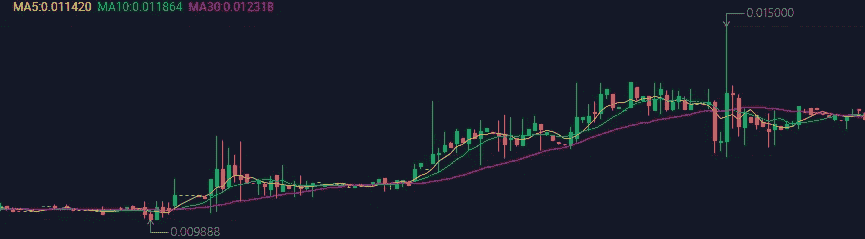
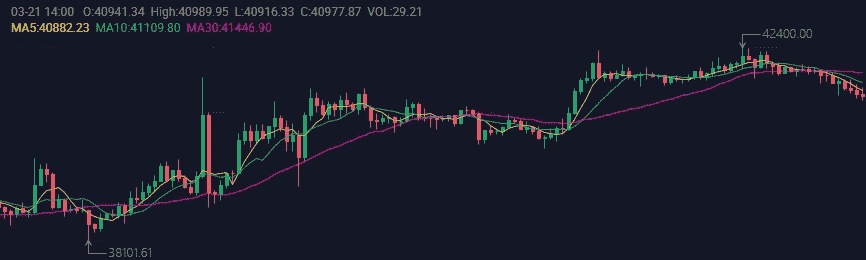

# 双 A 连锁|周报№204(2022 . 3 . 14–2022 . 3 . 20)

> 原文：<https://medium.com/coinmonks/double-a-chain-weekly-report-203-2022-3-14-2022-3-20-8f4905a6faed?source=collection_archive---------61----------------------->

# — —本周市场趋势— —

AAC 本周走势。

AAC token 的价格在本周呈上升趋势，周五上涨超过 0.013 美元。这是 AAC 在 90 天内第二次达到 0.013 美元的里程碑，本周末价格将升至 0.015 美元以上。AAC 到月球！

周最高价:0.015000 美元

一周低点:0.009888 美元

写作时的价格:0.0012630 美元

BTC 本周的趋势。

周高点:42400.00 美元

一周低点:38101.61 美元

写作时的价格:40830.81 美元

———运营进度———

1.  我们在 3 月 14 日星期一开始了空投活动。用户应在 3 月 23 日星期三之前完成空投机器人中的所有任务。总奖励 520 万 AAC，活动结束后十个工作日内发放。
2.  上周五，我们在 Twitter 空间举办了一场 AMA。在 AMA 期间，Charles 与双 A 连锁的技术总监 Ben 和社区代表 Tim Ho 一起介绍了该连锁的近期成就和计划。
3.  技术团队致力于创建一个更好的用户友好的官方网站，首先在网站上添加更多的语言选项。社区应该能够在不久的将来看到西班牙语选项。
4.  为了提高用户体验，双 A 连锁店计划建立我们的分散交易所。
5.  请订阅我们的官方公告和社区发展，了解更多最新进展。

# — ——新闻——

1.  [乌克兰泽伦斯基签署虚拟资产法案，使加密合法化](https://www.coindesk.com/policy/2022/03/16/ukraines-zelensky-signs-virtual-assets-bill-into-law-legalizing-crypto/)
2.  [马克·扎克伯格称，非功能性食物即将登陆 Instagram](https://www.coindesk.com/business/2022/03/15/mark-zuckerberg-says-nfts-are-coming-soon-to-instagram/)
3.  [随着市场适应来自美联储的更高利率，比特币保持在 4 万美元以上](https://www.coindesk.com/markets/2022/03/17/bitcoin-holds-above-40k-as-market-adjusts-to-higher-rates-from-federal-reserve/)

新的双 A 链将在元宇宙 Web 3 上有更好的表现。为了加速双 A 链市场份额和用户数量的增长，我们的团队在过去的六个月里一直致力于 NFT 和元宇宙的 Web 3 技术积累。

现在，双 A 链即将完成升级，将全面支持高频和大批量交易。最重要的是，我们的团队希望连锁店进入元宇宙，创造一个元宇宙 Web 3 生态系统。双 A 连锁制定了相应的元宇宙 Web 3 孵化和发行计划。当我们的双 A 链 mainnet 上线时，我们的团队承诺推出一系列元宇宙 Web 3 相关的应用程序。

# ———官方团体———

官网:[https://acuteangle.com/](https://acuteangle.com/)
推特:[https://twitter.com/DoubleA_chain](https://twitter.com/DoubleA_chain)电报:[https://t.me/Double_AChain](https://t.me/Double_AChain)
不和:[https://discord.gg/Pb8fjVwt4E](https://discord.gg/Pb8fjVwt4E)
中:[https://double-a-chain.medium.com/](https://double-a-chain.medium.com/)
GitHub:[https://github.com/double-a-chain-cloud](https://github.com/double-a-chain-cloud)

> *加入 Coinmonks* [*电报频道*](https://t.me/coincodecap) *和* [*Youtube 频道*](https://www.youtube.com/c/coinmonks/videos) *了解加密交易和投资*

# 另外，阅读

*   [Bookmap 评论](https://coincodecap.com/bookmap-review-2021-best-trading-software) | [美国 5 大最佳加密交易所](https://coincodecap.com/crypto-exchange-usa)
*   最佳加密[硬件钱包](/coinmonks/hardware-wallets-dfa1211730c6) | [Bitbns 评论](/coinmonks/bitbns-review-38256a07e161)
*   [新加坡十大最佳加密交易所](https://coincodecap.com/crypto-exchange-in-singapore) | [购买 AXS](https://coincodecap.com/buy-axs-token)
*   [红狗赌场评论](https://coincodecap.com/red-dog-casino-review) | [Swyftx 评论](https://coincodecap.com/swyftx-review) | [CoinGate 评论](https://coincodecap.com/coingate-review)
*   [投资印度的最佳密码](https://coincodecap.com/best-crypto-to-invest-in-india-in-2021)|[WazirX P2P](https://coincodecap.com/wazirx-p2p)|[Hi Dollar Review](https://coincodecap.com/hi-dollar-review)