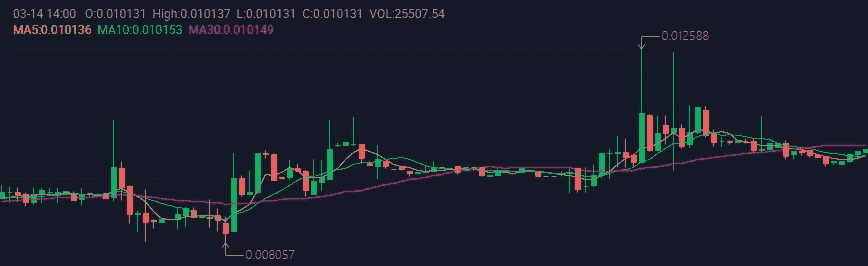
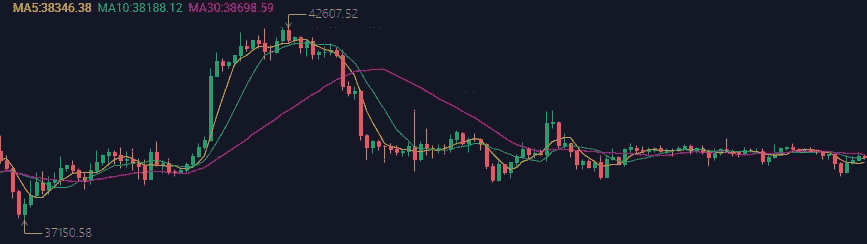

# 双 A 连锁|周报№203(2022 . 3 . 7–2022 . 3 . 13)

> 原文：<https://medium.com/coinmonks/double-a-chain-weekly-report-203-2022-3-7-2022-3-13-ceca6b55acda?source=collection_archive---------27----------------------->

# — —本周市场趋势— —

AAC 本周走势。

AAC token 的价格在本周呈上升趋势，并在新 mainnet 发布后的 24 小时内，于周五再次上涨超过 0.01 美元，这是 AAC 的价格今年第五次超过 0.01 美元的里程碑。

一周高点:0.012588 美元

一周低点:0.008057 美元

写作时的价格:0.010133 美元

AAC’s trend this week.

BTC 本周的趋势。

周高点:42607.52 美元

一周低点:37150.58 美元

写作时的价格:38538.02 美元

BTC’s trend this week.

———运营进度———

1.  我们在周四发布了双 A 连锁的 mainnet。我们将尽全力支持元宇宙和 Web3 开发者，为全球用户带来更好的体验。
2.  在双 A 连锁店推出后，我们收到了许多来自区块链世界的祝贺。就像我们来自 [BoringDAO](https://medium.com/u/65b7766fbc50?source=post_page-----ceca6b55acda--------------------------------) 的合作伙伴在转发我们的推文时所说的，他们很高兴与我们合作，他们的用户已经准备好加入我们的空投活动。
3.  运营团队正在策划一个大型空投活动，以庆祝双 A 链 mainnet 的启动。一旦一切确定，我们将发布更多的细节。请通过官方社区与我们保持联系，立即获得关注。
4.  为了提高用户体验，双 A 连锁店计划建立我们的分散交易所。
5.  请订阅我们的官方公告和社区发展，了解更多最新进展。

# — ——新闻——

1.  [拜登发布期待已久的美国加密行政命令](https://www.coindesk.com/policy/2022/03/09/biden-issues-long-awaited-executive-order-on-crypto/)
2.  [拜登的行政命令呼吁“高度紧急”进行 CBDC 研发](https://www.coindesk.com/policy/2022/03/10/bidens-executive-order-calls-for-highest-urgency-on-cbdc-research-and-development/)
3.  [比特币重回 40K 美元以下区间；支持价格为 35，000-37，000 美元](https://www.coindesk.com/markets/2022/03/10/bitcoin-returns-to-range-below-40k-support-at-35k-37k/)

新的双 A 链将在元宇宙 Web 3 上有更好的表现。为了加速双 A 链市场份额和用户数量的增长，我们的团队在过去的六个月里一直致力于 NFT 和元宇宙的 Web 3 技术积累。

现在，双 A 链即将完成升级，将全面支持高频和大批量交易。最重要的是，我们的团队希望连锁店进入元宇宙，创造一个元宇宙 Web 3 生态系统。目前，双 A 连锁已经制定了相应的元宇宙 Web 3 孵化和发行计划。当我们的双 A 链 mainnet 上线时，我们的团队承诺推出一系列元宇宙 Web 3 相关的应用程序。

# ———官方团体———

官网:[https://acuteangle.com/](https://acuteangle.com/)
推特:[https://twitter.com/DoubleA_chain](https://twitter.com/DoubleA_chain)电报:[https://t.me/Double_AChain](https://t.me/Double_AChain)
不和:[https://discord.gg/Pb8fjVwt4E](https://discord.gg/Pb8fjVwt4E)
中:[https://double-a-chain.medium.com/](https://double-a-chain.medium.com/)
GitHub:[https://github.com/double-a-chain-cloud](https://github.com/double-a-chain-cloud)

> 加入 Coinmonks [电报频道](https://t.me/coincodecap)和 [Youtube 频道](https://www.youtube.com/c/coinmonks/videos)了解加密交易和投资

# 另外，阅读

*   [BlockFi vs 摄氏度](/coinmonks/blockfi-vs-celsius-vs-hodlnaut-8a1cc8c26630) | [Hodlnaut 点评](/coinmonks/hodlnaut-review-best-way-to-hodl-is-to-earn-interest-on-your-bitcoin-6658a8c19edf) | [KuCoin 点评](https://coincodecap.com/kucoin-review)
*   [Bitsgap 审查](/coinmonks/bitsgap-review-a-crypto-trading-bot-that-makes-easy-money-a5d88a336df2) | [Quadency 审查](/coinmonks/quadency-review-a-crypto-trading-automation-platform-3068eaa374e1) | [Bitbns 审查](/coinmonks/bitbns-review-38256a07e161)
*   [加密复制交易平台](/coinmonks/top-10-crypto-copy-trading-platforms-for-beginners-d0c37c7d698c) | [Coinmama 审核](/coinmonks/coinmama-review-ace5641bde6e)
*   [印度的加密交易所](/coinmonks/bitcoin-exchange-in-india-7f1fe79715c9) | [比特币储蓄账户](/coinmonks/bitcoin-savings-account-e65b13f92451)
*   [OKEx vs KuCoin](https://coincodecap.com/okex-kucoin) | [摄氏替代品](https://coincodecap.com/celsius-alternatives) | [如何购买 VeChain](https://coincodecap.com/buy-vechain)