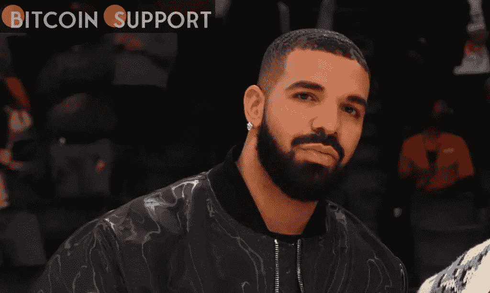

# 德雷克未能赢得 275，000 美元的比特币赌博

> 原文：<https://medium.com/coinmonks/drake-fails-to-win-a-275-000-bitcoin-gamble-5a3b3a065f39?source=collection_archive---------48----------------------->

**Visit our website:-** [**https://bitcoinsupports.com/**](https://bitcoinsupports.com/)

当 Colby Covingto 成为综合格斗高手时，Drake 遭受了超过 25 万美元的经济损失。

加拿大音乐家德雷克(Drake)在与美国职业综合格斗家豪尔赫·马斯维达尔(Jorge Masvidal)打赌后，在世界上最有价值的加密货币比特币中输掉了近 27.5 万美元。

“在我的感觉中”的歌手预计马斯维达尔将在周六的 UFC 272 赛事中击败科尔比·科温托。

德雷克在对处于劣势的一方大胆下注后，可能会带走超过 70 万美元。

[https://twitter.com/MMAFighting/status/1500309883291377666](https://twitter.com/MMAFighting/status/1500309883291377666)

遗憾的是对于这位超级巨星说唱歌手来说，冷门并没有发生，正如科温托在独霸每一轮后一致赢得了斗气战。

这已经不是德雷克第一次押比特币了。在 LVI 超级碗上下注 130 万美元后，他在 2 月份赢得了 381，000 美元。洛杉矶公羊队击败了辛辛那提孟加拉虎队，这让这位说唱歌手轻松赚到了钱。然而，后来发现处理德雷克赌注的加拿大在线博彩公司 Stake 并没有在安大略省注册。因此，他的赌博可能是非法的。

美国说唱歌手柯达·布莱克(Kodak Black)上个月表示，他收到了德雷克赠送的 25 万美元比特币礼物。

**访问我们的网站:-**[**https://bitcoinsupports.com/**](https://bitcoinsupports.com/)

**免责声明:以上为作者观点，不应视为投资建议。读者应该自己做研究。**