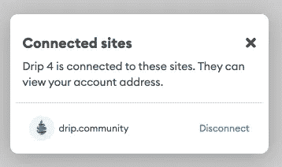

# drip——noobs 的详细设置方法

> 原文：<https://medium.com/coinmonks/drip-a-detailed-setup-howto-for-noobs-a41c66f2c5d1?source=collection_archive---------2----------------------->

对于那些想了解更多关于开始使用 Drip(和一般的 crypto)的本质细节的人来说，这篇文章是一个起点。我提供的细节比大多数介绍滴滴的文章都要多。

Photo by [Brett Jordan](https://www.pexels.com/@brettjordan?utm_content=attributionCopyText&utm_medium=referral&utm_source=pexels) from [Pexels](https://www.pexels.com/photo/brown-wooden-blocks-on-white-surface-10395126/?utm_content=attributionCopyText&utm_medium=referral&utm_source=pexels)

# TLDR；

有很多关于点滴投资的文章，大多数倾向于假设读者有一些知识。大多数文章是这样说的:

1.  购买 BNB
2.  创建元掩码 wallet
3.  将 BNB 转移到 Metamask
4.  进入[https://Drip . community/swap](https://drip.community/swap)，连接 Metamask 钱包，使用你的 BNB 余额购买滴滴。你至少需要 1.12 滴
5.  转到滴水水龙头页面，将水滴放入水龙头
6.  你需要一个好友，所以在这里使用我的好友地址(我的是 0 xcf 4a 851 b 797107927 b 23 B3 e 4648 f 66d 05 b 983 c 4 e，如果这个 TLDR 足够:)也见下面的细节加入我们的 Discord 服务器。
7.  水合物！或者声称一旦你有足够的点滴。

Brown Wooden Table With Chairs and wood cube shelves behind — Photo by [Mikhail Nilov](https://www.pexels.com/@mikhail-nilov?utm_content=attributionCopyText&utm_medium=referral&utm_source=pexels) from [Pexels](https://www.pexels.com/photo/brown-wooden-table-with-chairs-8871852/?utm_content=attributionCopyText&utm_medium=referral&utm_source=pexels)

好的，酷——我可以理解，因为我已经知道这个话题，但是如果你是第一次接触 Drip(或者甚至是一般的加密交易),那么会有很多遗漏的细节。**包括保护你的密码的关键步骤。**

这篇文章已经被证明是相当长的-这表明了有多少实际上涉及到从点滴开始。如果我需要进一步阐述这些或其他方面，请在评论中告诉我。或者扔掉任何浪费空间的东西。

本系列的第一篇文章是一篇介绍性文章，可以在以下网址找到:

*   [点滴——悲伤的五个阶段](/@bbosmith/drip-the-five-stages-of-grief-ba3c5ddf07fb)

我有一篇后续文章:

*   [滴滴本质安全](/@bbosmith/drip-essential-security-459cf58aad92)。

我还有几个正在筹备中。

# **滴漏—按编号**

Plastic Numbers on White Background — Photo by [Tara Winstead](https://www.pexels.com/@tara-winstead?utm_content=attributionCopyText&utm_medium=referral&utm_source=pexels) from [Pexels](https://www.pexels.com/photo/plastic-numbers-on-white-background-7111514/?utm_content=attributionCopyText&utm_medium=referral&utm_source=pexels)

**作者声明**:这不是贸易或金融建议。这些信息仅供娱乐，仅代表作者的观点。所有的交易和投资，无论是房地产、股票还是密码，都有亏损的风险，有时亏损会超过 100%。不要用你不愿意损失的资金进行交易或投资。我不对你的交易错误，交易损失，或错过的机会负责，即使你是我的滴滴团队的一员。请自己做研究，自己核实信息。对一项投资的过去或潜在表现的任何参考都不是，也不应被解释为对任何特定结果或利润的建议或保证。

滴滴是币安智能链(区块链)上的 Defi 项目，每天支付 1%，可以复利给你一个 3053.61%的 [APY](https://www.investopedia.com/terms/a/apy.asp) 。1000 美元的投资可能在 12 个月内价值 30，536 美元！更好的是，你可以用这种方式保持存款增长近 4 年。两年后，您的存款将价值 999，525 美元。你的银行可能会付给你每年 1%的利息。和他们在一起一年后，1000 美元就是 1010 美元。哇——冷静点儿！

事情远不止如此，但这些数字表明了结果。

请注意，您添加的任何存款都不能提取。所有的钱都来自于索赔而不是补水的利息——每天你都可以选择补水或者索赔。

对于习惯于股票等传统股票的投资者来说，存款被“烧掉”是不寻常的。这是滴滴的部分风险。像任何事情一样，只投资你能承受的损失。

必须等待资产的增长是很好理解的。但是对于传统投资者来说，拥有 3053.61%的 T2 APY 是完全疯狂的。鉴于此，尽管损失了您的存款，但**需要在前 124 天申领才能拿回初始存款**。或者从开始的 18 个月开始补水，然后在第 **1 天**领取您的存款。或者在补水和声称在 6 个月后拿回您的**存款之间交替！其余的都是利润。**

这凸显了滴滴网的一个游戏方面。有许多策略可以采用。

## 这是骗局吗

你可能想知道，滴滴网络是如何每天向用户支付 1%的费用的。我将在以后的文章中详细讨论这一点。现在只要明白这一切都是光明正大的。它的工作原理是在网络内征税。10%存取款。和 5%水合。一旦“鲸鱼”开始声称他们可能要向网络支付高达 50%的税。

这是一个骗局吗——我读到的一切都支持它是合法的。当然，像任何投资一样，也有风险。这是一种欺诈产品，会拿走你所有的钱吗？我读到的都是否定的。但是不要相信我的话。

从[https://charts . MongoDB . com/charts-Drip-EFP xa/public/dashboards/613 c 8813-c5e 6-4d a6-8d 73-62af 61 DD 4497 看滴滴图表和分析？UTM _ source = beta+chart+MongoDB](https://charts.mongodb.com/charts-drip-efpxa/public/dashboards/613c8813-c5e6-4da6-8d73-62af61dd4497?utm_source=beta+chart+mongodb)

Drip analysis screenshot showing number of investors and other Drip network stats

那就是 81000 人深信不疑。可以看到这个项目已经运行了 10 个月了。开发者不隐藏，可以自由接触。首席开发者 Forex Shark 公开了他正在开发的滴滴产品和其他产品——https://twitter.com/F0r3x_Shark。

有报酬吗？请查看底部图表水平轴上第四个条目后的所有蓝色线条(玩家数量和存款数量)。第三个条目是 1200 滴。这些玩家很可能已经开始申请了，至少每隔一天，他们每天至少接受 12 滴，或者每月 180 滴。按每滴水 100 美元计算，即每月 18，000 美元。水平轴中间的较大持有人有 10，000 滴水的存款，即每天 100 滴水的利息，每天 10，000 美元或每月 150，000 美元。头往右看，存款两万七滴的肥猫。他们得到 270 滴水，每天 27，000 美元，每月 405，000 美元。我用的是交替补水，在这里声明。一旦你达到这些更高的持有水平，你就会每天申请——那么每个月就是 81 万美元。9 个月(取决于你一路上索赔多少)。

这是每个钱包。我有 10 个钱包(实际上是 12 个，因为我一直在写这些文章)。所以当我到那里的时候，我将每个月得到 800 万美元！如果价格是 100 美元一滴。

## 这是庞氏骗局吗

> 庞氏骗局(/ˈpɒnzi/，意大利语:[pontsi])是一种欺诈形式，它引诱投资者，用近期投资者的资金向早期投资者支付利润。[1]该骗局使受害者相信利润来自合法的商业活动(例如产品销售或成功的投资)，而他们仍然不知道其他投资者是资金的来源。只要新的投资者投入新的资金，只要大多数投资者不要求全额还款，并且仍然相信他们声称拥有的并不存在的资产，庞氏骗局就可以维持一个可持续经营的假象。— [维基百科](https://en.wikipedia.org/wiki/Ponzi_scheme)

滴滴网的每个人都赚一样的 1%。早期投资者的唯一优势是他们可以建立一个“下线”团队。我加入这个网络已经 7 周了，已经有了一个有 5 个下线的团队。每个人都有同样的机会。

我的钱包就在上面显示和讨论的图表的左边。除了 1 个(11 个)都在最左边的栏中，不到 100 滴。第 12 个钱包在第二个吧台。

我很快就可以开始申请了。如果我从今天开始，我每天的收入会少于 400 美元(在我的国家纳税之前)。

这里关于滴滴不是骗局或庞氏骗局的细节非常简单。我会在以后的文章中写更多关于这个的内容，你只需要相信我和其他 81，226 个人。

# 我们开始吧

在阅读详细信息之前，请回顾一下本文开头和这里复制的步骤。我已经把遗漏的新步骤交错起来了。

1.  购买硬件钱包— **新品**
2.  设置硬件钱包和账户— **新增**
3.  设置加密货币兑换账户
4.  创建元掩码 wallet
5.  向外汇账户转账— **新增**
6.  购买 BNB
7.  将 BNB 转移到 Metamask
8.  进入[https://Drip . community/swap](https://drip.community/swap)，连接 Metamask 钱包，使用你的 BNB 余额购买滴滴。你至少需要 1.12 滴
9.  转到滴水水龙头页面，将水滴放入水龙头
10.  你需要一个好友，所以在这里使用我的好友地址(我的是 0 xcf 4a 851 b 797107927 b 23 B3 e 4648 f 66d 05 b 983 c 4 e，如果这个 TLDR 足够:)也见下面的细节加入我们的 Discord 服务器。
11.  水合物！或者声称一旦你滴够了。

在我们购买 BNB 并开始我们的加密之旅之前，我们需要做一些必要的基础工作。

我是一名计算机科学家，从事加密交易已经 5 年了。这里提供的信息基于我在那段时间的经历，最重要的是在过去的 8 周里，我倾注了无尽的努力来了解和参与滴滴网络。

当你开始读这篇文章的时候，请留出至少一周的时间来理清一切。做好心理准备，这样当你看到以太坊下跌 10%时，你就不会感到慌张和愤怒了！

**加密交易的第一条指导原则** —由于其分散的性质，以及缺乏银行甚至国家储备银行等中央机构的“监管”，它充满了**骗局和骗子**。遵循一些简单的规则可以防止几乎所有可能的攻击。最主要的一点是**不要上当受骗。**如上所述，滴滴不是一家:)。

**始终使用硬件钱包。**我在这里讨论这个问题——查看我的另一篇文章，其中我讨论了基本的滴滴安全的其他方面:

*   [滴滴——本质安全](/@bbosmith/drip-essential-security-459cf58aad92)

## 硬件(冷)钱包

订购一个**硬件钱包**——Leger 和 Trezor 是这一领域的大牌。还有一个新成员— Lattice，它由 Metamask 支持。硬件钱包是用来把你的私人钥匙放在与互联网断开的“冷库”里的。一个应该用于所有的加密交易(不仅仅是滴滴)。

有热门的软件钱包，我们用一个(元掩码)。然而，他们是热的，因为他们连接到互联网。连接到互联网的计算机会受到很多攻击。不值得用 crypto 冒险，因为它是一个非常受欢迎的目标。用一个冰冷的硬件钱包来存放你的私钥。

私钥就像你的银行账户登录信息一样，只是如果被盗就没有追索权了。没有你能与之交谈的“银行”能让事情恢复正常。你将会持续 3 年以上的点滴，这是一段很长的风险时期。

现在你可能会想，你可以以后再设置你的冷钱包。不幸的是，这对于滴滴来说并不容易，因为你没有自己的存款。在开始之前，你必须让这一切运转起来。

很抱歉，在这一步和下一步完成之前，你需要暂停你的旅程。

确保您直接从制造商处购买硬件钱包:

*   https://www.ledger.com/
*   【https://trezor.io/ 
*   [https://gridplus.io/products/grid-lattice1](https://gridplus.io/products/grid-lattice1)

我使用一个分类帐 Nano X(并有一个 Nano S 作为备份),并将只在我的文章中讨论使用这些。虽然我选择了使用莱杰，但我还是听到了很多关于特雷佐的好消息。这个格子对我来说是新的。

一旦你有了一个冷钱包，并按照制造商的说明设置好之后，请回到这里。继续下一步以设置加密交换帐户。

## 在分类帐 Live 中设置帐户

您需要在 Ledger Live 中设置帐户。它*可以*在 Metamask 中完成，但是我在这样做时犯了错误，并且发现最好这样做:

1.  首先[在你的账本设备上安装](https://support.ledger.com/hc/en-us/articles/4405365395857-Binance-Smart-Chain-BNB-?docs=true)币安智能链应用
2.  然后[在 Ledger Live 中设置](https://support.ledger.com/hc/en-us/articles/4404324652177-Set-up-a-Binance-Smart-Chain-BNB-account-in-Ledger-Live?docs=true)一个币安智能连锁(BNB)账户

我有多个滴滴钱包，分别命名为‘滴滴 1’，‘滴滴 2’，…以便在你需要在 Metamask 钱包中切换时更容易追踪。我将在以后的文章中讨论管理多个钱包。

您还需要在硬件钱包上安装 Etherium 应用程序。

## 设置加密交换帐户

在 BNB - [币安](https://www.binance.com)、 [Binance.us](https://www.binance.us/en) (*1)、[比特币基地](https://www.coinbase.com/price/binance-coin) (*2)、 [Coinify](https://mycoinify.com/trade/?targetPage=buy&coin=BNB) 或 [BTCMarkets](https://www.btcmarkets.net/) 交易的可信加密货币交易所设立账户。每天都有新的交易所开张。只要确保你选择了一个有信誉的(自己做研究——dyor)。

(*1) Binance.us 显然不适用于康涅狄格州、夏威夷、爱达荷州、路易斯安那州、纽约州、德克萨斯州和佛蒙特州的居民

(*2)美国公民不能使用比特币基地购买 BNB。

[Coinmaketcap](https://coinmarketcap.com/currencies/bnb/) 列出了 BNB 交易对。

你用哪一个也要看你的国家。除此之外，各种各样的产品之间没有太大的区别，所以我不会在这上面花费太多精力。除非你想购买所选交易所没有的其他硬币/代币。请记住，您可以注册多个交易所。

每个交易所都需要通过**了解你的客户(KYC)** 步骤来验证你在注册账户时的身份。这是帮助减少欺诈、诈骗和洗钱的部分步骤。它还可以让您所在国家的税务部门了解您的加密货币交易(意图)。大多数国家承认加密货币交易的资本收益，并希望你纳税。所以保留你自己的记录。我会就此再写一篇文章。

KYC 可能需要一两天来设置。

您应该在您的帐户上设置身份验证安全性。使用电子邮件、电话、认证器和 YubiKey 可以实现最大的安全性。你不太可能经常撤销，所以有必要设置多个，其中一个是认证者或 YubiKey。我使用电子邮件，电话和认证。

Binance security authentication setup screen

*在这一点上等待，直到你有一个冷钱包和加密交换帐户设置。*

## 设置热门钱包

滴滴运营需要一个软钱包。

热钱包将你的私人密钥储存在软件中，这些软件可以在你的桌面、手机或像币安这样的加密交换服务器上运行。它们使用起来既方便又容易。不利的一面是，它们暴露在互联网上，容易被恶意软件接管，被黑客攻击或通过其他方式暴露。

是的，这个概念很可怕。然而，热钱包可以和冷钱包一起使用，在冷钱包里，你的私人钥匙是安全的。从而为您提供两全其美的服务—便利和安全。通过方便的热钱包执行的所有交易都必须通过冷钱包，因为私钥实际上就在冷钱包中。

滴滴网络目前支持的有:

*   Metamask 作为一个浏览器插件出现在我们面前，有 Chromium (Chrome，Brave，Edge)和 Firefox 版本
*   [钱包连接](https://walletconnect.com/)是一款热门的钱包，用于将移动钱包连接到分散的应用程序
*   [币安智能链钱包](https://www.bnbchain.world/en/binance-wallet)——这是一款与币安交易所紧密集成的钱包，也是一款浏览器插件，有 Chromium (Chrome，Brave，Edge)和 Firefox 版本

我使用元蒙版，因为它是最流行的。我将从使用这个钱包的角度来谈。

*   从[https://metamask.io/](https://metamask.io/)安装 Metamask 钱包
*   设置它在币安智能链上进行[交易。](/stakingbits/setting-up-metamask-for-binance-smart-chain-bsc-921d9a2625fd)

我在 Chrome 中设置了它，并且只使用 Chrome 来执行加密交易。所有其他的网上冲浪都是在不同的浏览器中完成的。我这样做是为了增加一层安全性，并建议您也这样做(您可能会认为这过于偏执，但是这种方法又消除了一个攻击媒介)。加密不一定要用 Chrome，其他的不一定要用 Firefox。只需将一个浏览器专用于加密。永远不要混合搭配。

按照以下方式之一连接您的冷热钱包:

*   [将元掩码用于分类帐钱包的最安全方式](https://www.ledger.com/academy/security/the-safest-way-to-use-metamask)
*   [meta mask 中的 Trezor 集成](/metamask/trezor-integration-in-metamask-a8eaeae7f499)
*   [网格 1 —连接到元掩码](https://docs.gridplus.io/setup/metamask)

完成这些步骤后，应标记元掩码帐户，以表明它们受硬件钱包保护。现在，您可以在浏览器中方便地使用热钱包，同时安全地知道您的私人数据存储在冷钱包中。

Metamask wallet showing accounts are under the control of a Hardware wallet

## 转移资金

**尝试将测试金额**从您的银行账户转移到您的加密交易账户。我使用币安，从**购买密码**菜单中选择**用银行存款购买**。

Binance screen to initiate depositing fiat Via PayID / Osko

我的银行账户支持 OSKO / PayId，如果您当前的银行账户不支持，您需要在您的银行设置一个新账户(我的银行账户不支持，所以我必须执行此步骤，这只花了不到一个小时，因为我已经有了他们的账户)。

Binance screen with PayID to use in your banks ‘pay by PayId’ screen.

在这张截图中隐藏我的 PayID 是没有必要的，这只是又一层偏执。

在币安选择“OSKO / PayId ”,它会给你一个地址(很可能是一封带有“@”的电子邮件)。从你的银行账户转到这里。

Photo by [Laker](https://www.pexels.com/@laker?utm_content=attributionCopyText&utm_medium=referral&utm_source=pexels) from [Pexels](https://www.pexels.com/photo/graffiti-with-inscriptions-i-must-not-write-on-walls-against-gray-background-6156940/?utm_content=attributionCopyText&utm_medium=referral&utm_source=pexels)

请注意，当我尝试这个测试存款失败。我不得不打电话给我的银行，在 10 个电话和一个小时的等待后，我最终被接通到诈骗小组，他们问了我一系列问题，并警告我注意诈骗。他们必须这样做，这是他们尽职调查的一部分，也是一种免责声明，这样，如果我的 crytpo 交易失败，我就无法起诉他们。

同样显而易见的是，除了意志坚定的人，它们很难让所有人气馁。我希望银行能看到不祥之兆，并开始让自己的业务适应这个不那么新生的加密交易世界。

*在完成上述步骤之前，不要前进——你有一个硬件钱包、一个软件钱包(两者都是连接的)和一个加密货币交易所的账户，你可以轻松地将钱转移到这个账户。至少允许一周* ***所以现在就开始*** *！*

## 购买 BNB

在你信任的加密货币交易所购买 BNB。

BNB 是驱动币安生态系统的硬币，滴滴运行在币安智能链上——运行 DEFI 的手臂。

你购买的数量取决于滴滴的价格(用 BNB 支付)，你最少需要 1.12 英镑(10%存款税后 1.0 英镑)。目前的价格是 0.25 BNB/滴，所以 1 BNB(553.09 澳元或 396.90 美元/现价)将会得到 3.5 滴。足够 3 个钱包入手。你需要在钱包里留一些 BNB 作为油费。随着时间的推移买入更多(正如我所说，市场在最近的高点后仍然下跌，所以现在实际上是一个非常非常好的时机)。

这可能看起来是一笔可观的钱，但要知道，3 个钱包和 3 个滴滴(每个 1 个滴滴)将在 5 年内赚超过 1100 万美元(如果价格保持今天的水平)。更大的存款为您购买的唯一东西是更多的时间，因为它将更快地到达终点(1 个钱包中的 3 个滴液将更快地到期，但将“仅”达到不足 400 万美元。

如果你能得到 50 英镑的押金，并把它分散在 4 个钱包里，那么你将能够在 5 年内收集 1500 万美元，50 英镑的押金将在 6 个月内付清(如果你交替使用水合物和索赔的日子)。

我在另一篇文章中更详细地讨论了这种情况:

*   [点滴——悲伤的五个阶段](/@bbosmith/drip-the-five-stages-of-grief-ba3c5ddf07fb)

## 将 BNB 转移到 Metamask

你买的 BNB 将坐在你的币安热钱包。你需要把它放在你的元掩码钱包里( [https://drip.community](https://drip.community) 需要这个)。

在浏览器中打开 Metamask。单击浏览器窗口选项卡栏上的 Metamask fox 图标并登录。

Metamask Browser bar button

点击(垂直) **…** 和**展开视图**，可以将 Metamask 作为一个下拉窗口打开。

Turn Metamask drop down in to a browser tab

在垂直的“…”按钮上方的“圆形按钮”中选择帐户。

Metamask wallet showing accounts are under the control of a Hardware wallet

选择所需的帐户并选择钱包地址，例如下面截图中的 0x965…53A8。这将把它复制到剪贴板。

Metamask showing wallet address

在币安，登录后进入**钱包>概览**。

Binance Wallet Overview

然后点击**提取**，输入 BNB，以及你的钱包地址。确保已自动选择币安智能链。选择最大值或 BNB 号码发送到您的 Metamask 钱包。每次转移都要花费“汽油”,所以要准确转移你需要的东西。如果你有多个钱包，请更仔细地考虑这一点(记住最低 1.12)。

在点击**提取**之前仔细检查钱包地址，并提供任何所需的**认证**输入**(电话、电子邮件和认证代码**在我的情况下为**)。**

Withdraw BNB from Binance screen

在一两分钟内，你会在你的钱包里看到 Metamask 中的 BNB。

Metamask showing BNB now in your wallet

## 在滴滴社区连接钱包

前往[https://drip . community/swap](https://drip.community/swap)并按下连接。

Drip Swap page with a ‘connect wallet’ button

如果您**需要处理多个钱包**您需要在 Metamask 中断开当前钱包，然后选择下一个钱包，并从 Drip.community 中连接到该钱包。从垂直…菜单中选择连接的站点:

Metamask Connected sites menu item

并断开连接:

Metamask disconnecting a site from the wallet

从圆形菜单中选择下一个帐户。

当然，只有在转移到另一个钱包时才执行此操作。

## 买滴滴

Drip Fountain where you swap BND for Drip

这么说吧，最近几天价格真的回来了。请放心，随着加密市场在很大程度上受到比特币的推动，比特币将在 2022 年重返新高——参见[https://blog . cryptostars . is/a-former-professional-investor-explains-what-comes-next-in-the-crypto-cycle-4 eeec 130 b 496](https://blog.cryptostars.is/a-former-professional-investor-explains-what-comes-next-in-the-crypto-cycle-4eeec130b496)。以及俄罗斯入侵乌克兰等全球性事件。滴滴还响应了 Forex Shark 的开发团队的其他项目，如动物农场

尽管初始价格在任何交易中都很重要，但它对滴滴来说并不重要，因为不管市场其他人在做什么，滴滴的投资每天都会增长 1%(水合税后为 0.95%)。参见我的另一篇文章，我在其中讨论了我对滴滴投资的一些预期结果

[点滴——悲伤的五个阶段](/@bbosmith/drip-the-five-stages-of-grief-ba3c5ddf07fb)

现在用钱包里的 BNB 买滴滴。你需要留下一些 BNB 来支付汽油费。我的目标是离开 0.1 BNB，因为这应该足够 2 个月的补水和索赔。如果物有所值，现在就多买一些。

你会看到有多少滴你会收到。

Buy Drip with BND

您需要打开硬件钱包上的 Etherium 应用程序。

Metamask 将显示一个对话框，向您显示包括预期燃气费在内的交易。确认一下。

您的硬件钱包将亮起，显示“审查交易”。浏览屏幕，然后“接受并发送”

Ledger Wallet — Review Transaction

Ledger Wallet — Max Fees

Ledger Wallet — Accept and Send

我喜欢记录任何重要的交易，尤其是我不太清楚我们的税务部门会要求什么。因此，我在 BSCScan.com 的私人笔记字段中对交易进行了注释。

*   确保有一个 BSCScan 帐户并登录到 https://bscscan.com[的](https://bscscan.com)站点。
*   在**交易完成**对话框显示后，点击**链接**
*   在私人注释字段中输入详细信息

Transaction in BSCScan.com; also showing Private Note I added

现在，我可以以易于阅读的格式查看交易历史。对我来说也是一件好事，因为我有多个钱包(目前有 12 个)。

history of transactions in easy-to-read format

请注意，在这种情况下(对我来说是新的，有未知的情况)，我过于谨慎，可能会添加太多信息。做你觉得对的事。

## 你需要一个伙伴

在你可以存点滴之前，你需要一个伙伴。他们是你的直接上线。他们的伙伴会比你高 2 等。当您设置了一个父钱包并将另一个钱包作为其子钱包(父钱包是子钱包的伙伴)时，上线的深度会产生影响。我将这个问题引入:

*   [点滴——悲伤的五个阶段](/@bbosmith/drip-the-five-stages-of-grief-ba3c5ddf07fb)

在那篇文章中，我也阐述了为什么有些朋友比其他人更好。伙伴们会得到一点小小的奖励，这是让更多人滴酒不沾的动力。

使用此好友链接:

[**drip . community/水龙头？buddy = 0 cf4a 851 b 797107927 b 23 B3 e 4648 f 66d 05 b 983 c4e**](http://drip.community/faucet?buddy=0xcf4a851B797107927B23B3E4648f66d05B983C4E)

然后，输入我的钱包地址注册成为我的**好友**:

**0 cf4a 851 b 797107927 b 23 B3 e 4648 f 66d 05 b 983 c4e**

Get a Buddy dialog on the Faucet page

我是 **BlockStoxx** 团队的一员，邀请你加入 Discord 服务器。告诉他们 **bbos** 派你来的，你提名我做你的伙伴。

 [## 加入 BlockStoxx 滴/动物农场不和谐服务器！

### 这是一个基于社区的支持小组和粉丝网站，适用于滴滴、庄园农场和动物农场加密被动收入网站…

不和谐. gg](https://discord.gg/DWY46E8fSs) 

## 沉积滴漏

同样在水龙头页面上(见下文)，你应该在存款对话框上看到一个滴余额。选择最大值或输入您希望沉积多少液滴(至少需要 1.12 液滴)，然后点击**沉积**。

您需要使用元掩码进行确认，并在硬件钱包上进行验证。沉积也会形成水合物——任何可用的液滴(来自以前的沉积物)都会转移到沉积物中。这是作为一个组合交易完成的，你只需要支付一笔油费。汽油费实际上与事情的计划无关，我将在以后的文章中更多地讨论这一点。

Drip.community Faucet page for depositing, hydrating and claiming

## 水合物！并声称

每天，您存款的 1%将变为可用。正如我们在水龙头页面上看到的，有按钮水合物(化合物)和索赔。

考虑到税费和汽油费，你应该什么时候开始这样做？你猜对了——一篇未来文章的主题！

水合物(compound)，顾名思义，就是把可用的加入到存款中，从而复利。按下后，您需要使用元掩码进行确认，并在硬件钱包上进行验证。

要查看复利在行动，请访问[https://www . the calculator site . com/finance/calculators/compoundaterestcalculator . PHP](https://www.thecalculatorsite.com/finance/calculators/compoundinterestcalculator.php)并输入您的初始滴数(下面我选择了 100)，0.95%利率**每日**4 年复利**每日(365)** 。因为补水有 5%的税，所以是 0.95。押金是 10%。为什么会这样将变得很清楚(基本上这些税允许支付 1%的利息)。

Wow 99 million drip from 100 in 4 years

它永远不会达到 9500 万——这证明了复利的力量。然而，它将达到近 3 万滴，按每滴 100 美元计算，就是 300 万美元。但它并不完全是这样工作的，因为你是通过索取利息来赚钱的。答案是，一旦所有的钱都被认领，单个钱包将支付近 400 万美元(如果滴滴的价格保持在 100 美元，这不会也应该随着时间的推移而增加)。

看看我的文章[DRIP——悲伤的五个阶段](/@bbosmith/drip-the-five-stages-of-grief-ba3c5ddf07fb)中的支出。

申请会将可用金额转入您的点滴余额。你可以在喷泉页面上卖 BNB 的滴液。

根据你的需要，有不同的补水和补水策略。存款多少也影响结果。这些是未来文章的主题。

就是这样——虽然我略读了很多细节。您可以在以下网址找到更多信息:

*   [滴滴白皮书](https://drip.community/docs/DRIP_LIGHTPAPER_v0.8_Lit_Version.pdf)
*   [滴滴智能合约](https://bscscan.com/token/0x20f663cea80face82acdfa3aae6862d246ce0333)
*   阅读我的文章[点滴——悲伤的五个阶段](/@bbosmith/drip-the-five-stages-of-grief-ba3c5ddf07fb)。
*   还有我的文章[滴滴本质安全](/@bbosmith/drip-essential-security-459cf58aad92)。
*   我会写更多的文章。所以**关注我，敬请期待**。
*   如果你注册并使用我作为你的好友，请使用[https://discord.gg/DWY46E8fSs](https://discord.gg/DWY46E8fSs)加入 discord 服务器。请在这里的评论中随意提问。

> 加入 Coinmonks [电报频道](https://t.me/coincodecap)和 [Youtube 频道](https://www.youtube.com/c/coinmonks/videos)了解加密交易和投资

# 另外，阅读

*   [如何在印度购买比特币？](/coinmonks/buy-bitcoin-in-india-feb50ddfef94) | [瓦济克斯审查](/coinmonks/wazirx-review-5c811b074f5b)
*   [隐翅虫替代品](/coinmonks/cryptohopper-alternatives-d67287b16d27) | [HitBTC 审查](/coinmonks/hitbtc-review-c5143c5d53c2)
*   [CBET 评论](https://coincodecap.com/cbet-casino-review) | [库科恩 vs 比特币基地](https://coincodecap.com/kucoin-vs-coinbase)
*   [折叠 App 审核](https://coincodecap.com/fold-app-review) | [Kucoin 交易机器人](/coinmonks/kucoin-trading-bot-automate-your-trades-8cf0ca2138e0) | [Probit 审核](https://coincodecap.com/probit-review)
*   [如何匿名购买比特币](https://coincodecap.com/buy-bitcoin-anonymously) | [比特币现金钱包](https://coincodecap.com/bitcoin-cash-wallets)
*   [币安 vs FTX](https://coincodecap.com/binance-vs-ftx) | [最佳(SOL)索拉纳钱包](https://coincodecap.com/solana-wallets)
*   [比诺莫评论](https://coincodecap.com/binomo-review) | [斯多葛派 vs 3Commas vs TradeSanta](https://coincodecap.com/stoic-vs-3commas-vs-tradesanta)
*   [Capital.com 评论](https://coincodecap.com/capital-com-review) | [香港的加密借贷平台](https://coincodecap.com/crypto-lending-hong-kong)
*   [如何在 Uniswap 上交换加密？](https://coincodecap.com/swap-crypto-on-uniswap) | [A-Ads 审查](https://coincodecap.com/a-ads-review)
*   [WazirX vs CoinDCX vs bit bns](/coinmonks/wazirx-vs-coindcx-vs-bitbns-149f4f19a2f1)|[block fi vs coin loan vs Nexo](/coinmonks/blockfi-vs-coinloan-vs-nexo-cb624635230d)