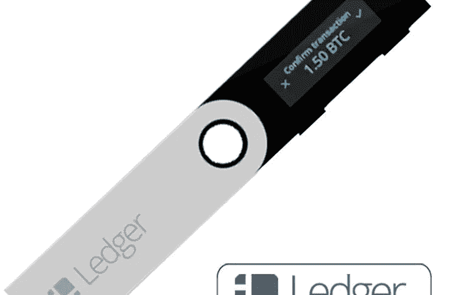
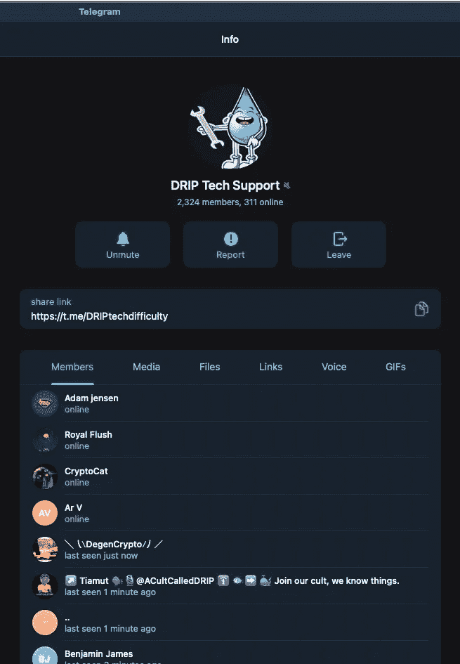
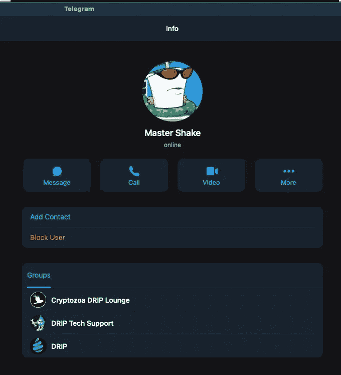
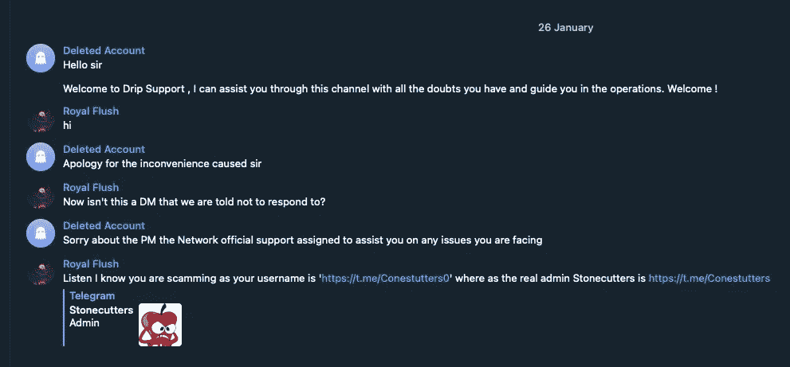
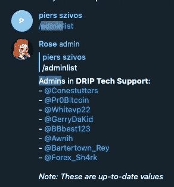

# 滴水——本质安全

> 原文：<https://medium.com/coinmonks/drip-essential-security-459cf58aad92?source=collection_archive---------6----------------------->

Silver iMac Near White Ceramic Kettle with the iMac showing blank screen — Photo by [MockupEditor.com](https://www.pexels.com/@mockupeditor-com-56805?utm_content=attributionCopyText&utm_medium=referral&utm_source=pexels) from [Pexels](https://www.pexels.com/photo/silver-imac-near-white-ceramic-kettle-205316/?utm_content=attributionCopyText&utm_medium=referral&utm_source=pexels)

在我对参与滴滴加密投资的详细介绍中:

[Drip—noobs 的详细设置方法](/@bbosmith/drip-a-detailed-setup-howto-for-noobs-a41c66f2c5d1)

我谈到了一些基本的安全措施，主要集中在使用远离互联网的硬件钱包。这篇文章对此进行了更详细的介绍，并讨论了其他一些必要的习惯，以使自己成为一个安全的滴头。

我在这个系列中的第一篇文章可以在:

*   [点滴——悲伤的五个阶段](/@bbosmith/drip-the-five-stages-of-grief-ba3c5ddf07fb)

# 硬件钱包

使用硬件钱包来保护您的加密货币私钥。使用分类帐、Trezor 或 Lattice 是获得内心平静的小小代价。

Ledger Hardware (cold) Wallet

要付出的代价是:

*   这款设备——简单的 Nano-S 售价 109 澳元(€70 美元，美国 79 美元)
*   或者 250 澳元(€160 美元，美国 180 美元)的一个分类账包，一个分类账 Nano X 用于交易，一个分类账 Nano S 用于备份(S 是较旧的、功能较弱的 Nano；然而，它可以保存所有相同的私钥，并且通过一些工作可以交易大多数相同的加密硬币)。**为什么备份**？所以你可以很快重新开始工作；如果你正在进行一些重要的交易，你最不想做的事情就是重建钱包。或者更糟，先买个新的。
*   Trezor Gold 是欧盟€59(澳币 93 元)，Trezor T 型是欧盟€189(澳币 296 元)。他们没有宣传“备份包”，但莱杰给你半价的 S，所以让我们说一个 Trezor T 和半价黄金-欧盟€220(澳元 345)
*   一个格子 1 是 397 美元(澳币 549)。我对此不太了解，相比之下这个价格似乎有点高。
*   设置主钱包(如 Nano X)的时间— 30 分钟到 1 小时
*   设置备份钱包(如 Nano S)的时间— 10 分钟，因为只需在中输入密码即可
*   计划 pin 和种子短语备份的时间— 15 到 30 分钟加上执行此操作的时间。请参见下面的更多内容。
*   钱包需要用密码解锁——10 到 20 秒。但是如果钱包有一段时间没有使用，它就会超时。我有 12 个钱包，我检查每个钱包的空投和奖励。如果我收到了一些，那么我需要在我的电子表格中记录这些。当这种情况发生时，钱包可能会超时，我需要再次解锁。
*   然后，对于每笔交易，我需要审查 5 个屏幕— 10 秒钟。
*   如果您添加或删除钱包，那么您应该插入备份并同步— 5 到 10 分钟

作为这一投资的回报，您可以高枕无忧，就像拥有至少两套文件系统备份，其中一套在异地！

## Pin 和种子短语的备份

您不应该将种子短语存储在您的计算机或任何联网的地方。如果一个恶意的人发现了这一点(通过黑客或恶意软件)，那么他们可以重建你的钱包(在其他设备上)并控制你的资产。最有可能的是，他们会把它们转移到一个新的钱包地址，这样他们就可以绝对控制它们。

将您的 PIN 保存到密码管理器中是可以的，因为骗子也需要物理访问您的设备。我没做过这个但是你权衡利弊。

设备说明明确指出要写下种子短语。这样做，并安全地保存卡，也许与一个信任的家庭成员或朋友保留一份副本。

有各种由防火、防水和防腐蚀的硬金属制成的物理设备，你可以在其中重现这句话，并将其存储在某个你永远不会忘记的秘密地方。在[https://shop.ledger.com/#category-accessories](https://shop.ledger.com/#category-accessories)看到的 Cryptosteel Capsule、Cryptotag Zeus 和 Billfodl 等设备。

除了不希望您的种子短语落入怀有恶意的人手中之外，您也不想丢失您的种子短语。或者在几年后，当加密货币资产的价值飙升时，你希望能够以 100 万美元的价格出售它们。我听说过很多人的故事，他们在早期获得了大量的比特币，但后来忘记了，因为 T2 看起来像是垄断货币。没有第三方——您可以致电银行或支持服务。这些钱包被称为**保管**——你对它们拥有唯一的监护权。

我可以看到像加密钱包保险库一样的企业如雨后春笋般涌现。

# 使用专用的加密浏览器

我在我的[Drip——一篇详细的 noobs](/@bbosmith/drip-a-detailed-setup-howto-for-noobs-a41c66f2c5d1) 文章中讨论了如何使用一个专用的加密浏览器。并且不要使用该浏览器进行任何其他网上冲浪。浏览器越来越好，但你也需要保护你。浏览器选项卡或窗口中存在已知漏洞。

您可能会不小心导航到一个恶意网站，然后砰的一声，您就被感染了。用同时运行你的博客文章的浏览器做这件事是一回事，但当你的加密资产被暴露时又是另一回事了。

这似乎是一个安全级别的提高(偏执狂！)但是您希望减少所有可能的攻击媒介。 [Chrome 有 116 个漏洞](https://www.cvedetails.com/vulnerability-list.php?vendor_id=1224&product_id=15031&version_id=&page=1&hasexp=0&opdos=0&opec=1&opov=0&opcsrf=0&opgpriv=0&opsqli=0&opxss=0&opdirt=0&opmemc=0&ophttprs=0&opbyp=0&opfileinc=0&opginf=0&cvssscoremin=0&cvssscoremax=0&year=0&month=0&cweid=0&order=3&trc=116&sha=de3d2bf76af9f0969b374a8b9f2421be92ad7a31)，其中 42%的漏洞得分在 9 分以上。

# 骗子

**利用密码交易的骗局无处不在**。只要你遵守一些简单的规则，你就会保持安全。

确保安全要做的第一件事是**永远不要告诉任何人你的元掩码秘密短语或你的硬件钱包**。也不知道你的密码。让我重复一遍— **永远不要告诉任何人太多！**

> 如果你告诉任何人你的秘密，你将失去一切——孔子论大约公元前 551 年的中国密码交易:)

下一条建议是——永远不要回复直接信息(在电报、争吵或相关电话中——我对不同的群体使用这两个应用)。

Telegram group for Drip Tech Support — note the list of members.

有时候你需要帮助，比如来自 Telegram-t.me/DRIPtechdifficulty 的滴滴技术支持团队——不要让任何人告诉你不同的团队。你可以很容易地确定假定群体的诈骗帐户。从截图中可以看出，群组有很多成员。

确定一个人是不是骗子并不那么容易。一般来说，他们应该是主要滴滴团队的一部分，可能是滴滴支持团队，也可能是团队特定的团队。

Drip user that belongs to a specific teams Telegram group

不是每个人都在其他团体中，但如果有人和你交谈，他们应该是知情的，并与滴滴社区中的其他人有更深的联系。

现在，如果你在滴滴支持中寻求帮助，预计至少会有一个用户直接给你发 DM(因此 DM 中的 D！).他们甚至会给你打电话。忽略这些。挂断电话。

我有时执行调查(点击他们的处理)并告诉他们，他们是一个骗子。只是为了好玩。这是我小时候的一张照片。

Drip Scammer on Telegram

一般来说，不要回复 DMs，除非首先在一个小组中建立了沟通(但不是**滴滴或滴滴技术支持小组，因为即使骗子也可以加入这些小组)。总是小心为上。你可以随时向管理员询问某个用户的情况，或者更重要的是，只接受来自管理员的消息(首先在组内)。**

你可以用 */adminlist* Telegram 命令查看谁是滴滴支持的管理员。

Drip Support /adminlist

你可以看到@Conestutters 是一个管理员。上面那个滴滴骗子是@Conestutters0。时刻保持警惕。

就是这样。如果你想加入(并且你需要一个好友)，好友详情如下。我会帮助指导你，还给你初始存款的 2.25%。

滴水很严重，但也很有趣。加密货币领域有许多未铺设的道路。小心行事，但也探索和享受自己。然后把这些知识传递给其他人——让他们加入你，成为他们的点滴伙伴。

如果你有任何问题，请在评论中提问，或者让我成为你的好友，我们可以在不和谐的时候聊天。或者上滴滴电报群(但是要小心！).[t.me/DRIPtoken_Chat](https://t.me/DRIPtoken_Chat)

# 如何进入滴滴

参见我的其他文章:

*   [点滴——悲伤的五个阶段](/@bbosmith/drip-the-five-stages-of-grief-ba3c5ddf07fb)
*   [滴滴 noobs 详细设置指南](/@bbosmith/drip-a-detailed-setup-howto-for-noobs-a41c66f2c5d1)

使用此好友链接:

[**drip . community/水龙头？buddy = 0 cf4a 851 b 797107927 b 23 B3 e 4648 f 66d 05 b 983 c4e**](http://drip.community/faucet?buddy=0xcf4a851B797107927B23B3E4648f66d05B983C4E)

然后，输入我的钱包地址注册成为我的**好友**:

**0 cf4a 851 b 797107927 b 23 B3 e 4648 f 66d 05 b 983 c4e**

我是 **BlockStoxx** 团队的一员，邀请你加入 Discord 服务器。告诉他们是 bbos 派你来的，你提名我做你的朋友。

 [## 加入 BlockStoxx 滴/动物农场不和谐服务器！

### 这是一个基于社区的支持小组和粉丝网站，适用于滴滴、庄园农场和动物农场加密被动收入网站…

不和谐. gg](https://discord.gg/DWY46E8fSs) 

> *加入 Coinmonks* [*电报频道*](https://t.me/coincodecap) *和* [*Youtube 频道*](https://www.youtube.com/c/coinmonks/videos) *了解加密交易和投资*

# 另外，阅读

*   [无聊猿游艇俱乐部(BAYC)回顾](https://coincodecap.com/bored-ape-yacht-club-bayc-review) | [拜比特 vs 比特币基地](https://coincodecap.com/bybit-vs-coinbase)
*   [5 款最佳加密交易终端](https://coincodecap.com/crypto-trading-terminals) | [最佳 DeFi 应用](https://coincodecap.com/best-defi-apps)
*   [比特币基地 vs 瓦济克斯](https://coincodecap.com/coinbase-vs-wazirx) | [比特鲁点评](https://coincodecap.com/bitrue-review) | [波洛涅克斯 vs 比特克斯](https://coincodecap.com/poloniex-vs-bittrex)
*   [德国最佳加密交易所](https://coincodecap.com/crypto-exchanges-in-germany) | [Arbitrum:第二层解决方案](https://coincodecap.com/arbitrum)
*   [币安交易机器人](/coinmonks/binance-trading-bots-d0d57bb62c4c) | [OKEx 评论](/coinmonks/okex-review-6b369304110f) | [Atani 评论](https://coincodecap.com/atani-review)
*   [最佳加密交易信号电报](/coinmonks/best-crypto-signals-telegram-5785cdbc4b2b) | [MoonXBT 评论](/coinmonks/moonxbt-review-6e4ab26d037)
*   如何在 Bitbns 上购买柴犬(SHIB)币？ | [买弗洛基](https://coincodecap.com/buy-floki-inu-token)
*   [CoinFLEX 评论](https://coincodecap.com/coinflex-review) | [AEX 交易所评论](https://coincodecap.com/aex-exchange-review) | [UPbit 评论](https://coincodecap.com/upbit-review)
*   [十大最佳加密货币博客](https://coincodecap.com/best-cryptocurrency-blogs) | [YouHodler 评论](https://coincodecap.com/youhodler-review)
*   [AscendEx 保证金交易](https://coincodecap.com/ascendex-margin-trading) | [Bitfinex 赌注](https://coincodecap.com/bitfinex-staking)
*   [最好的卡达诺钱包](https://coincodecap.com/best-cardano-wallets) | [Bingbon 副本交易](https://coincodecap.com/bingbon-copy-trading)