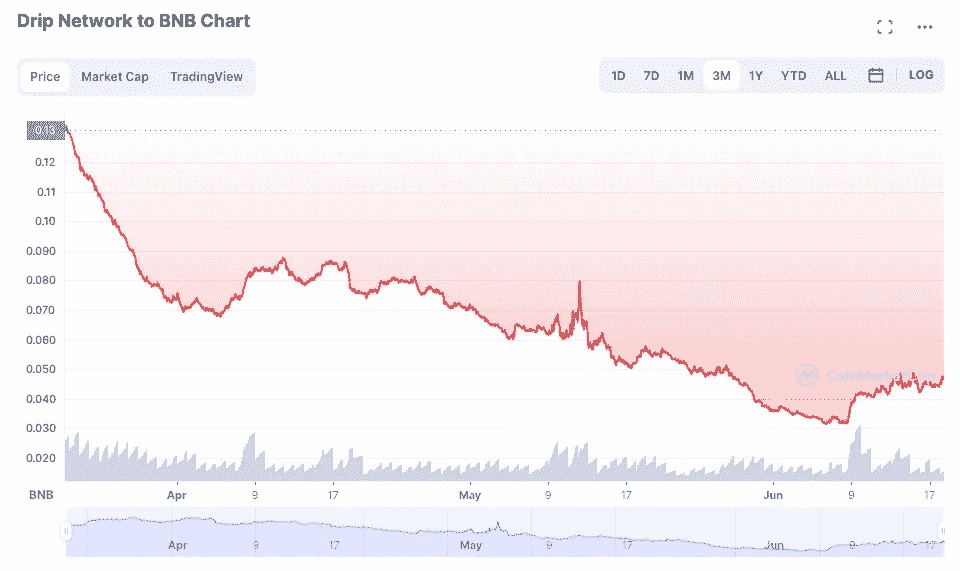
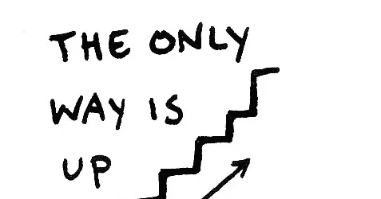

# 点滴——复苏将如何展开

> 原文：<https://medium.com/coinmonks/drip-how-the-recovery-will-play-out-9c3a8dc1787e?source=collection_archive---------0----------------------->

Recovery is on the way .. eventually

有许多滴流生活在希望事情会改变，外汇鲨鱼项目将再次流行。毕竟，我们已经投入了很多——无论是在资本方面，还是在补水和成为好伙伴的时间方面。

社区中有很多积极的情绪，也有很多来自社区外(甚至社区内)的消极情绪。

我很乐观，因为我知道 Forex Shark 和他的开发团队在最近几个月经历了什么，也看到了他们的点滴和点滴相关项目的发展方向。

然而，有时我对滴滴价格感到绝望，陷入“滴滴抑郁症”。摇摇欲坠的世界经济和隐秘的冬天也于事无补。

我的总体感觉是积极的，滴漏会及时恢复，但最有可能是在隐秘的冬天开始解冻之后。

# 我如何看待点滴恢复？

只是作为一个引子，我向你推荐这篇最近的文章，它谈到了最近的滴滴价格调整(再次——让我成为你的朋友，不是 CryptoKnight，但见下文)

 [## 为什么滴漏了

### 这次会不一样吗？

blog.cryptostars.is](https://blog.cryptostars.is/why-drip-blipped-a580c30eb5eb) 

由于短暂的波动，价格持续上涨。在我们过去 4 个月所看到的一切之后，这真的令人震惊。

BND Drip price for last 3 months. The price seems to be holding. Courtesy [coinmarketcap](https://coinmarketcap.com/currencies/drip-network/drip/bnb/).

以下是我对经济复苏的看法:

1.  首先，人们会继续抛售，因为他们仍然担心天会塌下来，想要“卖出”。世界政治和金融市场是这背后的主要影响因素。看起来目前买的比卖的多，但是在卖的放缓之前，价格会保持平稳。
2.  改进正在进行中——Forex Shark 的团队正在解决动物农场的问题，并将很快发布修复程序；会有新的滴滴/动物农场/存钱罐 UI；滴/狗/猪抽奖正在进行中；还有更多。关于这一切的文章很多。如果这一切都很干净，那么积极的情绪将回到项目上，我们将看到各种代币的价格开始再次上升。
3.  价格的提高将有两个影响。首先，那些从钱包里掏钱卖便便的人将开始拉屎，因为他们意识到，他们提出的 8 美元或 10 美元的说法是被误导的，因为他们将看到价格上涨到 20 美元，并继续上涨到 50 美元甚至更高。叉子！他们会说。如果他们意识到这种上升趋势会发生，他们应该复利而不是抛售。叉子！因此，他们将开始复合，就像一名骑兵试图挽回一些损失。他们可能会开始购买更多的滴滴，以帮助恢复他们的地位，但会绝望地以 20 美元或 50 美元购买他们以 8 美元或 10 美元出售的东西。这将进一步利好滴滴。我为这些人感到难过。
4.  第二个效果是会带来一波坚持在那里拼命复利的滴头们的认领抛售！我们一直在等待，现在是时候拿回一些东西了。这将产生负面影响。希望只是一个小的整体。
5.  将会有第三组人，他们刚刚进入滴滴，大部分会与一些索赔人复合。这将产生非常积极的影响。
6.  总的来说，我认为许多人会意识到，在墙上写的东西和唯一的方法是向上，宝贝！你和我。这可能要等到加密冬天结束。
7.  我刚刚读了来自 Flow Rider 团队的 Irene 的评论，作为对有人担心熊市的回应，当然她指的是外汇鲨鱼项目-

> 人们会在无聊的熊市期间想要投资机会…我相信好的 defi 项目可能会提供这种机会，人们会抓住它。

The only way is up, baby, you and me!

我无法推测这将在什么时间段内发生。最大的因素是世界市场，特别是由于通货膨胀。俄罗斯战争仍在继续(我没想到会持续这么久)，这让许多人感到紧张。此外，它正在影响食品和能源的价格。一旦这种情况开始稳定下来，市场将再次变得更加乐观。但是什么时候，没人知道。然而，在这么说的同时，我们还需要意识到，加密是一种不同于传统金融(tradfi)的野兽，其行为也不同。改天再谈这个。

我今天听了这个播客-

 [## 无银行:通货膨胀会变得多糟糕？吉姆·比安科

### 告诉我们真相，吉姆。我们完了吗？- METAMASK |最容易买到的加密软件-订阅时事通讯:️…

podcast.banklesshq.com](http://podcast.banklesshq.com/how-bad-will-inflation-get-jim-bianco) 

值得一听。Jim 在结束评论时提出了一些看好 Crypto 的行为，因为人们对传统金融和金融市场越来越不满，尤其是对疫情的处理方式。1:06:40 自己听。

# 不要做我的朋友

每个人都以“做我的朋友”之类的话结束他们的点滴文章。我建议你参考我最近的决定，推荐人们加入我所在的团队。一定要告诉他们是皇家同花顺派你来的。

 [## 滴——我不想再做你的朋友了

### 我推荐加入我的球队的球员实际上加入了我所在的一个球队。

bbosmith.medium.com](https://bbosmith.medium.com/drip-i-no-longer-want-to-be-your-buddy-87acf0751201) 

**作者声明**:这不是贸易或金融建议。这些信息仅供娱乐，仅代表作者的观点。所有的交易和投资，无论是房地产、股票还是密码，都有亏损的风险，有时亏损会超过 100%。不要用你不愿意损失的资金进行交易或投资。我不对你的交易错误，交易损失，或错过的机会负责，即使你是我的滴滴团队的一员。请自己做研究，自己核实信息。对一项投资的过去或潜在表现的任何参考都不是，也不应被解释为对任何特定结果或利润的建议或保证。

> 加入 Coinmonks [电报频道](https://t.me/coincodecap)和 [Youtube 频道](https://www.youtube.com/c/coinmonks/videos)了解加密交易和投资

# 另外，阅读

*   [加密复制交易平台](/coinmonks/top-10-crypto-copy-trading-platforms-for-beginners-d0c37c7d698c) | [五大 BlockFi 替代方案](https://coincodecap.com/blockfi-alternatives)
*   [CoinLoan 点评](https://coincodecap.com/coinloan-review)|[Crypto.com 点评](/coinmonks/crypto-com-review-f143dca1f74c) | [火币保证金交易](/coinmonks/huobi-margin-trading-b3b06cdc1519)
*   [Bybit vs 币安](https://coincodecap.com/bybit-binance-moonxbt)|[stealth x 回顾](/coinmonks/stealthex-review-396c67309988) | [Probit 回顾](https://coincodecap.com/probit-review)
*   [顶级付费加密货币和区块链课程](https://coincodecap.com/blockchain-courses)
*   [CBET 评论](https://coincodecap.com/cbet-casino-review) | [库科恩 vs 比特币基地](https://coincodecap.com/kucoin-vs-coinbase) | [拜比特 vs 比特币基地](https://coincodecap.com/bybit-vs-coinbase)