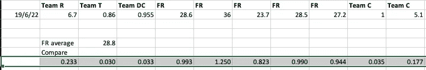

# 滴——我不想再做你的朋友了

> 原文：<https://medium.com/coinmonks/drip-i-no-longer-want-to-be-your-buddy-87acf0751201?source=collection_archive---------5----------------------->

Buddy from Elf the movie

这是我最近一篇文章的摘录。我怀疑这条信息在文章的细节中丢失了。它来自…

 [## 滴滴——还是给我的吗？

### 我开始滴滴之旅已经三个月了。我的感受，我和滴滴的未来。

medium.com](/coinmonks/drip-is-it-still-for-me-1b8c58abc6de) 

# 如何进入滴滴

**作者声明**:这不是贸易或金融建议。这些信息仅供娱乐，仅代表作者的观点。所有的交易和投资，无论是房地产、股票还是密码，都有亏损的风险，有时亏损会超过 100%。不要用你不愿意损失的资金进行交易或投资。我不对你的交易错误，交易损失，或错过的机会负责，即使你是我的滴滴团队的一员。请自己做研究，自己核实信息。对一项投资的过去或潜在表现的任何参考都不是，也不应被解释为对任何特定结果或利润的建议或保证。

现在，如果你还不是滴滴答答的人，而我的文章引起了你的兴趣，而且当你看到一个好的便宜货时，你会发现它，那么请加入这个滴滴答答的游戏。价格还是超低的。

参见我的其他文章:

*   [点滴——悲伤的五个阶段](/coinmonks/drip-the-five-stages-of-grief-ba3c5ddf07fb)
*   [滴滴 noobs 详细设置指南](/@bbosmith/drip-a-detailed-setup-howto-for-noobs-a41c66f2c5d1)
*   [滴滴——本质安全](/@bbosmith/drip-essential-security-459cf58aad92)
*   [为什么滴滴价格崩盘](/coinmonks/why-is-the-drip-price-crashing-23568ae0771e)
*   [滴滴——销售是错误的策略](https://bbosmith.medium.com/drip-selling-is-the-wrong-strategy-9edd26a84394)
*   [永远在一起](/coinmonks/drip-together-forever-️-587de6baadae) ❤️

在我之前的所有文章中，我都建议通过加入我的团队来进入滴滴。我决定采取不同的策略，那就是建议人们加入我所在的团队之一——**flow riders**。虽然我不会得到新员工的奖励，但我会得到团队的一些激励性奖励。

为什么我想这样做——主要是因为我想让新员工得到一个好的待遇。我的钱包还不够大，这意味着我没有能力给一个大团队支付体面的报酬。FlowRiders 从一开始就加入了滴滴，并拥有可以空投的大钱包。

我是 5 个团队中的一员——当我设置我的 10 个初始钱包时，我这样做是为了好玩，另外我想对比一下团队(FlowRiders 不是我的第一选择，所以我很高兴我继续四处看看)。

你需要一个制作优秀宣传片的团队——尤其是在滴滴的早期。

这是一个粗略的电子表格，比较了我所在的五个团队(跨越 10 个钱包)。日期行中的值是截至该日期的空投。

弗雷德是花车骑士。DC 队是“滴社区”的钱包，这是众所周知的支付什么。

你可以看到我所在的一个团队支付的空投费用比滴滴社区钱包还少。

我预计大多数钱包的数字不是空投，而是存款和补水的回扣。

团队 C 是一个很大的团体，里面充满了有趣的人，他们有很多话要说来帮助团队成员。他们没有支付很好的空投费用，尽管为了保护自己，他们举行了许多比赛和游戏，并为诸如增加滴水库的行为提供奖励。

FlowRiders 支付给我的报酬几乎是其他车队的 5 倍。两个月前，当我第一次写这个信息时，它是 2 倍。

我有一个预测电子表格，它显示在 12 个月的时间里，我将比下一个最大的空投者多 1200 滴。2730 比 1484。这还没有考虑到未来的空投。

**为什么这对我很重要** —除了显而易见的原因，还因为我认为这个社区应该互相帮助。我觉得大部分团队建设者纯粹是为了自己而比赛。我想这是整个世界的象征。我们变得以自我为中心，自私自利。大部分纯粹是作为生存机制的一部分。毕竟——“其他人都在这么做”。

我们正处于一个相当动荡的时代，我们要以最好的方式度过这个时期，唯一的办法就是团结一致。朝着共同的目标努力。

我鼓励你加入 FlowRiders，加入他们的电报组【https://t.me/flowriders ，并请让他们知道**皇家同花顺**派你来的。

在这一点上，你可能会问——你目前拥有的团队成员呢——他们没有得到“低报酬”的空投吗？

不，我有足够的钱支付给我现有的团队成员。我可能会付更多的钱——目前在我的 13 个钱包里(3 个孩子的钱包里有我这个家长),我有将近 1700 个滴滴，所以我每天收到 17 个。

我昨天付了空投费。我所做的是仔细检查每个钱包(现在我下面有 15 个)，对于较大的钱包，给每个钱包至少 2 倍的水化物。和 5 到 10 倍的小钱包，以帮助他们进行。我只是喜欢一个团队成员的脸上的表情，当他们的 5 滴钱包在空投中收到 0.5 滴(10%的增长或 10 倍的水合物)。

我很高兴人们继续加入我的团队，尽管我认为大多数人都会同意 FlowRiders 是更好的选择。

随着我的钱包越来越鼓，我将能够更加慷慨，进一步壮大我的团队。但是我很乐意等待，因为对我来说球员得到一份好的合同更重要。

你的团队付多少钱——我很想听听其他人的经历。

Good team player

Oh Buddy! Bye bye :(

> 加入 Coinmonks [电报频道](https://t.me/coincodecap)和 [Youtube 频道](https://www.youtube.com/c/coinmonks/videos)了解加密交易和投资

# 另外，阅读

*   [加密货币储蓄账户](/coinmonks/cryptocurrency-savings-accounts-be3bc0feffbf) | [加密交易机器人](https://coincodecap.com/best-crypto-trading-bots)
*   [BigONE 交易所评论](/coinmonks/bigone-exchange-review-64705d85a1d4) | [CEX。IO 审查](https://coincodecap.com/cex-io-review) | [交换区审查](/coinmonks/swapzone-review-crypto-exchange-data-aggregator-e0ad78e55ed7)
*   [最佳比特币保证金交易](/coinmonks/bitcoin-margin-trading-exchange-bcbfcbf7b8e3) | [比特币保证金交易](https://coincodecap.com/bityard-margin-trading)
*   [加密保证金交易交易所](/coinmonks/crypto-margin-trading-exchanges-428b1f7ad108) | [赚取比特币](/coinmonks/earn-bitcoin-6e8bd3c592d9)
*   [WazirX vs CoinDCX vs bit bns](/coinmonks/wazirx-vs-coindcx-vs-bitbns-149f4f19a2f1)|[block fi vs coin loan vs Nexo](/coinmonks/blockfi-vs-coinloan-vs-nexo-cb624635230d)