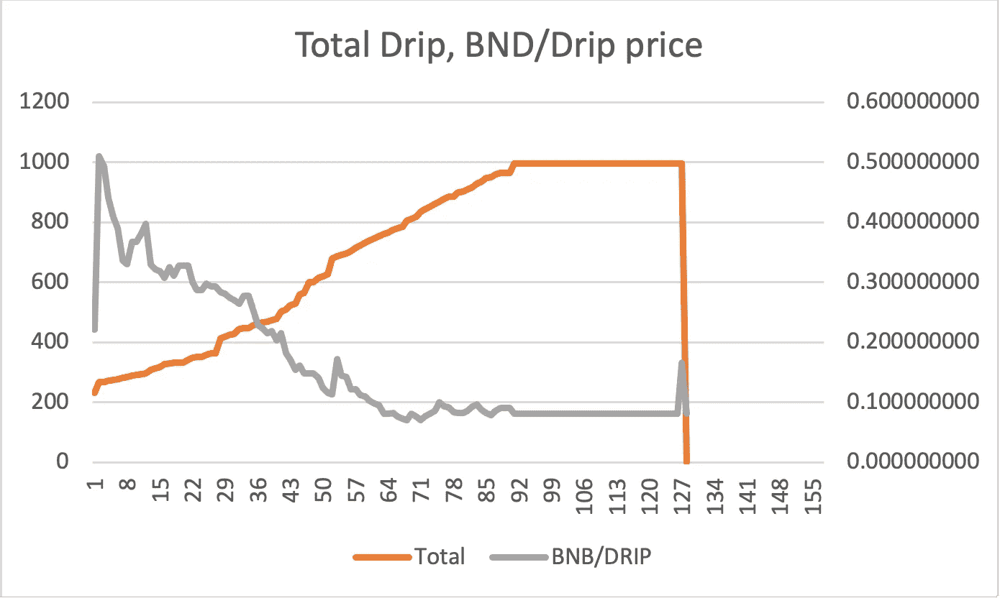
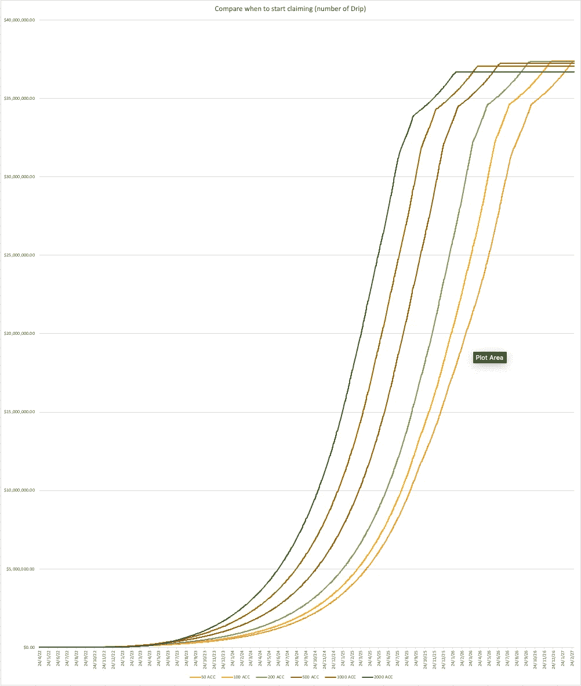
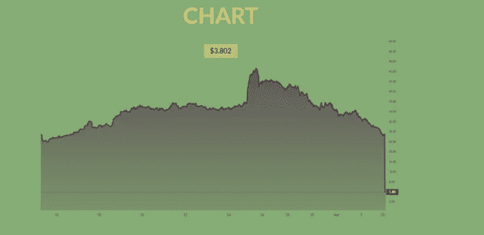
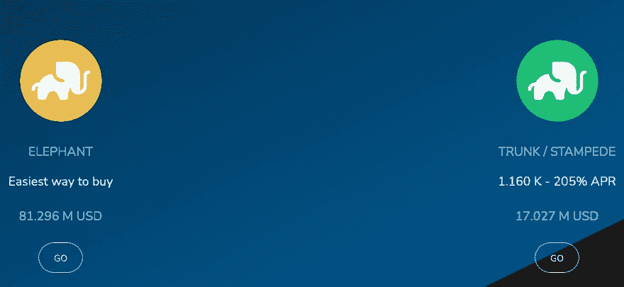
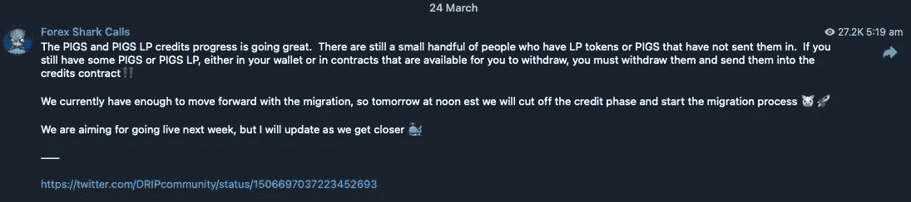
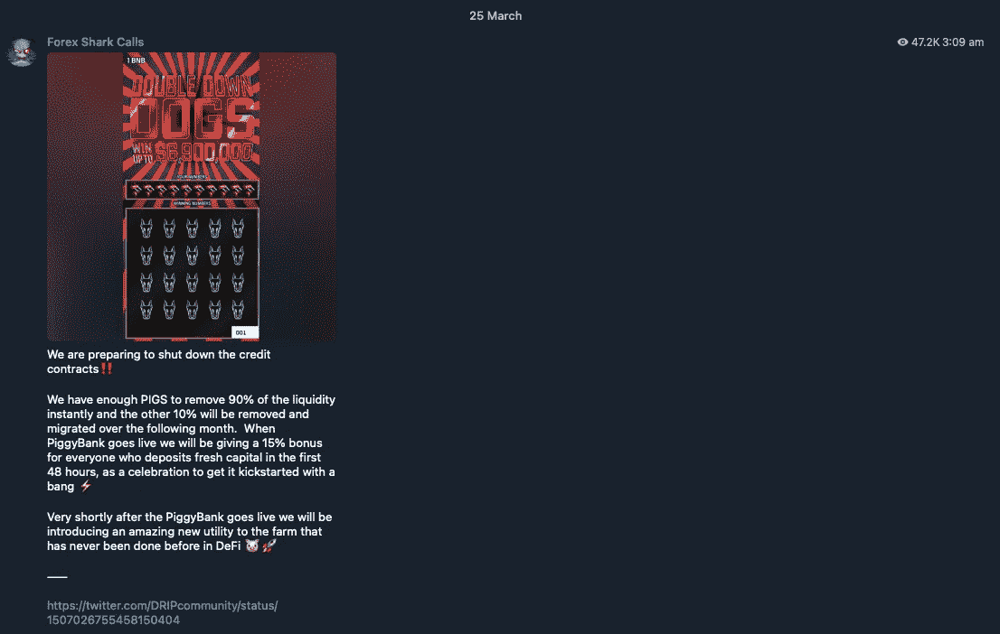
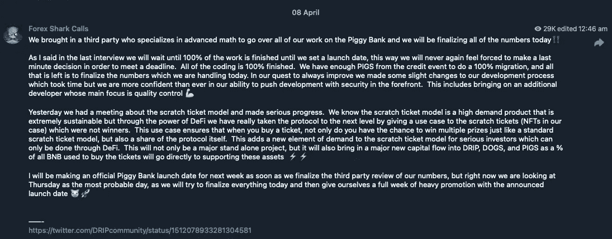
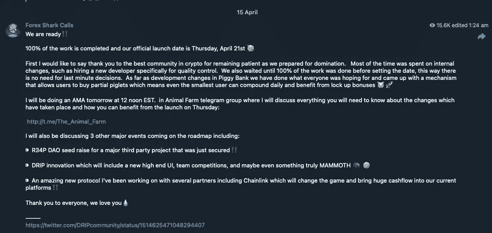

# 滴滴——还是给我的吗？

> 原文：<https://medium.com/coinmonks/drip-is-it-still-for-me-1b8c58abc6de?source=collection_archive---------8----------------------->

Couple Sitting on Snow Covered Ground Near the Snowman by [Arina Krasnikova](https://www.pexels.com/@arina-krasnikova/)

自从我开始我的滴滴之旅，三个月已经过去了。这个故事是关于我现在对这个项目的感觉，在加密令牌组学领域发生的事情以及我未来的计划的讨论。

距离我上一篇文章已经过去一个多月了。当我开始写中型文章时，我的目标是在短时间内写很多内容。希望有吸引人的内容。从那以后，我开始了一份新工作，它有一个相当陡峭的学习曲线，所以我有点分心。这是复活节长周末，我现在有点时间。

滴滴还适合我吗？那个标题对否认者来说有点像点击诱饵。

我的观点没有改变，尽管价格从 2022 年 1 月 27 日的 0.45 BNB /滴滴升至 4 月 4 日的 0.068，但我仍然非常看好它。它目前处于 0.08 BNB /滴。

在价格逐渐下跌的过程中，我意识到自己投资了多少钱，以及存款的“现值”。我知道滴滴不是这样的，因为你不能卖掉押金，但这仍然是我关注的一个数字。还要意识到，索赔和出售的回报与价值有直接关系——所以这是一个很好的指标。

我的“现值”在我开始后迅速跃升至 200%(即价值翻倍)。在滴滴价格的最低点，它下降到 68%(可怕的是几乎减半)，在过去几周一直保持在 100%左右(价值与我的投资相同)。

达到 100%的原因有两个——BND/滴滴的价格已经提高，我现在持有的滴滴数量是我购买时的 2.5 倍。在短时间内，我将持有足够多的 BND /滴滴的价格将变得不那么相关。虽然我显然希望看到价格上涨。

我相信 Drip token 和 Forex Shark 及其开发团队创造的景观。我在我的点滴之旅的早期就建立了这一点，并且非常高兴看到他们在 3 个月里的进步。稍后会有更多内容。

相对较低的价格意味着索赔没有意义——我最好等待滴滴/ BNB 的价格更高的时候。我做了一个决定，当价格超过我的平均美元成本 0.16 BNB /滴滴时，我将开始向 BNB 销售(是的，是的，我知道 DCA 对滴滴的意义不大——但是我需要选择一些价格。这个价格对我来说意味着这个项目又开始看起来“健康”了。

所以我每天不停的补水/复水。但我对此很冷静，因为从一开始我的计划就是这样做，直到我合成了足够的滴剂。我也想让我的 NDV 保持在零以上。

> 存款净值=(存款+空投+滚动)-索赔

如果你的 NDV 是负的(即你要求的比你收到的多，空投给别人)，那么你就不能从你的下线那里得到奖励。另外，许多团队在决定空投多少物资时，会将团队成员 NDV 考虑在内。

我一直在补水，在下降的过程中我买了更多的点滴。到 2022 年 2 月的价格高峰时，我已经存了 226 滴。我在高峰期又买了两个小的，又买了 6 个，然后乘着这波行情又买了 136 个。我总共购买了 410 滴和存款 370。我的平均价格是 0.16 BNB /滴。不太妙，但很快就会变得无关紧要。

补水 3 个月，加上来自空投和奖励的加成，减去我给过的空投，我现在坐 1000 滴。在下面的图表中，一些存款很容易识别，你可以看到它们是在价格下跌时产生的(然而，最后突然上涨是因为我去度假了，回来后补充了所有可用的水分)。我期待着在 3 个月的时间里写一篇这样的后续文章。对于所有的反对者来说，这条线是平的，因为我看不到未来。

My drip total after 3 months of depositing, hydrating, airdrops and rewards

1000 滴意味着我每天接受 10 滴(并且还在增加)。如果我认领并出售(按今天的价值计算，扣除税费后)，那就是大约 400 澳元。

我有一个预测电子表格。根据它(*)，我将在 2.5 个月内获得 2000 滴，1.5 个月后获得 3000 滴，1.1 个月后获得 4000 滴，1 个月后获得 5000 滴，从今天起 12 个月内将获得 21，000 滴。按今天的价值计算，扣除点滴税后，这相当于每天 9450 澳元。我认为价格正在上涨，可能在 12 个月内翻了一番或更多。

(*) —这是使用 6 天水合物和 1 天索赔策略。一旦存款足够多，我可能会将其改为 1，1。我也不会要求，直到一个钱包包含 200 滴(除了我空投的钱包)。我做了一些分析，并将在以后的文章中展示我的推理。

Chart comparing when to start claiming. Hint — Right-most line starts claiming earliest; Left-most, latest

该预测电子表格没有考虑奖励、空投和空投。我正在编写一个 web 应用程序来接管电子表格的角色，并希望在一两个月内推出。同时，我打算写一篇关于我的电子表格的文章，我的电子表格用来记录我的多钱包点滴之旅，正如我所承诺的——上面图表的分析。

索赔指日可待，6 天前我开始使用 6 天水合物和 1 天索赔策略进行索赔。但在价格高于我的 DCA 之前，我不会卖给 BNB。我预计到价格会持续上涨，于是开始申请，并积累我的余额。

我还声称给我的团队发工资(我已经连续 6 周每两周给他们发一次工资——为了做到这一点，我在“发薪日”之前每天都声称要发工资。现在我不那么被动了)。

# 要滴注的替代项目

在过去的 3 个月里，启动了许多类似的项目:

*   巨大的
*   bakedbeans.io
*   [piston-token.com](https://piston-token.com)
*   大象的钱

Splassive 是一个 Drip fork，并且是在 Drip 开发者修复漏洞之前分叉的。这个漏洞被利用了，一个恶意的玩家设法进行了大规模的销售，导致价格暴跌。

Splassive 本身似乎有点好得令人难以置信。这与滴滴完全一样，但每天支付 2%。我认为这是不可持续的。但人们对滴滴也是这么说的。

Splassive 网站上写着“很快会重新上线”，显然聊天群是沉默的。我们很快就会知道了。

Splassive chart showing price drop

与滴滴相关的项目 Piggy Bank 也遭受了类似的攻击，这也影响了滴滴和动物农场。我在[讨论了为什么滴滴价格暴跌](/coinmonks/why-is-the-drip-price-crashing-23568ae0771e)以及 Forex Shark 开发团队正在采取的识别和解决问题的步骤。花了一些时间，但是他们几乎完成了。

很难说大规模的开发者是否也在这么做。Forex Shark 发表了评论，大意是像 Splassive 和 Beans 这样的项目是对 Drip 的拙劣复制，可能不会持续很久。

烘豆和活塞也是重新标记的副本(可能是现有代码的分叉)。我认为所有这些都是为了在滴滴价格下跌时利用不满的滴滴用户而开发的。我不会投资他们。

**滴滴刚刚庆祝了一周年纪念日，许多人都说这是 Defi 世界的一个惊人壮举。**这一事实以及 Forex Shark 及其开发团队为修复项目所付出的努力证明了他们的正直、勇气和决心。当项目出现问题时，他们本可以拿走他们所有的钱，然后就跑了，就像他们做了一次地毯式搜索一样。然而，他们似乎重视他们的名字和完整性，而是想解决问题，让他们的球员知道他们的进展。他们有一个路线图，并且似乎渴望继续前进。他们有长期目标。Defi 仍处于初期阶段，我预计 Forex Shark 将着眼于成为这一领域的大玩家。

Elephant Money UI

大象钱已经相当普及，和滴滴不一样(不是叉，不是抄)。但是它也崩溃了。根据[https://www . publish 0x . com/journey-through-crypto-from-newbie-to/elephant money-collapses-rug-pull-or-exploit-xvyvrry](https://www.publish0x.com/journey-through-crypto-from-newbie-to/elephantmoney-collapses-rug-pull-or-exploit-xvyvrry):

> [大象。Money](https://elephant.money/) 今天遭受了重大损失，投资者在几秒钟内损失了平台价值的 90%。币安智能链上的 DeFi projects 令牌突然猛烈下降，使得平台中的用户没有时间采取纠正措施。平台随后暂停，但为时已晚，因为大象令牌已跌至 0.00000008 美元。
> 
> 该平台已经通过了 [Certik](https://www.certik.com/projects/elephant) 的认证，其安全得分为 77，他们求助于认证公司来帮助他们弄清楚到底发生了什么。尽管许多投资者立即大喊“拉地毯”，但更有可能的是，这是某种形式的利用，抽干了 TVL 的大量资金，并导致其本土股票暴跌。该平台的 twitter feed 鼓励平台上的人不要出售他们的代币，不要回复任何直接消息，并试图告诉他们他们投资的钱是安全的。

对这个项目仍然有很多积极的看法。这听起来很有趣，我认为这是合理的。不幸的是，Defi 仍然是蛮荒的西部，仍然可以找到一些漏洞。开发商 Bankteller 似乎在理解漏洞，修复漏洞，让玩家重新玩游戏。我相信这将会发生，它将再次成为一个非常受欢迎的项目。参见[https://medium . com/elephant-money/reserve-exploit-52fd 36 CCC 7 e 8](/elephant-money/reserve-exploit-52fd36ccc7e8)。

Ben Kenobi and Vader’s final battle

什么不能杀死一个 Defi 项目，只会使它更强大。修正漏洞使它更有弹性。这会建立信任和信心。现在还为时尚早，我认为只要有时间，每个人都会看到有一些项目是可信的，是可持续的。我们会知道什么是明显的拉地毯。

多个类似的 Defi 项目可以共存吗？我也这么认为大象的钱和其他的不一样。我认为，我们将看到滴滴、大象资金(以及任何其他资金)随着周期的变化，以交替的同步方式运行。当一个人上升时，其他人就会下降。人们(或机器人)会不断地在他们之间转移资金。

但我可能错了。这纯粹是充满希望的猜测。

# 滴滴价格预测

这些 Defi 项目让我感到惊讶的一点是，像 Forex Shark 和他的团队或 Bankteller 和他的团队这样的 Defi 开发者就像公司一样。但是那些不生产有形资产的公司。

反对者和批评家对此大动干戈，批评这些项目就像没有明天一样。

的确，像代币这样的概念没有多少价值。除非它有用。我不能说任何关于大象的钱或 Splassive 等，但外汇鲨鱼有一个漫长的路线图计划滴和相关的令牌。

我在文章里讲过这个。

 [## 滴滴——永远在一起❤️

### 滴滴代币的价格在过去的 6 个星期里一直在逐渐下降，因为它在飙升后达到了顶峰…

medium.com](/coinmonks/drip-together-forever-️-587de6baadae) 

看来未来是美好的。

这里有一些来自 https://t.me/forexsharkcalls 外汇鲨鱼的最新消息。自从存钱罐的问题浮出水面以来，他一直在公开交流，并讨论解决问题的进展。这些回答有助于建立对 Forex 及其开发团队的信任。我相信他们会留在这里。

Forex Shark directing players of the Animal Farm

> PIGS 和 PIGS LP credits 的进展非常顺利。还有一小撮人有 LP 代币或者猪没有送进去。如果你还有一些 PIGS 或 PIGS LP，无论是在你的钱包里还是在你可以提取的合同里，你必须提取它们并把它们存入 contract‼️信贷银行
> 
> 我们目前有足够的资金来推进迁移，所以明天美国东部时间中午，我们将停止信用阶段，开始迁移过程🐷🚀
> 
> 我们的目标是下周上线，但是当我们接近的时候我会更新🐳
> 
> — —
> 
> https://Twitter . com/drip community/status/1506697037223452693

A teaser for the lottery and further information for Animal Farm and Piggy Bank players

> 我们正准备关闭 contracts‼️信贷
> 
> 我们有足够的 PIGS 来立即移除 90%的流动性，另外 10%将在接下来的一个月中移除和迁移。当 PiggyBank 上线时，我们将为每个在前 48 小时内存入新资金的人提供 15%的奖金，作为庆祝，让它以一声⚡️启动
> 
> 小猪银行上线后不久，我们将为农场引入一个前所未有的惊人的新工具🐷🚀

Forex Shark discusses positive progress with the Piggy Bank and other planned projects

> 我们请来了一个专门研究高等数学的第三方来检查我们在存钱罐上的所有工作，我们将最终确定 today‼️的所有数字
> 
> 正如我在上次采访中所说的，我们将等到 100%的工作完成，直到我们设定一个发布日期，这样我们就不会再感到被迫在最后一刻做出决定，以满足最后期限。所有的编码都 100%完成了。我们有足够的来自信用事件的猪来进行 100%的迁移，剩下的就是最终确定我们今天处理的数字。在我们寻求不断改进的过程中，我们对我们的开发过程做了一些轻微的改变，这需要时间，但我们比以往任何时候都更有信心将安全性放在首位来推动开发。这包括引入一个额外的开发者，他的主要焦点是质量控制💪🏻
> 
> 昨天我们开了一个关于刮刮卡模式的会议，并取得了重大进展。我们知道，刮刮卡模式是一种高需求产品，非常具有可持续性，但通过 DeFi 的力量，我们通过为未获奖的刮刮卡(在我们的案例中为 NFT)提供一个用例，将协议提升到了一个新的水平。这个用例确保当你购买一张票时，你不仅有机会像标准的刮刮卡模型一样赢得多个奖项，而且还有协议本身的份额。这为严肃投资者的刮奖模式增加了新的需求元素，而这只能通过 DeFi 来实现。这不仅是一个重大的独立项目，也将为“滴、狗和猪”带来大量新的资金，因为用于购买门票的所有 BNB 的%将直接用于支持⚡️⚡️的这些资产
> 
> 一旦我们完成第三方对我们的数字的审查，我将在下周制定一个正式的存钱罐推出日期，但现在我们认为周四是最有可能的一天，因为我们将努力在今天完成一切，然后给我们自己一整周的大力宣传，宣布推出日期🐷🚀
> 
> ——
> https://Twitter . com/drip community/status/1512078933281304581

More updates from Forex Shark on the fixes for the Piggy Bank project and other Drip related information

> 我们已经完成了所有的脚本/自动化测试，今天正在进行预演，部署所有的新合同，将它们连接到前端，并向我们的管理员开放进行最终的手动测试。我们知道每个人都希望它现在就上线，我们正在尽可能快地行动，同时保持极度的勤奋。我们一直非常勤奋，这就是为什么即使我们在路上遇到颠簸，资本也总是受到保护，但我们专门为质量控制带来了新的开发工具，我们准备将它带到下一个 level‼️
> 
> 周四，我们将为下周提供一个正式的发布日，因为我们所有的测试都将完成，除了宣传和让每个人做好准备，我们没有什么可做的了🐷🚀
> 
> 新的滴滴用户界面已经建立，我们已经为 DAO 准备了一个主要的第三方筹集资金，NFT 刮刮卡协议即将推出，对此我非常兴奋。我们才刚刚开始👑
> 
> ——
> https://Twitter . com/drip community/status/1513937734607515650

Official launch date for the fixed Piggy Bank project and some more work the team has been preparing

> 我们是 ready‼️
> 
> 100%的工作已经完成，我们的正式发布日期是🥳时间 4 月 21 日星期四
> 
> 首先，我想对 crypto 中最好的社区说声谢谢，感谢他们在我们准备统治的时候保持耐心。大部分时间花在了内部变更上，比如专门为质量控制雇佣了一个新的开发人员。我们也等到 100%的工作完成后再确定日期，这样就不需要在最后一刻做出决定。至于小猪扑满的发展变化，我们已经做了每个人都希望的事情，并提出了一个机制，允许用户购买部分小猪，这意味着即使是最小的用户也可以每天复合，并受益于锁定奖金🐷🚀
> 
> 我将在美国东部时间明天中午 12 点做 AMA。在动物农场电报小组，我将讨论您需要了解的关于已经发生的变化的一切，以及您如何从周四的发布中受益:
> 
> [http://t.me/The_Animal_Farm](http://t.me/The_Animal_Farm)
> 
> 我还将讨论路线图中的其他 3 个重大事件，包括:
> 
> ⁍ R34P 道种子筹集的一个主要的第三方项目，这只是 secured‼️
> 
> ⁍滴创新，这将包括一个新的高端用户界面，团队比赛，甚至可能是真正庞大的🦣🤣
> 
> ⁍:我和包括 Chainlink 在内的几个合作伙伴一起开发了一个惊人的新协议，它将改变游戏规则，为我们当前的 platforms‼️带来巨大的现金流
> 
> 谢谢大家，我们爱你💧
> 
> ——
> https://Twitter . com/drip community/status/1514625471048294407

在接下来的文章中，我建议直到存钱罐修好，没有被搁置，玩家们重新安顿下来，滴价才会回升。我认为取消暂停将在明天(2022 年 4 月 26 日星期二)发生。

 [## 为什么滴滴价格暴跌

### 不是因为滴滴问题。是 PiggyBank 玩家用滴滴作为买入迫使价格下降。而且不知情…

medium.com](/coinmonks/why-is-the-drip-price-crashing-23568ae0771e) 

向前向上滴！

Aircrafts flying and leaving contrail, [Photo by Spencer Davis from Pexels](https://www.pexels.com/photo/aircrafts-flying-and-leaving-contrail-4400026/)

# 如何进入滴滴

**作者声明**:这不是贸易或金融建议。这些信息仅供娱乐，仅代表作者的观点。所有的交易和投资，无论是房地产、股票还是密码，都有亏损的风险，有时亏损会超过 100%。不要用你不愿意损失的资金进行交易或投资。我不对你的交易错误，交易损失，或错过的机会负责，即使你是我的滴滴团队的一员。请自己做研究，自己核实信息。对一项投资的过去或潜在表现的任何参考都不是，也不应被解释为对任何特定结果或利润的建议或保证。

现在，如果你还不是滴滴答答的人，而我的文章引起了你的兴趣，而且当你看到一个好的便宜货时，你会发现它，那么请加入这个滴滴答答的游戏。价格还是超低的

参见我的其他文章:

*   [点滴——悲伤的五个阶段](/coinmonks/drip-the-five-stages-of-grief-ba3c5ddf07fb)
*   [Drip—noobs 的详细设置方法](/@bbosmith/drip-a-detailed-setup-howto-for-noobs-a41c66f2c5d1)
*   [滴滴——本质安全](/@bbosmith/drip-essential-security-459cf58aad92)
*   [为什么滴滴价格崩盘](/coinmonks/why-is-the-drip-price-crashing-23568ae0771e)
*   [滴滴——销售是错误的策略](https://bbosmith.medium.com/drip-selling-is-the-wrong-strategy-9edd26a84394)
*   [永远在一起](/coinmonks/drip-together-forever-️-587de6baadae) ❤️

在我之前的所有文章中，我都建议通过加入我的团队来进入滴滴。我决定采取不同的策略，那就是建议人们加入我所在的团队之一——**flow riders**。虽然我不会得到新员工的奖励，但我会得到团队的一些激励性奖励。

为什么我想这样做——主要是因为我想让新员工得到一个好的待遇。如果我的团队中有太多的人，我就无法支付体面的奖励，因为我的钱包还不够大，但 FlowRiders 从一开始就一直在滴滴打车，他们有很大的钱包可以空投。

我是 5 个团队中的一员——当我设置我的 10 个初始钱包时，我这样做是为了好玩，另外我想对比一下团队(FlowRiders 不是我的第一选择，所以我很高兴我继续四处看看)。

你需要一个制作优秀宣传片的团队——尤其是在滴滴的早期。在我所在的 5 个团队中，FlowRiders 是唯一一个这样做的团队。我从他们那里得到的报酬是第二好的球队的 2 倍多，是最大和最受欢迎的球队的 5 倍。其他两队几乎没有空投我。

三个月后，这真的显现出来了。我的 FlowRider 钱包几乎是其他三个团队的两倍大。或者多 30 滴。根据我的预测电子表格，一年后这一比例将大致相同，数字表明我的 FlowRiders 钱包里将多 500 滴。但这还没有考虑到他们在未来 365 天的空投。我预计比率和差异会大得多。

大多数团队领导永远无法做到 FlowRiders 能够做到的事情。FlowRiders 可以，因为他们很早就设置了许多钱包。有些人从中获利，有些人执行空投任务。大多数人在过去的 3、4 个月里加入了滴滴，许多人争先恐后地组建团队。但是他们永远不会有足够的能力给每个队员空投任何像样的东西(暂时的)。

我鼓励你加入 FlowRiders，加入他们的电报组【https://t.me/flowriders ，请让他们知道**皇家同花顺**派你来的。

在这一点上，你可能会问——你目前拥有的团队成员呢——他们没有得到“低报酬”的空投吗？

不，我有足够的钱支付给我现有的团队成员。但我不想让任何新成员加入，因为这会稀释奖金。

随着我的钱包越来越鼓，我将能够更加慷慨，进一步壮大我的团队。但是我很乐意等待，因为对我来说球员得到一份好的合同更重要。我想很多人都不是。

> 加入 Coinmonks [电报频道](https://t.me/coincodecap)和 [Youtube 频道](https://www.youtube.com/c/coinmonks/videos)了解加密交易和投资

# 另外，阅读

*   [3 商业评论](/coinmonks/3commas-review-an-excellent-crypto-trading-bot-2020-1313a58bec92) | [Pionex 评论](https://coincodecap.com/pionex-review-exchange-with-crypto-trading-bot) | [Coinrule 评论](/coinmonks/coinrule-review-2021-a-beginner-friendly-crypto-trading-bot-daf0504848ba)
*   [莱杰 vs n rave](/coinmonks/ledger-vs-ngrave-zero-7e40f0c1d694)|[莱杰 nano s vs x](/coinmonks/ledger-nano-s-vs-x-battery-hardware-price-storage-59a6663fe3b0) | [币安评论](/coinmonks/binance-review-ee10d3bf3b6e)
*   [Bybit Exchange 审查](/coinmonks/bybit-exchange-review-dbd570019b71) | [Bityard 审查](https://coincodecap.com/bityard-reivew) | [Jet-Bot 审查](https://coincodecap.com/jet-bot-review)
*   [3 commas vs crypto hopper](/coinmonks/3commas-vs-pionex-vs-cryptohopper-best-crypto-bot-6a98d2baa203)|[赚取加密利息](/coinmonks/earn-crypto-interest-b10b810fdda3)
*   最好的比特币[硬件钱包](/coinmonks/hardware-wallets-dfa1211730c6) | [BitBox02 回顾](/coinmonks/bitbox02-review-your-swiss-bitcoin-hardware-wallet-c36c88fff29)