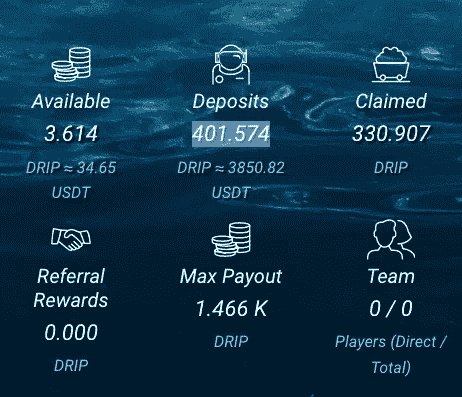
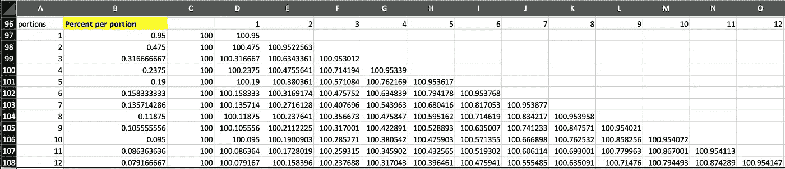
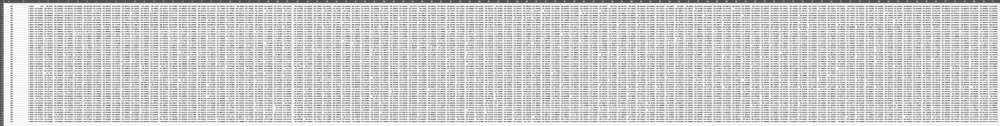
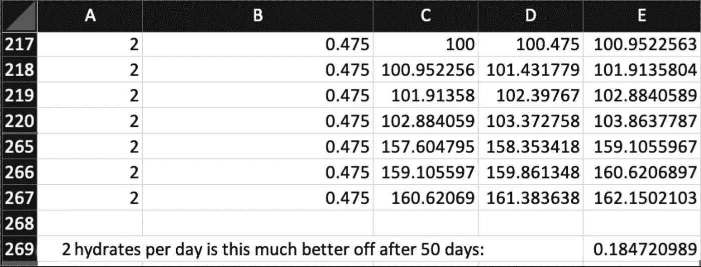
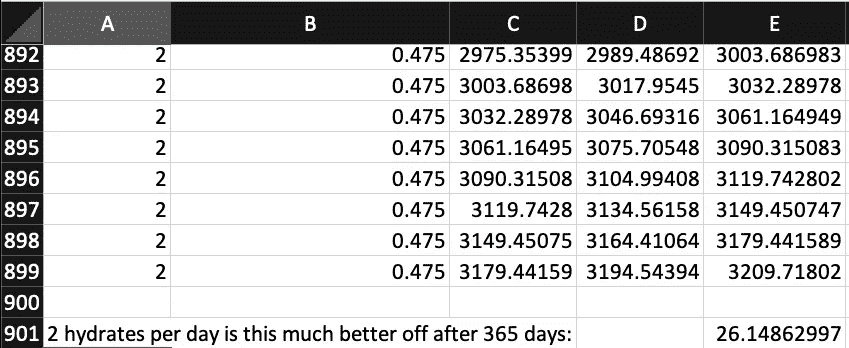

# 点滴——每天多次复利有什么好处吗？

> 原文：<https://medium.com/coinmonks/drip-is-there-any-benefit-to-compounding-many-times-per-day-b144e43e5991?source=collection_archive---------2----------------------->

滴滴是 Defi 加密项目，每天支付 1%的存款，你可以水合(复合)或索赔。

Courtesy [http://www.petermorscheck.xyz/building-blocks-discipline-and-the-magic-of-compound-growth/](http://www.petermorscheck.xyz/building-blocks-discipline-and-the-magic-of-compound-growth/)

更多关于滴滴的信息，请看很多其他文章，包括我自己的，比如

 [## drip——noobs 的详细设置方法

### 对于那些想了解更多有关入门知识的人来说，这篇文章是一个起点

medium.com](/coinmonks/drip-a-detailed-setup-howto-for-noobs-a41c66f2c5d1) 

此外，请务必将以下内容视为我的首选“伙伴”产品-

 [## 滴——我不想再做你的朋友了

### 我推荐加入我的球队的球员实际上加入了我所在的一个球队。

bbosmith.medium.com](https://bbosmith.medium.com/drip-i-no-longer-want-to-be-your-buddy-87acf0751201) 

本文讨论每天多次复利是否有益。

首先，每种水合物都要支付天然气费用。看看我最近的 10 笔交易，平均每笔花费约 0.30 美元。当涉及到大量数据时，这绝对是需要考虑的事情。

# TLDR

每天服用多种化合物绝对有经济优势。汽油费会有额外的成本，但最终与收益相比，这些成本可以忽略不计。缺点是每天水合需要额外的努力超过一次。

# 存款利息

有两种类型的利息，两者都在 Drip 中使用—简单利息和复合利息。

当你水合时，你是在应用复利。因为可用的会添加到押金中，并且每天的 1%是根据押金计算的。

单利就是每天的 1%是如何应用的。每小时、每分钟或每秒多少钱？

首先让我们确定多久支付一次利息。我看着我的“可用”，它在 1 分钟后滴答滴答地走着。所以我会认为每分钟支付一部分利息——或者每天 24 * 60 = 1440 次。

Faucet where watching it I can see the “available” updated every minute

支付的比例是多少——1 %, 1/1440 还是什么？就是每分钟 1/1440=0.06944%。所以每分钟都有 0.06944%的存款被添加到可用存款中。

为了形象化这一点，看看每天多次补水的效果，我制作了一个电子表格-

 [## 加载 Google 工作表

### 在 Google Sheets 中打开“2022-06-13 影响复利. xlsx”。这可能需要一些时间。

docs.google.com](https://docs.google.com/spreadsheets/d/10pJvRiSpX6zAcmVLrOLbB4oJN_CBi1x7/edit?usp=sharing&ouid=112159798391300658840&rtpof=true&sd=true) 

我将其简化为最多 100 份(每天 100 次)(在我的模拟中)，每份增加 0.0095%。

Simple interest for 1% paid in various portions

当每天有一份时，百分比(B 列)为 0.95%(因为适用 5%的水合税)。

100 滴存款一天补水一次变成 100.95。而每天补水 12 次就变成了 100.954299。因此，这是 0.004299 美元的额外滴水，但这需要大约 3.60 美元的汽油费。

滴滴价格约为 0.05 BNB/滴滴，BNB 为 200 美元，这意味着 0.004299 滴滴的收益为 0.04 美元，因此与汽油费相比几乎为零，显然不值得。

如果价格上涨怎么办——比如我的神奇数字[0.16 BND/滴滴和 BNB 到 2022 年 1 月的 400 美元。那么额外的 0.004299 美元现在值 0.28 美元。还是不值得。](/coinmonks/drip-is-it-still-for-me-1b8c58abc6de)

0.43 BNB /滴滴呢，2022 年 1 月底巅峰时的价格。400 美元的 BNB 价格——相当于 0.74 美元。你做梦去吧。

## 100 份水合物 50 天

好吧，好吧，但如果我们得到一些更大的数字，每天水合 100 次，持续 50 天呢？向你展示有点困难，但我要说的是…

Hydrate 100 Drip 100 times per day for 50 days

你可以在我的电子表格里看到-

 [## 加载 Google 工作表

### 在 Google Sheets 中打开“2022-06-13 影响复利. xlsx”。这可能需要一些时间。

docs.google.com](https://docs.google.com/spreadsheets/d/10pJvRiSpX6zAcmVLrOLbB4oJN_CBi1x7/edit?usp=sharing&ouid=112159798391300658840&rtpof=true&sd=true) 

我进行了模拟，并与每天补水一次进行了 50 天的比较，差异为 0.367087482 滴。所以是上面讨论的 0.004299 的近 100 倍。在 1 月份的高峰时期价值 63.14 美元。

这产生了 5000 笔交易和相应的汽油费，给你留下了 1500 美元的账单。

所以进行大量的水化绝对没有优势。

## 2 水合物

只有两种水合物怎么样？

看着**在不同部分支付的 1%单利**上面的电子表格截图，2 次水合(与 1 次相比)给你多 0.0022563 滴。在 1 月份的高峰期，这一价格应该是 0.39 美元。对于 0.30 美元的汽油费，这是 9 美分的优势。几乎不值得。

但是等等，滴滴的优势来自于多日复利。

## 50 天 2 次水合物

50 天后的画面会是什么样？

2 hydrates for 50 days

0.184720989 滴滴最高价 31.77 美元。这相当于每天 0.63 美元的收益。50 个额外的水合物是 15 美元，所以总的来说 50 天是有优势的(16.77 美元)。我认为这种收获不值得加倍努力？

## 365 天 2 次水合物

一个钱包将被水化(“活着”)，可能长达 4 年。所以这个问题值得考虑更长一段时间。让我们选择 1 年。

2 hydrates for 365 days

好了，现在我们开始讨论——26.14862997 每天额外补水一次(但必须在一天的大约一半时间进行)。按照 2022 年 1 月的峰值价格，110 美元的额外汽油费相当于 4497 美元。

按照今天的价格，那只需要 261 美元，所以几乎不值得努力。但我们知道复利会成倍增加收益。我认为将分析推到钱包的最大支出是值得的，我相信当我们看到这张照片时，它甚至在今天的价格下也是值得的。

# 结论

我的模拟显示，每天摄入两种水合物是有好处的。我的分析应该进一步帮助完善这项调查——包括补水到最大支出，并查看其他部分(每天的水合物数量)以帮助找到最佳值。我把它作为一个练习留给感兴趣的读者。

 [## 加载 Google 工作表

### 在 Google Sheets 中打开“2022-06-13 影响复利. xlsx”。这可能需要一些时间。

docs.google.com](https://docs.google.com/spreadsheets/d/10pJvRiSpX6zAcmVLrOLbB4oJN_CBi1x7/edit?usp=sharing&ouid=112159798391300658840&rtpof=true&sd=true) 

其他人可能不同意的是汽油费。一天之后，差价为 0.00225625 或 1 月份最高价的 0.38 美元。所以非理性的经济学家会说不值得。但随着时间的推移，通过复利的力量，我们看到汽油费变得越来越不相关。

如果你能付出努力，那么每天至少复利两次是值得的。

**作者声明**:这不是贸易或金融建议。这些信息仅供娱乐，仅代表作者的观点。所有的交易和投资，无论是房地产、股票还是密码，都有亏损的风险，有时亏损会超过 100%。不要用你不愿意损失的资金进行交易或投资。我不对你的交易错误，交易损失，或错过的机会负责，即使你是我的滴滴团队的一员。请自己做研究，自己核实信息。对一项投资的过去或潜在表现的任何参考都不是，也不应被解释为对任何特定结果或利润的建议或保证。

> 加入 Coinmonks [电报频道](https://t.me/coincodecap)和 [Youtube 频道](https://www.youtube.com/c/coinmonks/videos)了解加密交易和投资

# 另外，阅读

*   [在美国如何使用 BitMEX？](https://coincodecap.com/use-bitmex-in-usa) | [BitMEX 评论](https://coincodecap.com/bitmex-review)
*   [最佳期货交易信号](https://coincodecap.com/futures-trading-signals) | [流动性交易所评论](https://coincodecap.com/liquid-exchange-review)
*   [南非的加密交易所](https://coincodecap.com/crypto-exchanges-in-south-africa) | [BitMEX 加密信号](https://coincodecap.com/bitmex-crypto-signals)
*   [MoonXBT 副本交易](https://coincodecap.com/moonxbt-copy-trading) | [阿联酋](https://coincodecap.com/crypto-wallets-in-uae)的加密钱包
*   [雷米塔诺评论](https://coincodecap.com/remitano-review)|[1 inch 协议指南](https://coincodecap.com/1inch) | [购买 Floki](https://coincodecap.com/buy-floki-inu-token)
*   [MoonXBT vs Bybit vs 币安](https://coincodecap.com/bybit-binance-moonxbt) | [Arbitrum:第二层解决方案](https://coincodecap.com/arbitrum)