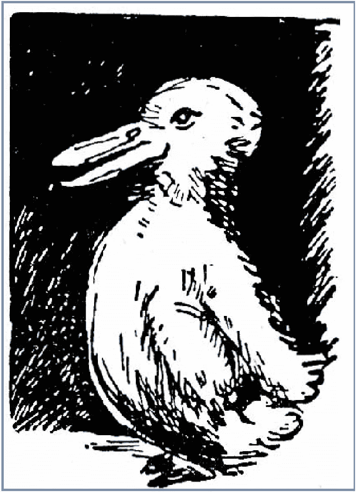

# $滴滴= $骗局？:水龙头与打桩

> 原文：<https://medium.com/coinmonks/drip-scam-faucet-vs-staking-52e4f16ae2ef?source=collection_archive---------6----------------------->

Duck?

我越是思考正在兴起的更大的滴滴生态系统，就越觉得它被包装得不好。下意识的反应是称之为庞氏骗局或传销。正如我在别处写的那样，这似乎是一种肤浅的解释，经不起推敲。试图挑战这种审查的帖子往往会受到批评。依我看，滴滴的象征经济学才是吸引人的地方，而不是转诊制度，然而转诊制度才是焦点。

总是在寻找一个好的打击，我想我应该试着从另一个角度来看待它。一旦我开始像锁定 3-12 个月的锁定期一样看待滴水系统，它有助于提供一些清晰度。

# 赌注 vs $ DRIP 模型

赌注是加密货币世界中一种常用的工具。最初，赌注只是一个过程，涉及提交您的加密资产以支持区块链网络，目的是通过赌注证明机制确认交易。它已经发展到包括任何系统，允许一个人存入他们的单一代币，并获得奖励或利息。根据币安的说法，赌注是“锁定加密资产以赚取回报和利息的过程”。

例子比比皆是。截至 2022 年 2 月底，Midas Investments 将给你 18%的年利率，如果你在他们那里存款，你可以以 60%的价格入股 Pancakeswap 的代币蛋糕，你可以以大约 7.5%的价格将你的 USDT 放在 AAVE。作为一个旁注，Midas 支付的令牌类型与存款相同(存款 ETH 和自动复合 ETH)，我一直认为这很酷。如果你有兴趣，你可以在这里找到他们**。**

**打桩的一般规则如下:**

*   **APR 可以而且确实会改变**
*   **通常情况下，您将获得本地令牌支付**
*   **更高的年利率通常伴随着锁定期**

**总而言之，这是一笔不错的交易。主要的风险是，当你的代币被锁定时，其他人将停止购买代币。如果出现这种情况，投资者将面临负面的市场波动。其中的损失可能会抵消利息的收益。如果没有锁定期，那么这个风险就不存在了。**

**我已经拥有了一些$MELD，最近我想赌一把。作为背景，MELD 是 MELD DeFi 系统的治理令牌。它可以用作支付平台交易的手段，但人们不需要使用它，就像不需要使用蛋糕在 Pancakeswap 上交易一样。除此之外，这是一个投资机会，与滴滴没有什么不同(没有滴滴的通缩象征经济学)。在撰写本文时，我可以通过他们的 DeFi 应用程序下注我的 MELD，并获得 4 月 10%-15%的回报。如果我将我的令牌锁定 6 个月，我可以获得 10%，如果我锁定 12 个月，我可以获得 15%。**

**因此，用 1000 美元的 MELD，我将在 12 个月内收回 150 美元。那时，我可以拿出我押的代币，也可以将总计 1，150 美元收入囊中。滴滴做的是他们拿了钱，开始每天给你 1%的回报，但以年利率的形式提及。这有点误导。**

**如果 MELD 像滴滴一样营销他们 12 个月锁定赌注计划的 APR，那么他们可以说他们给了投资者 115%的回报。为了配合滴滴的营销方式，MELD 将告诉投资者，在最初的 1000 美元投资烧完之后，他们将获得每日回报。对于 12 个月的计划，投资者将开始获得 0.315%的日回报率(3.15 美元是 1000 美元的 0.315%，因此这可以作为 0.315%的日回报率进行营销)。MELD 不必改变他们的任何协议，因为 1)投资者不能取出一年的“锁定”投资，2)在 12 个月的期限结束时，投资者带着 1150 美元离开。所以 MELD 可以*说*他们支付 3.15 美元/天(1150/365 天= 3.15 美元/天)。如果你把它延长到第 365 天，你会得到 115%的年百分比率。这是一种非常复杂的看待 apr 的方式。这样看有点让我头疼，因为这不是一个基于标准定义的 APR。对于年利率，最初的存款没有被烧掉，所以口袋里的最终金额是收益加上投资的反映，但年利率只对收益进行评论。**

**如果 MELD 是额外的操纵性，他们可以将 6 个月的锁定利率作为 213%的年利率来销售。这甚至更具误导性，只有当你强迫投资者在第 180 天收回他们的钱时才有效。这是数学是如何工作的…记住 MELD 有一个 6 个月锁定率为 10%。因此，6 个月后，1000 美元的投资将获得 50 美元的收益。如果他们使用滴滴的系统，那么他们会把它推销为一个投资被烧掉，但投资者获得每日回报的系统。如果 1000 美元的烧钱需要 180 天才能创造出 1050 美元的新钱，那么每天就能创造出 5.833 美元(1050/180 天= 5.833 美元/天)。5.833 美元是 1，000 美元的 0.583%，这个人每天的收入是 0.583%。365 天后，这一数字增加了 213%。从表面上看，似乎没有办法从那些开始的数字中得到 213%的年利率，只有在 6 个月的时候停止这个过程才有效。如果你更进一步，在今年剩下的时间里每天再给投资者 5.833 美元，投资者在第 365 天的口袋里最终会有 2129 美元。这代表了超过 1000 美元的收益，所以 MELD 希望迫使投资者在 6 个月内停止投资。滴滴已经找到了一种营销方式，可以让任何人把 10%的年化增长率当成 213%。**

**滴滴有这么多宣传的原因之一是，365%的年回报率似乎好得令人难以置信。如果你不复合，那么你实际上不会得到 365%(如果你复合，你可以得到超过 900%的**)。初始存款被征收 10%的税，因此投资者在滴滴系统中只有 900 美元，赚取 1%的日回报率。如果每天有 9 美元的收益，投资者在年底将有 3285 美元。提取税将扣除其中的 10%,共计 2，965.50 美元。但是请记住，APR 假设初始投资仍然保留，所以当我们偿还投资者最初的 1000 美元时，我们剩下 1965.50 美元。这是 196.55%的年利率，而不是 365%。在一年内获得 196.55%的初始投资回报还是相当不错的。如果滴滴以 MELD 的方式向投资者展示这一点，那么可以说投资者是在押注 6 个月或 12 个月的锁定期。在 6 个月的锁定期内，此人将获得 1，458 美元的回报(9 x 180 天= 1，620 美元，然后 1，620-10% = 1，458 美元)。如果你在 6 个月内获得 458 美元，那么你将在 12 个月内获得 906 美元，这就是 90.6%的年利率。我们已经知道 12 个月的锁定期将给投资者带来 2，965.50 美元(或 1，965.50 美元的收益)。他们可以通过告诉投资者，他们可以在 6 个月的期限内抵押贷款，获得 90.6%的年利率，或者在 12 个月的锁定期内获得 196.5%的年利率。****

****这些数字相当不错，但在加密领域并不罕见。****

********

****DRIP vs Staking****

****改变一个人看待事物的方式会对他们的感知产生重大影响。将其与类似的模型进行比较也会有所帮助。当一个人认为$DRIP 模式与另一种代币没有什么不同，它提供了一个入股的机会，但锁定了你 6 个月或 12 个月的投资，那么对$DRIP 的担忧很快就会消失。这种方法随处可见，但远没有引发争议。如果$DRIP 1)改变他们的营销，将其作为一个赌注机会，2)取消他们的推荐系统，那么他们将只剩下一个具有相当好的赌注 APR 的通货紧缩标志。如果他们这样做，那么我们可能不会谈论他们。****

****如果你有兴趣投资滴滴，这里有一个演练 [**。**](/@hjellen1974/optimizing-returns-on-drip-get-731-apr-if-done-right-3ec646dbea17)****