# 滴滴——永远在一起❤️

> 原文：<https://medium.com/coinmonks/drip-together-forever-%EF%B8%8F-587de6baadae?source=collection_archive---------3----------------------->

Four people Standing on Cliff in Front of Sun — Photo by [Helena Lopes](https://www.pexels.com/@wildlittlethingsphoto?utm_content=attributionCopyText&utm_medium=referral&utm_source=pexels) from [Pexels](https://www.pexels.com/photo/four-person-standing-on-cliff-in-front-of-sun-697243/?utm_content=attributionCopyText&utm_medium=referral&utm_source=pexels)

## 更新 Fri 2022 年 3 月 25 日

参见 Cryptozoa 团队的 Crypto Singh 的这篇优秀文章。他对滴滴生态系统进行了更深入的研究，并概述了为什么滴滴在未来很长一段时间内仍将是一个有价值的象征(正如计划中的那样)。

还是那句话，如果你有兴趣加入滴滴，请把我当成你的好友，而不是加密辛格！

 [## 可能性的海洋

### 欢迎来到滴滴生态。

cryptozoa.com](https://cryptozoa.com/an-ocean-of-possibility-dd5f30014408) 

自 2022 年 1 月兴趣激增后达到顶峰以来，滴滴代币的价格在过去 6 周内一直在逐渐下降。

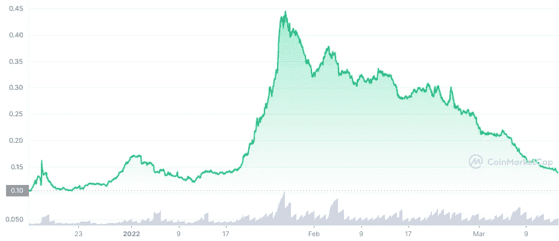

[Drip to BND](https://coinmarketcap.com/currencies/drip-network/) chart from Coinmarketcap.com

我在文章中讨论了为什么我认为这种情况会发生。

 [## 为什么滴滴价格暴跌

### 不是因为滴滴问题。是 PiggyBank 玩家用滴滴作为买入迫使价格下降。而且不知情…

medium.com](/coinmonks/why-is-the-drip-price-crashing-23568ae0771e) 

接着问为什么卖出不是最好的行动。

 [## 滴水不漏——销售是错误的策略

### 滴滴因价格贬值而抛售(索赔)是错误的策略。可能无法收回您的存款…

bbosmith.medium.com](https://bbosmith.medium.com/drip-selling-is-the-wrong-strategy-9edd26a84394) 

这是(进化)系列的第三篇文章。这里我想说说为什么滴滴会一直陪在我们身边。永远。它不会带着你的投资崩溃。那些试图脱离滴滴的恐慌的‘卖家’不明白这一点。他们是傻瓜，欺骗自己轻松的财富。

以下是人们认为滴滴将会破产的可能原因:

*   不可抗力——所有的事情都受此影响，所以我不会报道它
*   滴滴网络崩溃了
*   开发商拔掉了地毯上的插头
*   俄罗斯领导的对乌克兰的入侵，或者其他一些重大的世界事件让世界变得一团糟。

我将讨论为什么这些都不会导致滴滴网络的终结。它会一直留在这里。

# 滴滴网络崩溃了

公司一直在死亡。有时缓慢地持续几十年，有时快速地持续一天或一周。他们所持股票的所有价值实际上都消失了。至少对父母股东来说是这样的。机构投资者比他们先拿到钱。

同样真实的是，许多加密货币代币不再具有任何价值——要么是因为 rugpulls，要么只是因为晦涩难懂(市场上有许多不同的代币，人们可能会失去兴趣)。

但是点滴是完全不同的东西。它是一个智能合同，每天支付存款的 1%作为利息。它会一直这样下去，直到时间的尽头。让我们把这个时间限制在只要还有玩家在游戏中。

让我们来看看目前大约 90，000 名玩家。

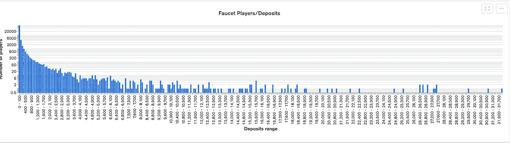

这显示了给定大小钱包的玩家数量。左边的大组是所有最近加入的玩家。右边的是已经有一段时间的“鲸鱼”,它们的钱包很鼓。他们会一路索赔，当他们一路向右时，他们将达到最大支出，他们的钱包将变得不活动。

在玩家加入后的第一天，他们可以“离开”的最早时间是 365 天，他们通过不断从他们的钱包中索取生命来做到这一点。左边的玩家会花大约这个时间。这意味着滴滴网络将有玩家，并至少再继续运营一年。在此期间，只要其中一个玩家看到了滴滴网络的价值，并增加押金或简单地加水，这个网络就会保持活力。

我想你会同意我的观点，在目前的游戏规则下，很可能会有相当多的玩家想要继续留在游戏中。

# 开发商们拔掉了插头

Rugpulls 在 Crypto 中很常见，但我不相信开发人员(外汇鲨鱼，BB +团队)符合典型的配置文件。

*   滴滴网络已经运行了近 12 个月。请访问 https://www . publish 0x . com/crypto chilly/drip community-launching-in-less-20-hours-xwqpvox 查看有关该项目的公告。
*   拉拽比这更快发生。它们倾向于通过泵和倾卸方案工作。非法参与者倾向于快速注入大量资金来购买和抽取一些加密令牌。与此同时或在此之前，他们营销市场。投资者看到了这种快速的变化，并跳上了肥缺。那些怀有恶意的人拿走了流动性，留下了一文不值的代币和一大堆愤怒的投资者。
*   滴滴网络开发团队失去的不仅仅是这个项目。他们也有相关的项目——动物农场和存钱罐。很多精力和智慧都投入到了这些事情中。开发者放弃这一切，让[在 Endor](https://www.youtube.com/watch?v=aV6NoNkDGsU) 上线，这是没有道理的。他们肯定想开始类似的项目，但要多久才能得到认可和曝光。
*   他们已经为滴滴相关项目制定了路线图:

(如果你需要的话，把我当成你的朋友，而不是 Ryan！)

 [## 滴滴有什么打算？

### 憎恨者会憎恨！对他们来说太糟了！滴滴有一个广泛的 2022 年“路线图”,将吹走任何…

blockstoxx.medium.com](https://blockstoxx.medium.com/whats-in-store-for-drip-7914c55576a5) 

*   开发团队已经证明了他们的承诺。存钱罐从一开始就有一个 bug，过了一会儿，开发者公开了它是什么。他们承认了自己的错误，并为队员们想出了解决的办法。他们的解决方案并不简单，需要大量的奉献和协作。如果他们只是想卷走所有人的钱，他们早就这么做了。

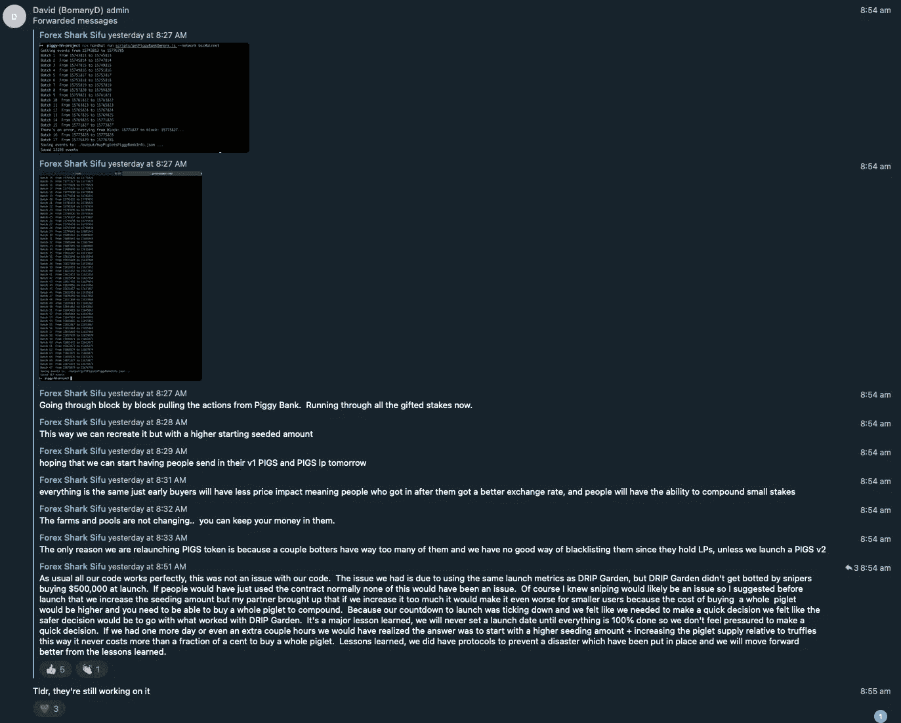

Chat in the Cryptozoa Team Telegram chat

目前的滴滴网络、动物农场和存钱罐以及一系列即将发布的新兴项目背后的开发商试图耍花招，这是没有道理的。

# 俄罗斯入侵乌克兰

如果它变得令人讨厌；或者有其他极端的世界灾难。

这些都是不好的事情，它吓坏了市场。包括传统股票和加密在内的所有市场都受到了入侵的影响。

## S&P500

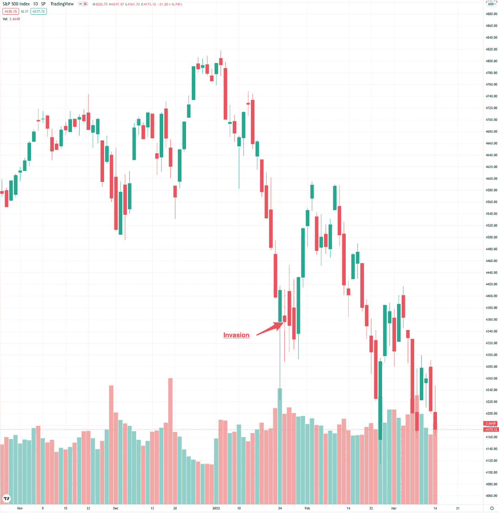

S&P 500 — TradingView

## （同 failedtosustainengraftment）支撑移植物植入失败

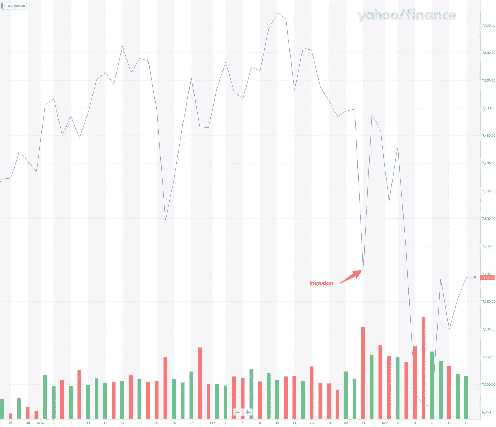

London FTSE index — Yahoo Finance

## 日经

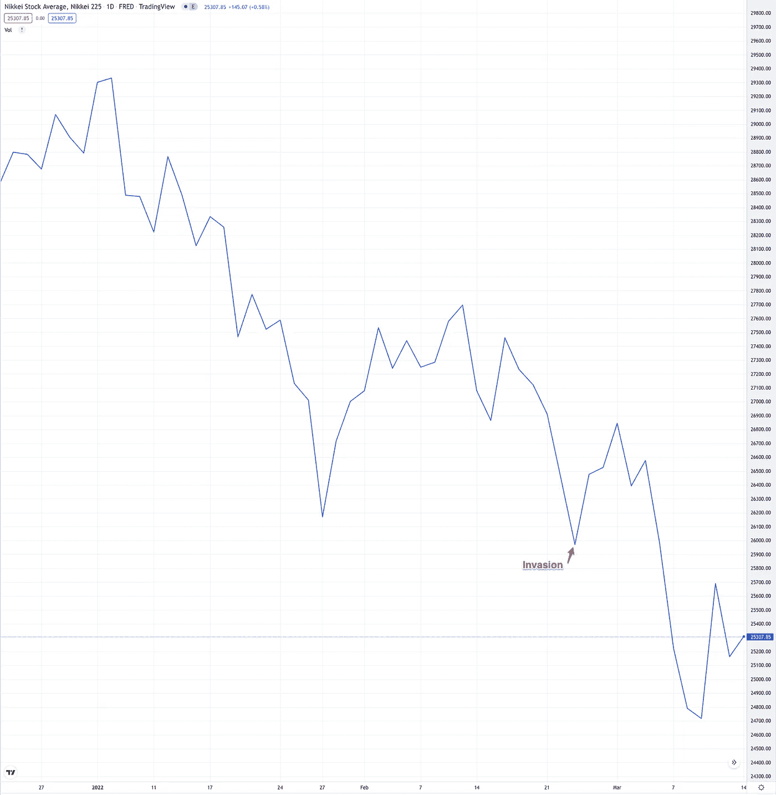

Japanese Nikkei index — Tradingview

## 指数

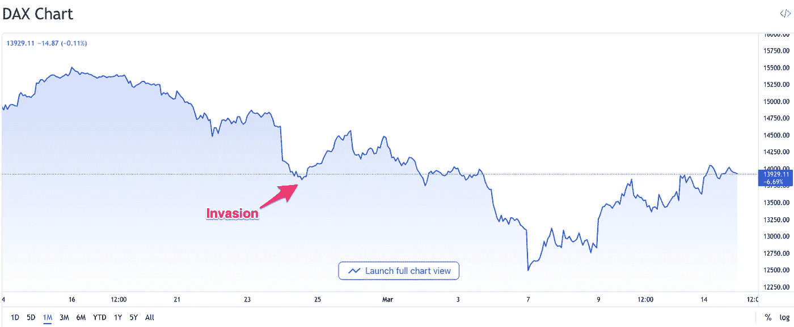

German DAX index — TradingView

## 比特币

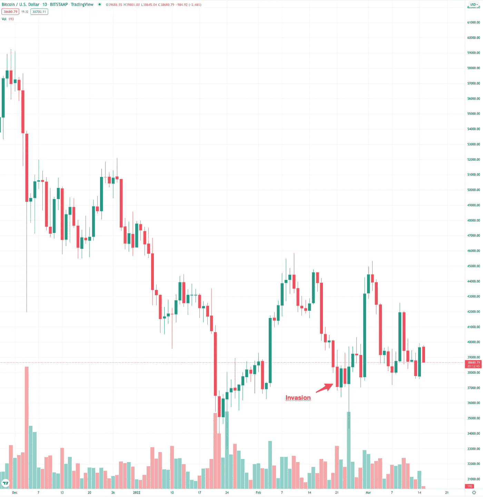

Bitcoin chart — TradingView

## 以太坊

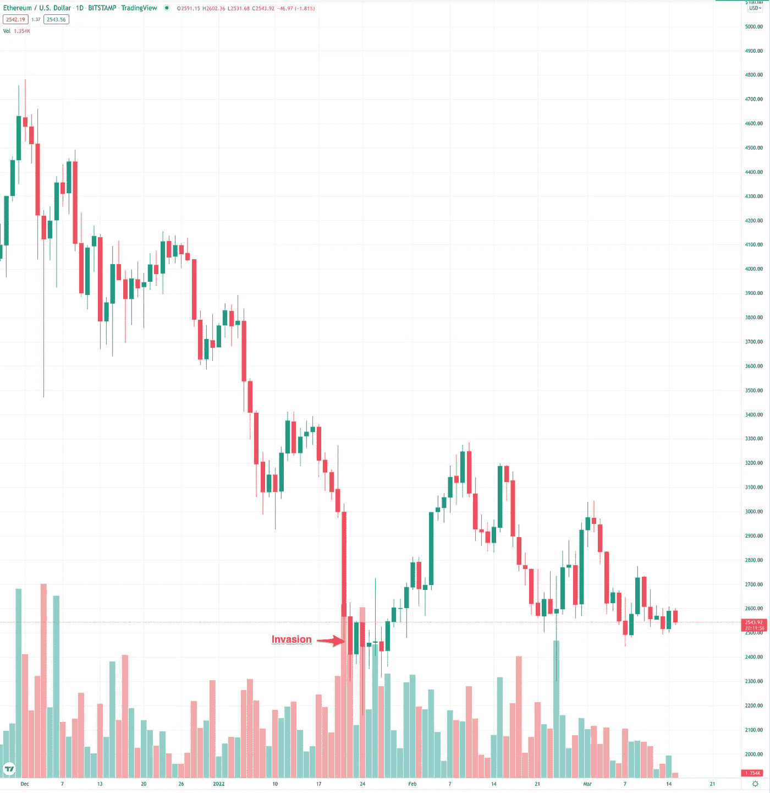

Ethereum chart — TradingView

我只对全球几个市场进行了抽样调查，所以对下面的评论要有所保留。看起来传统市场比秘密市场更受俄罗斯入侵的影响。这将是一个有趣的研究课题...总有一天。

然而，所有这些都没有实际意义。我们知道，随着时间的推移，所有市场都会复苏和升值(似乎除了 DAX 指数！).

## S&P500

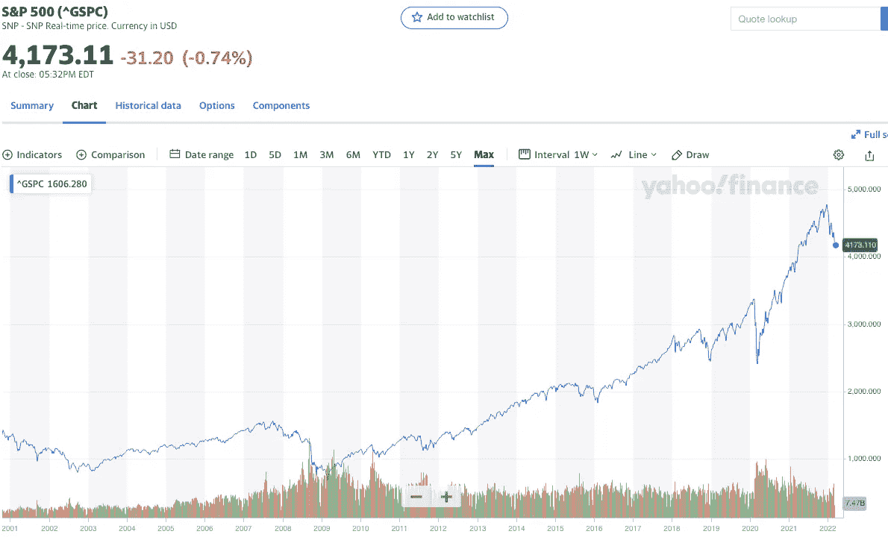

New York S&P500 index all time chart — Yahoo Finance

## （同 failedtosustainengraftment）支撑移植物植入失败

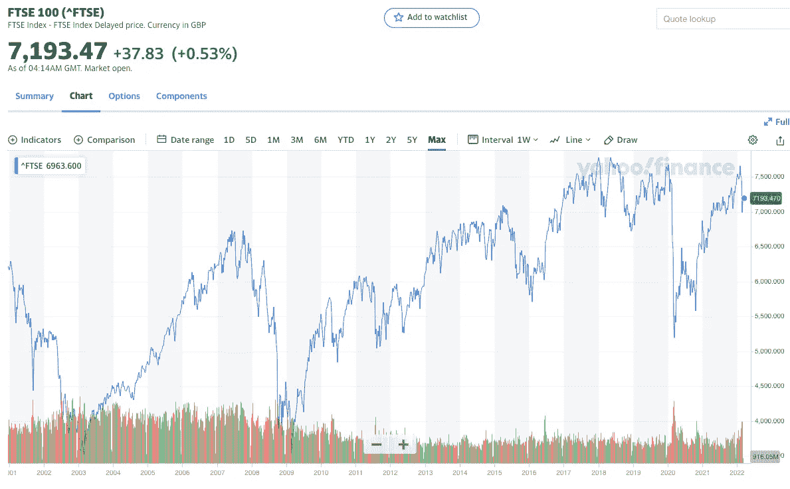

London FTSE index all time chart — Yahoo Finance

## 【经】日经股价指数

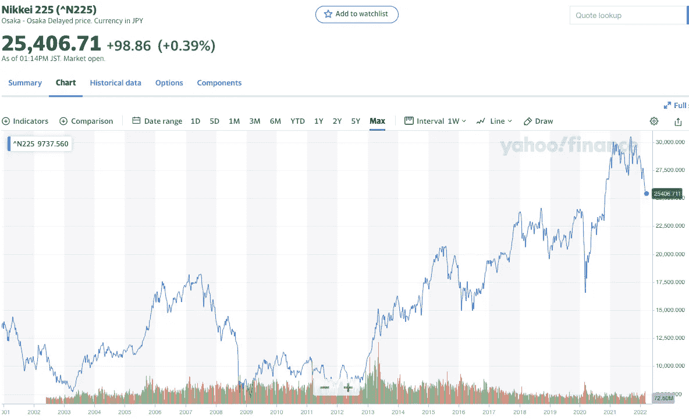

Japanese Nikkei index all time chart — Yahoo Finance

## 指数

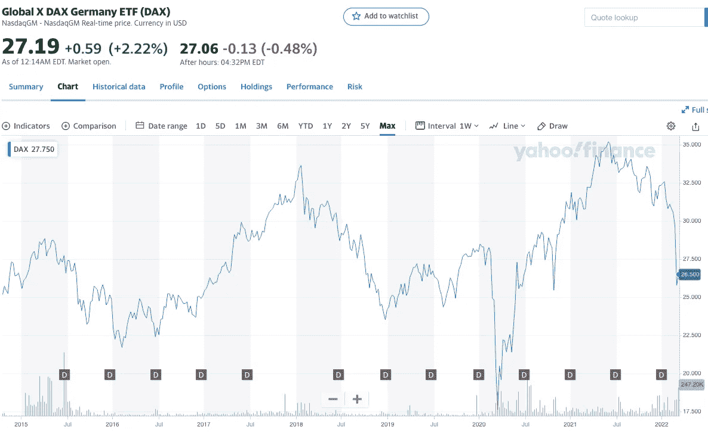

German DAX index all time chart — Yahoo Finance

## 比特币

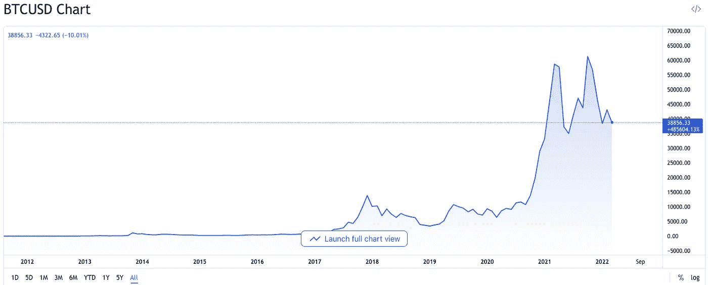

Bitcoin all time chart — Tradingview

## 以太坊

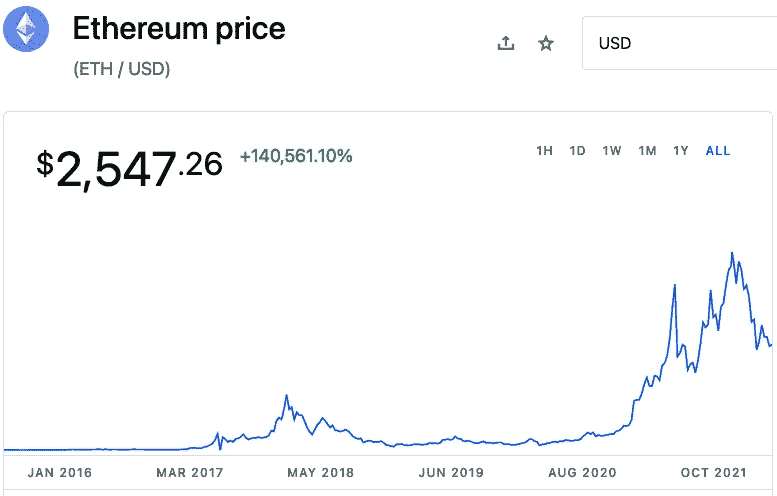

Ethereum all time chart — Coinbase

查看指数是对市场的一个非常高层次的看法。我们需要仔细观察单个公司层面的微观活动。这里有一个关于 10 家大公司在 Covid 市场崩溃后破产的雅虎故事。

这样的死亡不可能发生在滴漏身上，原因如下:

*   滴滴网络由智能合约组成，在独立于人类的分散式服务器上运行，每天支付 1%的利息
*   所有钱包清空以及网络停止运行至少需要 365 天

# 第三次世界大战呢

嗯，我认为如果世界变得一团糟，那么我们会有很多其他的事情要担心。

但是，好吧，如果你设法掩盖你的[需求层次](https://en.wikipedia.org/wiki/Maslow's_hierarchy_of_needs)，你开始关心你的投资，我会更担心你在公司的管理投资或银行存款。这是你看到价值下降的地方，就像最近梅塔/脸书发生的那样。这些事情发生得很快。不需要太多。

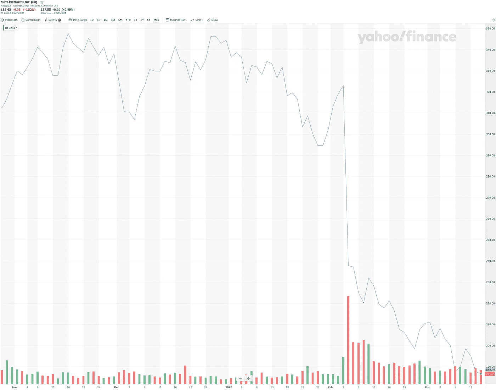

Facebook share price on [Yahoo Finance](https://yhoo.it/3IaV7gG)

滴滴永远不会消亡——即使发生世界大战，计算机也可能继续运行，并每天支付 1%的利息。可能:)

我认为滴滴是那些令人惊叹的千载难逢的投资机会之一。随着 DeFi 的成熟，以及世界各国政府和企业接受它，我们可能会发现，此类项目会“正常化”，成为一种新的标准，就像当前的股票市场一样。

我可能错了。不管怎样，我要尽可能长时间地骑着它！

# 如何进入滴滴

**作者声明**:这不是贸易或金融建议。这些信息仅供娱乐，仅代表作者的观点。所有的交易和投资，无论是房地产、股票还是密码，都有亏损的风险，有时亏损会超过 100%。不要用你不愿意损失的资金进行交易或投资。我不对你的交易错误，交易损失，或错过的机会负责，即使你是我的滴滴团队的一员。请自己做研究，自己核实信息。对一项投资的过去或潜在表现的任何参考都不是，也不应被解释为对任何特定结果或利润的建议或保证。

现在，如果你还不是一个滴流者，而我的文章引起了你的兴趣，而且当你看到一个好的便宜货时，你会发现它，那么请加入我的滴流团队。

参见我的其他文章:

*   [点滴——悲伤的五个阶段](/coinmonks/drip-the-five-stages-of-grief-ba3c5ddf07fb)
*   [滴滴 noobs 详细设置指南](/@bbosmith/drip-a-detailed-setup-howto-for-noobs-a41c66f2c5d1)
*   [滴滴——本质安全](/@bbosmith/drip-essential-security-459cf58aad92)
*   [为什么滴滴价格崩盘](/coinmonks/why-is-the-drip-price-crashing-23568ae0771e)
*   [滴滴——销售是错误的策略](https://bbosmith.medium.com/drip-selling-is-the-wrong-strategy-9edd26a84394)

当您准备好开始时，请使用此好友链接:

[**drip . community/水龙头？buddy = 0 cf4a 851 b 797107927 b 23 B3 e 4648 f 66d 05 b 983 c4e**](http://drip.community/faucet?buddy=0xcf4a851B797107927B23B3E4648f66d05B983C4E)

然后，输入我的钱包地址注册成为我的**好友**:

**0 cf4a 851 b 797107927 b 23 B3 e 4648 f 66d 05 b 983 c4e**

我是 BlockStoxx 团队的一员，邀请你加入 Discord 服务器。告诉他们是 T21 派你来的，你提名我做你的朋友。

 [## 加入 BlockStoxx 滴/动物农场不和谐服务器！

### 这是一个基于社区的支持小组和粉丝网站，适用于滴滴、庄园农场和动物农场加密被动收入网站…

不和谐. gg](https://discord.gg/DWY46E8fSs) 

> 加入 Coinmonks [电报频道](https://t.me/coincodecap)和 [Youtube 频道](https://www.youtube.com/c/coinmonks/videos)了解加密交易和投资

# 另外，阅读

*   [BigONE 交易所点评](/coinmonks/bigone-exchange-review-64705d85a1d4) | [电网交易 Bot](https://coincodecap.com/grid-trading)
*   [氹欞侊贸易评论](https://coincodecap.com/anny-trade-review) | [CoinSpot 评论](https://coincodecap.com/coinspot-review)
*   [新加坡十大最佳加密交易所](https://coincodecap.com/crypto-exchange-in-singapore) | [购买 AXS](https://coincodecap.com/buy-axs-token)
*   [投资印度的最佳加密软件](https://coincodecap.com/best-crypto-to-invest-in-india-in-2021) | [WazirX P2P](https://coincodecap.com/wazirx-p2p)
*   [7 个最佳零费用加密交易平台](https://coincodecap.com/zero-fee-crypto-exchanges)
*   [最佳网上赌场](https://coincodecap.com/best-online-casinos) | [期货交易机器人](/coinmonks/futures-trading-bots-5a282ccee3f5)