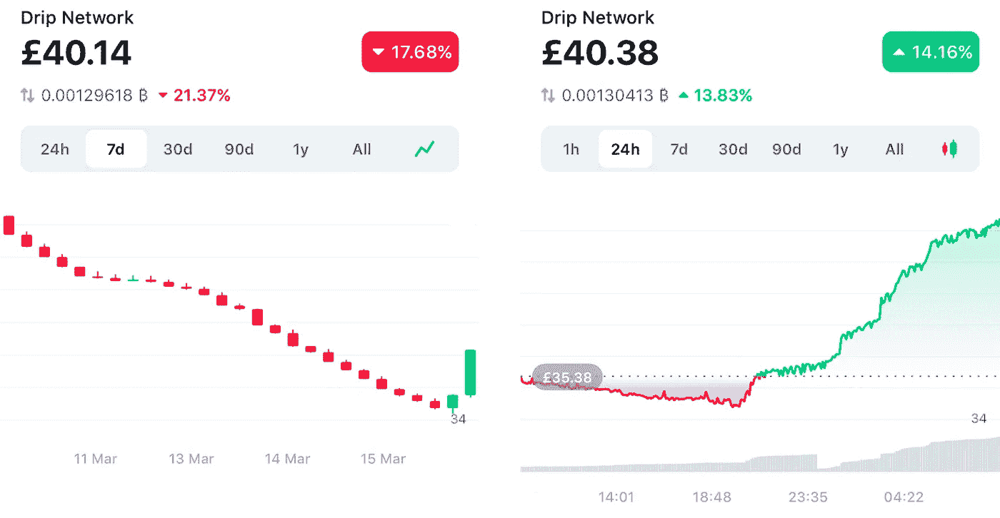
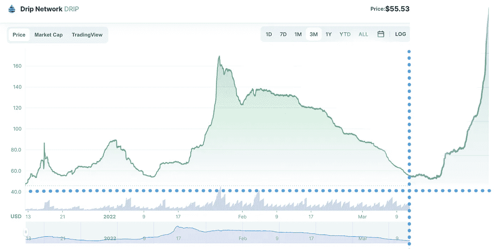

# dri 可预测定价

> 原文：<https://medium.com/coinmonks/dripredictable-pricing-7df5b1b198cd?source=collection_archive---------1----------------------->

**更新**【2022 年 3 月 31 日】40 美元的“地板”被打破，30 美元的新地板似乎正在逐渐形成，并继续接受测试。查看 3M 图表@ CoinMarketCap>【coinmarketcap.com/currencies/drip-network 。

**更新**【2022 年 3 月 17 日】大势已去，可想而知？

**原文**

为什么在过去的 60 多天里，滴滴的价格一直在下降？

不确定滴滴是什么？看我的'[龙头不要逼它](https://richardconner.medium.com/faucet-dont-force-it-d8988b94ebdf)'文章[这里](https://richardconner.medium.com/faucet-dont-force-it-d8988b94ebdf)。

以下是我用语境分析对滴滴最近价格行为的评估。

## 卖出压力

1.从历史上看，水滴价格的下降导致了更广泛的 Forex Shark 等生态系统产品的推出(水滴花园、庄园农场、动物农场、存钱罐等)。)滴手和园丁声称并出售滴滴，以投资于 Forex Shark 开发的新的更高风险产品。

2.动物庄园预发布、发布和发布后存钱罐的跨度约为。60 天，这增加和维持了滴滴索赔和销售。因此，线性回撤，没有绿色的日子。

3.筋疲力尽的鲸鱼不再能够(或者没有好处)补水/复利，所以只能每天申请可用资金。

4.通货膨胀和战争正在全面影响传统和秘密市场。

5.因为 1-4 个新来者不鼓励投资，弱手撤资，并要求超过水化和复合作为一个整体。

注意滴水的价格影响滴水/ BUSD LP 的价格/价值，从而影响滴水花园中植物的“价格/价值”。虽然植物的“价格”旨在随着时间的推移而降低，以激励新园丁进入，但滴灌的价格是过去 60 多天植物价格稳步下降的决定性因素。

## **买压**

1.鲸鱼已经达到并接近最大支出，导致水滴供应减少。

2.动物农场和存钱罐产品发布阶段即将完成。历史上，当外汇鲨鱼生态系统启动后尘埃落定时，价格就会上涨。

3.价格回落正逼近 40 美元的明显下限，这对于新来的投资者非常有吸引力。

4.一个新的用户界面正在开发中，它将吸引比加密/ DeFi 更广泛的客户，并增强滴滴网络/社区和更广泛的生态系统网络的“信任”价值。

5.滴滴的路线图正在开发、演进和稳步部署中。

## **永远记住**

1.价格仅在您要求和/或出售您的可用点滴时相关。

2.考虑美元成本平均法(DCA ),以利用点滴滴(无论它们可能有多长)

3.所有加密/和 DeFi 项目和产品都应被视为高风险。

4.只投资你能承受损失的东西。

5.低买，索赔，高卖。自己做研究。

## 滴水优势

这是蘸或滴的好时机；-)你的脚趾在水里。我可以帮忙。

$1K > $20K+每月< 1 YEAR💧Join [DRIPreneurs](http://t.me/dripreneurs) 与 [@richardconner](http://twitter.com/richardconner) 一起策划指导和 1-2-1 支持，通过[滴滴网络](http://drip.community/faucet?buddy=0x44A64ca69Cd15Cb480cBa20B65E6F8A1Ef77592b)在不到一年的时间内将 1K 变成每月超过 20K 的被动收入。

💧始乱终弃的电报频道>[t.me/dripreneurs](http://t.me/dripreneurs)

💧你的组长+电报上的滴滴导
>[t.me/richardconner](http://t.me/richardconner)

💧滴滴目标规划+补水进度+降价风险模型
>[bit.ly/DRIPpreneurs_TOOLS](http://bit.ly/DRIPpreneurs_TOOLS)

💧免费入门手册+迷你书
>[bit.ly/drip-passive-income](http://bit.ly/drip-passive-income)

💧当你和[drip reneurs](http://t.me/dripreneurs)
>[bit.ly/flowcastic-money-kit](http://bit.ly/flowcastic-money-kit)成为好友时

💧好友 ID 地址
>[0x 44 a 64 ca 69 CD 15 CB 480 CBA 20 b 65 e 6 f 8 a1 ef 77592 b](http://drip.community/faucet?buddy=0x44A64ca69Cd15Cb480cBa20B65E6F8A1Ef77592b)

💧与[理查德·康纳](https://www.transformerpreneur.com/richard-conner)
>[bit.ly/DRIP_Setup](https://bit.ly/DRIP_Setup)进行 1–2–1 次点滴准备活动，享受九折优惠

💧设置>[滴滴网络](http://drip.community/faucet?buddy=0x44A64ca69Cd15Cb480cBa20B65E6F8A1Ef77592b)每月 1 千美元>2 万美元+1 年<

* DM 您的电子邮件和公共钱包地址，以便 [Flowcastic 钱袋](http://bit.ly/flowcastic-money-kit)访问。

你们组长的简介>[transformerpreneur.com/richard-conner](http://transformerpreneur.com/richard-conner)

> 加入 Coinmonks [电报频道](https://t.me/coincodecap)和 [Youtube 频道](https://www.youtube.com/c/coinmonks/videos)了解加密交易和投资

# 另外，阅读

*   [SmithBot 评论](https://coincodecap.com/smithbot-review) | [4 款最佳免费开源交易机器人](https://coincodecap.com/free-open-source-trading-bots)
*   [比特币基地僵尸工具](/coinmonks/coinbase-bots-ac6359e897f3) | [AscendEX 审查](/coinmonks/ascendex-review-53e829cf75fa) | [OKEx 交易僵尸工具](/coinmonks/okex-trading-bots-234920f61e60)
*   [如何在印度购买比特币？](/coinmonks/buy-bitcoin-in-india-feb50ddfef94) | [瓦济克斯审查](/coinmonks/wazirx-review-5c811b074f5b)
*   [隐翅虫替代品](/coinmonks/cryptohopper-alternatives-d67287b16d27) | [HitBTC 审查](/coinmonks/hitbtc-review-c5143c5d53c2)
*   [CBET 评论](https://coincodecap.com/cbet-casino-review) | [库科恩 vs 比特币基地](https://coincodecap.com/kucoin-vs-coinbase)
*   [折叠 App 审核](https://coincodecap.com/fold-app-review) | [Kucoin 交易机器人](/coinmonks/kucoin-trading-bot-automate-your-trades-8cf0ca2138e0) | [Probit 审核](https://coincodecap.com/probit-review)